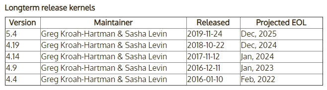
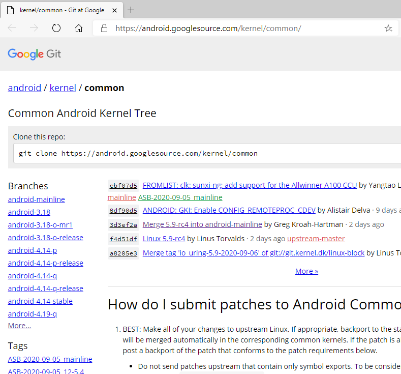
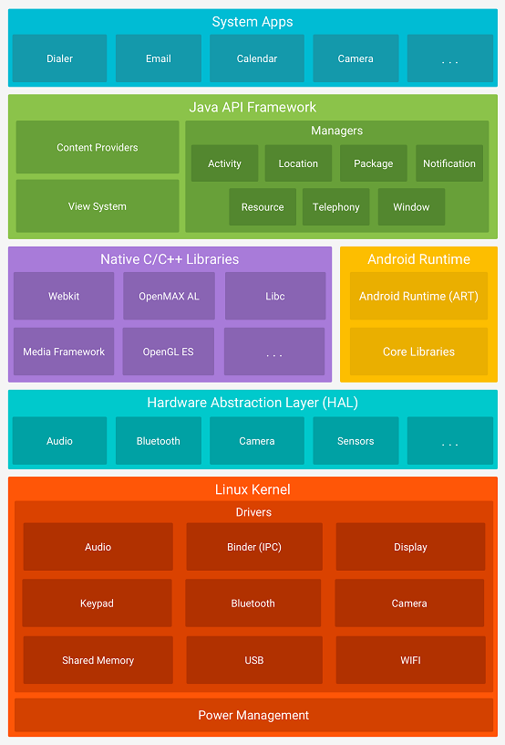
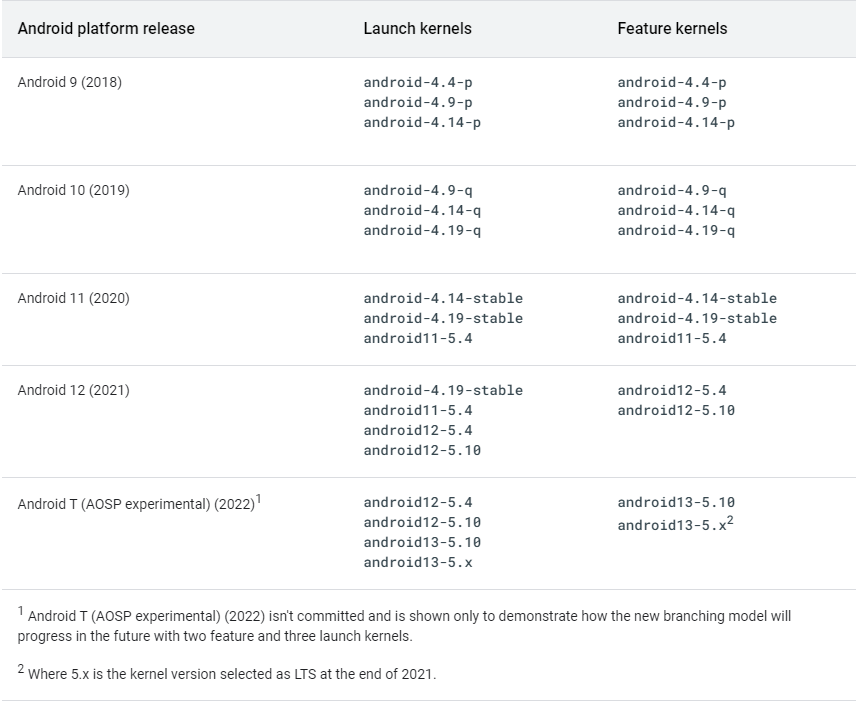

文章标题：**AOSP 内核的版本管理**

- 作者：汪辰
- 联系方式：<unicorn_wang@outlook.com> / <wangchen20@iscas.ac.cn>

文章大纲

<!-- TOC -->

- [1. 参考](#1-参考)
- [2. 前言](#2-前言)
- [3. **Linux 内核** 的版本管理](#3-linux-内核-的版本管理)
- [4. **AOSP 内核** 的版本管理](#4-aosp-内核-的版本管理)
    - [4.1. AOSP 通用内核](#41-aosp-通用内核)
    - [4.2. Android Platform 的内核版本管理](#42-android-platform-的内核版本管理)
        - [4.2.1. “Launch Kenel”](#421-launch-kenel)
        - [4.2.2. “Feature Kernel”](#422-feature-kernel)
- [5. TBD](#5-tbd)

<!-- /TOC -->

# 1. 参考

- <https://www.kernel.org/>
- <https://source.android.google.cn/devices/architecture/kernel>

# 2. 前言

我们知道 AOSP（Android Open Source Project，和我们常说的 Android 是一个意思）所使用
的操作系统内核就是 Linux。但 AOSP 使用的 Linux 内核是在原生 Linux 内核上加上了一些自己
的东西，包括一些 Android 社区特有的特性（短期内还看不到可以被 Linux 接纳，以至于还未合
并到 Linux upstream 的补丁程序）。所以严格地说 Android 的内核和 Linux 还不是一回事，
本文中我们叫它 **AOSP 内核** 以示区别，而 Linux 则称之为 **Linux 内核**。

由于 **Linux 内核** 一直在演进， **Android 内核** 自身也在进化，所以如何尽可能用上 
upstream Linux 内核的新特性，管理好 **Linux 内核** 与 **AOSP 内核** 之间的关系对于 
Android 系统的发展来说一直是一件头等重要的事情。最近我整理了一下这方面的思路，总结在这
里，供大家参考，有些地方也是加入了自己的一些理解，有什么说得不到位的地方，欢迎大家拍砖指正。

# 3. **Linux 内核** 的版本管理

首先熟悉一下 **Linux 内核** 的版本管理模式。

在版本发布管理模式上，**Linux 内核** 与标准的 AOSP 是很不相同的。从 2003 年 12 月往后，
也就是 从 `2.6` 内核版本发布往后，内核开发者社区从之前维护单独的一个开发分支和另一个稳定
分支的模型迁移到只维护一个 “稳定” 分支模型。在此模式下，每 2-3 个月就会发布一次新版本，
出现这种变化的原因在于：`2.6` 版本内核之前的版本周期非常长（将近 3 年），且同时维护两个
不同的代码库难度太高。

内核版本的编号从 `2.6.x` 开始，其中 x 是一个数字，会在每次发布新版本时递增（除了表示此
版本比上一内核版本更新之外，该数字的值不具有任何意义）。内核版本发展到现在已经进入 5 系
列（最新的是 `5.8.x`）。在众多内核版本中，分为 mainline 即主线版本，stable 稳定版本
和 longterm 长期维护版本。其中 mainline 版本由 Linus 本人维护，每两到三个月会做一次升
级，而且是两位数字版本号，不涉及第三位数字，譬如 `5.1`、`5.2`、`5.3` ......。stable 
版本是针对 mainline 版本你的小版本更新，譬如对应 `5.1` 的会有 `5.1.1`、`5.1.2`、`5.1.3` ......。
某一些 stable 版本会被指定为 longterm 版本（也称为 LTS），从而拥有更长的维护周期，直白
了说就是其第三位数字会会变得很大。

下图是 Linux 的版本计划（by 2020/9）

(图片来源：https://www.kernel.org/)

下图是 Linux 的 LTS 版本计划（by 2020/9）

(图片来源：https://www.kernel.org/category/releases.html)

# 4. **AOSP 内核** 的版本管理

## 4.1. AOSP 通用内核

针对 Andorid 内核的管理， Google 定义了一个所谓 “AOSP 通用内核 ( AOSP common kernels，
简称 ACKs)” 的概念。 ACKs 版本基于 **Linux 内核** 开发（术语上称之为 downstream，形
象地说可以认为 **Linux 内核** 的发布处于上游，而 ACKs 随着 Linux 内核版本的升级而升级，
就好像处在流水线的下游），ACKs 在 **Linux 内核** 的版本基础上包含了许多与 Android 社
区相关但尚未合并到 LTS 的补丁程序，可以简单地分成以下几大类：

- Android 需要，存在于更新的 Linux mainline 版本上，但尚未合入当前 LTS 版本的内容。
- Android 需要，但未被 Linux mainline 接受的功能（例如 Energy Aware Scheduling/EAS）。
- Vendor（供应商）/ OEM（原始设备制造商）特有的功能（例如 sdcardfs）。

**AOSP common kernels** 的发布网站地址在 <https://android.googlesource.com/kernel/common/>。
我截了个图，感兴趣大家可以看一下。

图上左侧 Branches 列表的第一个 `android-mainline` 是 Android 的主要开发分支。每当 
Linus Torvalds 发布 Linux 的主线版本以及候选版本时，其 Linux 主线代码就会被合并到 
`android-mainline` 中。

在 2019 年之前，**AOSP common kernels** 的构建方法是追踪最新的 LTS 内核版本，每次一个
 Linux LTS 版本发布后， Google 就基于该最新的 LTS 版本添加特定于 Android 的补丁。但这
么做的一个问题是 Linux LTS 版本发布的周期比较长（大概一年发布一次），由于跨度较大，每次
基于 LTS 版本进行移植和添加 Android 的补丁冲突可能会比较大，容易引入混乱。所以从 
2019 年开始 Google 修改了该流程，目前的做法是 `android-mainline` 持续保持对 Linux 的 
mainline 版本的追踪，每次有正式发布，或者 RC 发布都同步升级这个 `android-mainline` 分
支，基本思想就是将原来的一年一次升级分散到多个小步辐升级过程，再加上持续的每日构建和测试，
避免了以前构建方式下执行 “前向移植（forward port）” 带来的压力。新的流程减轻了这些压力，
保证了内核的高质量。当然代价是需要小心地维护 `android-mainline`，将维护的工作量分散到
平时的工作中。

在以上持续更新 `android-mainline` 的基础上，当 Linux 宣布某个 mainline 版本成为一个新
的 LTS 版本时，Google 将相对应地从 `android-mainline` 上拉一个新的对应该 LTS 
的 **AOSP common kernel** 分支。因为 Google 和它的合作伙伴一直在积极维护这个 
`android-mainline` 分支，所以在其基础上拉出来的分支代码都不会有太大的质量问题，这种迁
移是无缝的。

此外，一旦某个 LTS 版本有小版本升级，我们仍然需要积极地将其修改合入对应的 
**AOSP common kernels** 版本。例如，我们已经基于 Linux 的 `4.19` 建立了 
**AOSP common kernels** 分支版本 `android-4.19-q`，当 Linux 对 `4.19.x` 进行更新，
升级到 `4.19.y` 时，我们需要将对应的修改也相应合并到 `android-4.19-q` 中，从而保持 
`android-4.19-q` 这个 **AOSP common kernel** 分支与最新的 `4.19.y` LTS Linux 内核
版本同步同时又包含了特定于 Android 的补丁修改。

## 4.2. Android Platform 的内核版本管理

先回顾一下 AOSP 的层次模型。

(图片来源：AOSP 官网)

整个 AOSP 项目从层次上来看，最下面的是 **AOSP 内核**，其上部分除了 HAL 之外都可以认为
是 AOSP 的 Platform 部分。这部分的代码，即 Android Platform 的 Version 版本发布由 
Google 定义（有关 AOSP Platform 版本的相关介绍请参考我写的 [另一篇总结](./20200911-platform-version.md)）。
结合 Google 自身的 Android Platform 的版本发布策略，Google 定义了与之相对应的最新的 
Android 内核版本管理方法，总结在下面这张表格中。我们可以结合这张表继续深入理解一下 
Google 对 Android 的内核版本的维护和管理思想。

(图片来源：https://source.android.com/devices/architecture/kernel/android-common#feature-and-launch-kernels)

这张表格的第一列是 **“Android platform release”**, 这个无需多言，基本上 Google 的策
略是保持一年更新升级一个 Platform 的版本。过早的版本暂不予考虑。

### 4.2.1. “Launch Kenel”

这张表格的第二列叫 **“Launch Kenel”**。具体是什么意思呢，原来 Google 规定，每个 
Android Platform 固定支持三个 **AOSP 内核** 版本用于发布（launching）新设备，这些 
**AOSP 内核** 版本称之为 “Launch Kernel”。譬如，表格中 Android 11 支持的三个 
**Launch Kernels** 版本分别是 `android-4.14-stable`、`android-4.19-stable` 和 
`android11-5.4`。这些版本实际上就是上文我们介绍的从 `android-mainline` 分支上拉出来的
对应各个 Linux LTS 版本的稳定分支。也就是说针对每个 Platform 发布，只支持最近的三个 
Linux 内核 LTS 版本的稳定分支，而且这三个版本可以认为是每个 Platform 版本支持的 
“老”、“中”、“青” 三代，还是以 Android 11 为例，其支持的 “老” 一代版本是 `android-4.14-stable`，
恰好对应 Android 10 支持的 “中” 一代版本 `android-4.14-q`，以此类推。由于目前 Linux 
的 LTS 分支差不多一年发布一个，而 Android 的 Platform 也是一年升级一个版本，所以对应每个 
Android 的 Platform 版本支持的 LTS 内核版本也会吐故纳新，去掉一个最老的，加入一个新的，
如此循环往复。Google 这么设计的考虑也是为了设备的兼容性和升级。假设有一款手机 Foo 采用 
Android 10 platform，内核采用 `android-4.14-q`。当 Android 升级到 11 后，由于 
Android 11 所支持的 “Launch Kernel” 中是宣称支持 `android-4.14-stable` 的，所以 
Google 的兼容性测试会保证该手机即使不升级内核（更重要的是这也意味着不需要升级 Vendor/OEM 
的驱动等），只升级 Platform 版本到 11 也是可以运行的，当然 11 中那些需要新内核补丁才可
以工作的特性将无法工作，前提是该款手机不需要这些特定的新特性。

另外针对 **“Launch Kernel”**，我们会看到从 Android 11 开始，**“Launch Kernels”** 
的命名发生了变化，其支持的三款 **“Launch Kernels”** 分别叫做 `android-4.14-stable`、
`android-4.19-stable` 和 `android11-5.4`，其命名习惯发生了修改。

首先我们发现形如 `android-4.14-p` 这样的分支名称被替换为`android-4.14-stable`。
`android-4.14-p` 这样的命名遵循的是 Codename 的缩写命名形式，其末尾的 `p` 其实就是 
Pie 的首字母，所以这种命名方式也称为 “甜品（dessert）” 内核版本号。但考虑到从 10 开始
对外 Google 不再使用甜品的绰号，所以先是采用 “stable” 代替了末尾的字母。

其次我们还看到形如 `android11-5.4` 这样的新规则。这种新的版本规则 Google 称之为 
KMI kernel 分支。这和 Google 的新发明有关。所谓 KMI 全称叫 “Kernel Module Interface”，
指的是 Linux 内核中提供给 “模块（Module）” 的编程接口 API。譬如 Vendor/OEM 会根据自己
设备的特色为设备编写很多外设驱动模块，这些模块很可能并没有进入内核主线，或者在构建时和内
核是独立编译安装的，那么维持模块和内核之间 API 的一致性就变得非常重要。如果 KMI 不一致很
可能会导致系统升级时发生兼容性问题。为了解决 Android 版本的碎片化问题，从 Android 11 
开始，Google 提出 **GKI（Generic Kernel Image）** 计划，这个具体可以参考 Andorid 
官网有关 GKI 的说明：<https://source.android.google.cn/devices/architecture/kernel/generic-kernel-image>。
简而言之就是通过统一内核的公共部分，并为内核模块提供稳定的内核模块接口（KMI），从而达到
可以独立更新模块和内核的目的。与之对应的新的内核命令规则就叫 “KMI 内核”，具体形式为 
`<androidRelease>-<kernel version>`，通过结合 Linux 内核版本号和 Android 的 
Platform Version 号来唯一决定。譬如表格中的 `android11-5.4` 表达的意思就是基于 
Linux 5.4 LTS 版本，并且是支持 Android Platform 11 及以上版本。

### 4.2.2. “Feature Kernel”

表格的第二列叫 **“Feature Kernel”**。我们知道，有时候为了支持 Android 的某个 Platform 
的新的 “特性（Feature）”，可能会涉及到需要修改 Linux 内核（当然这种情况是比较少的，但也
不能排除），那么添加了这些补丁的 AOSP 内核自然就叫 **“Feature Kernel”** 了。在 
Android 11 之前我们看到基本上每个 “Launch Kernel” 都打上了 Platform 相关的补丁，所以
针对每个 Platform 版本，三个 “Launch Kernel” 本身就是 “Feature Kernel”。这样的好处是
延长了老设备的维护周期。还是以上面的 Foo 设备举例，其发布时采用内核版本 `android-4.14-q`，
假设 Android Platform 从 10 升级到 11 后新增支持了一个特性 A，而且 A 这个特性是需要内
核新增支持的，那么如果 Foo 这款手机也希望使用特性 A，那么它还是有内核可用的，当然除了升
级内核到 `android-4.14-stable`，Platfrom 自然也需要升级到 11。但从 Google 的角度来看，
Foo 生命周期的延长导致 4.14 内核系列的维护生命周期也变长了，这增加了碎片化的风险。所以
从 Android 12（S）开始，为了控制和限制需要支持的稳定的 KMI 的个数，避免碎片化，Google 
计划缩减每个 Platform 对应支持的 **“Feature Kernel”** 个数，从三个减为两个。从表格上
来看，以 Android S 即 Platform version 为 12 的那行为例，“Feature Kernel” 不再支持 
`android-4.19-stable`，后果就是如果 12 中引入了一个新特性 B，而且该特性需要内核补丁支
持的话，已经发货的手机如果采用的是 `android-4.19-stable` 及以前的内核，那么必须强制升
级内核到 `android12-5.4`，这也意味着 Vendor/OEM 维护的驱动等也需要相应适配到更新的 
Linux 内核 5.4。

# 5. TBD
补充 内核生命周期部分，
https://source.android.com/devices/architecture/kernel/android-common

> When entering the frozen phase, the branch is git-tagged with the KMI version 
> string containing the KMI generation number. For example, when android11-5.4 
> was frozen, it was tagged with the KMI version string 5.4-android11-0 where 
> the trailing 0 is the KMI generation number.

