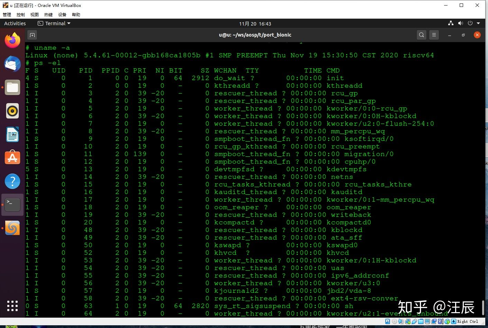
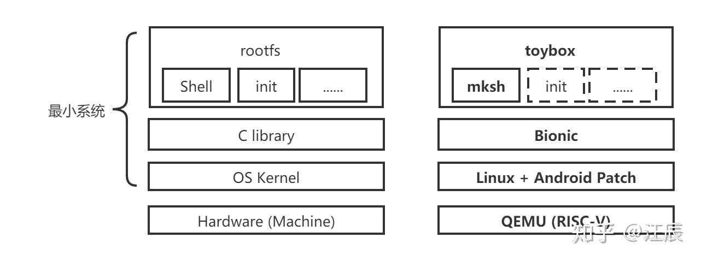
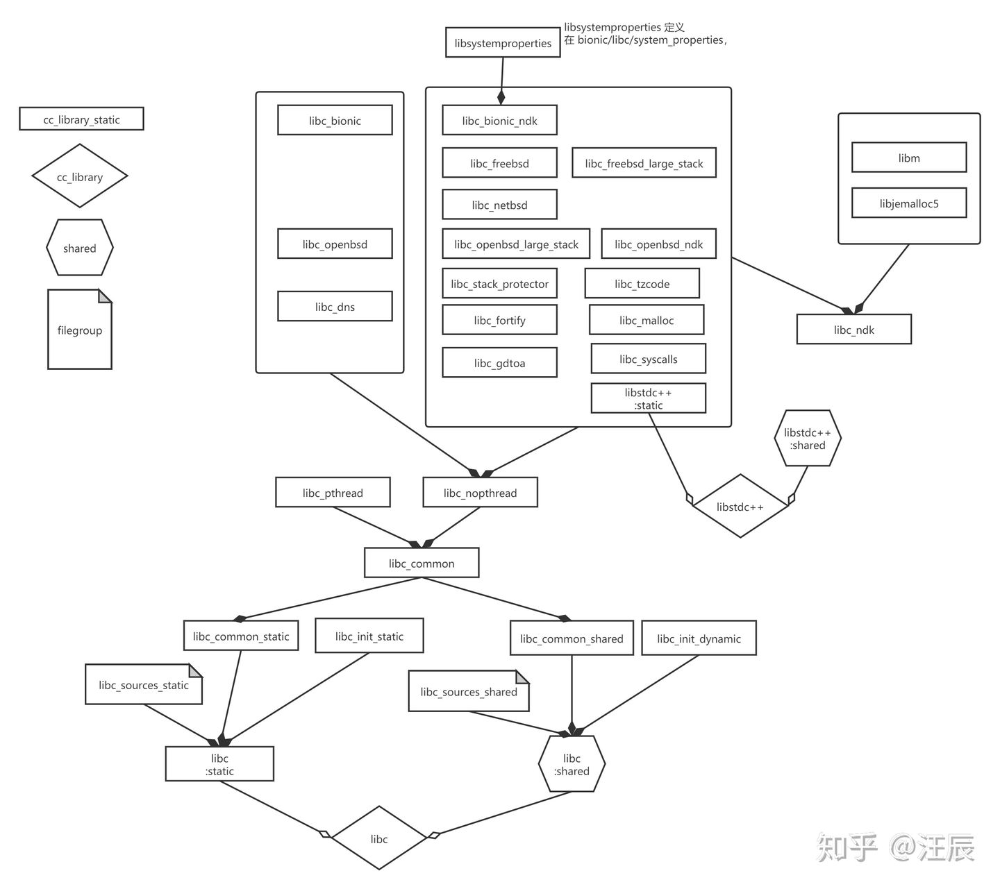
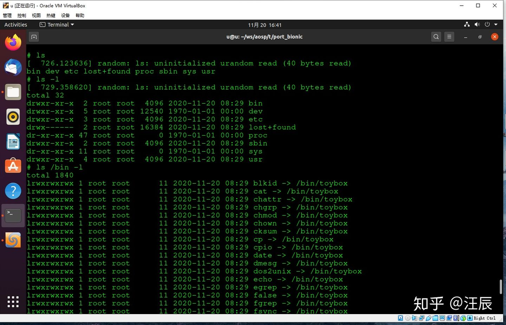

文章标题：**第一个 RISC-V 上的“Android 最小系统”**

- 作者：汪辰
- 联系方式：<unicorn_wang@outlook.com> / <wangchen20@iscas.ac.cn>

文章大纲

<!-- TOC -->

- [1. 需求分析](#1-需求分析)
- [2. 移植工作介绍](#2-移植工作介绍)
- [3. 实验步骤](#3-实验步骤)
    - [3.1. 构建 GNU 工具链](#31-构建-gnu-工具链)
    - [3.2. 构建 LLVM/Clang 工具链](#32-构建-llvmclang-工具链)
    - [3.3. 构建 QEMU](#33-构建-qemu)
    - [3.4. 构建 Android 内核](#34-构建-android-内核)
    - [3.5. 构建 “最小系统”](#35-构建-最小系统)
    - [3.6. 运行](#36-运行)

<!-- /TOC -->

经过这段时间以来的埋头苦干，目前我们已经可以在 RISC-V 的 QEMU 上启动一个 Android 的 
“最小系统”。先来张图，有照为证。



下面简单总结一下这段时间的工作，虽然前方征途依旧漫长，但好歹有了一点可以看到的东西。

# 1. 需求分析

我们的项目全称是 AOSP for RISC-V，目前所有源码开源在 github 上：<https://github.com/aosp-riscv> 
（注：与本文工作对应的代码仓库已经备份到 <https://gitee.com/aosp-riscv-bionic-porting>，
具体参考 [项目 README 文件](https://gitee.com/aosp-riscv/working-group/blob/master/README_zh.md) 
中 2021-01-xx 的日志记录）。说白了就是希望乘着 RISC-V 这阵春风将 Android 也移植到 RISC-V 上去。当然这个终极目标很大。

但目前我们还有一个小目标，用一句话描述就是：`基于 RISC-V 平台，实现在 QEMU 上跑起来 
Android 的 kernel 部分，并将 Android 的 Shell 运行起来。`

基于以上目标，具体分析来说，也就是要实现一个最小的 Android 系统，这里的 **“最小系统”** 
的含义就是所谓的 “bootable unix-style command line operating system”。传统意义上一
个完整的 “最小系统” 如下图的左侧所描述，从下往上，最下面是硬件（注意：硬件不算我们的 
“最小系统” 的一部分）。硬件上运行的第一层软件是操作系统内核 (Operating System Kernel)，
OS kernel 上是 [C 库 (C Library)](https://en.wikipedia.org/wiki/C_standard_library)，
基于 C Library 我们就可以搭建一个最小的文件系统，一个可以满足我们基本操作的文件系统本质
上来说就是一堆命令行工具，这些命令行工具里至少要包含一个 init， 用于配合内核启动基本的
登录 Shell，以及一个 Shell 用于和用户交互，用来调用其他的工具程序。有了这个 **“最小系统”**，
我们的大目标就有了一个基础。



通过对 AOSP 的调研，我大致归纳了我们需要实现的工作如下：
- 硬件部分：这里我们先采用 QEMU for RISC-V 来模拟。
- OS Kernel：Android 的内核采用的就是 Linux，当然打上了自己的一些补丁。有关如何在 RISC-V 
  的 QEMU 上运行一个 Android 的内核，我们在另外一篇文章 
  [《编译一个 RISC-V 的 Android 内核》](./20200929-build-riscv-android-kernel.md) 
  中有过介绍
- C Library：Android 有自己的 C 库，就是 bionic。它与 GNU C库（glibc）的不同之处在于，
  它是为内存和处理器能力较低的并且运行 Linux 的设备设计的。它基于 BSD 许可发布，而不是
  像 glibc 那样使用 GNU 公共许可证。
- Rootfs：Android 有自己复杂的文件系统组织，作为我们实验的目标，我们需要的是一个最精简
  的最小文件系统，暂时没有必要将 Android 的完整系统移植过来，所以我选择了 
  [toybox](https://en.wikipedia.org/wiki/Toybox) 来实现我们的各种命令行工具。同学们
  可能会问为啥不用更著名的 [busybox](https://zh.wikipedia.org/wiki/BusyBox)，原因还
  是和软件许可证有关，busybox 是 GPL，而 toybox 是 BSD，自然更符合 Android 的胃口，
  所以最后被包含在 AOSP 的源码树里的就是 toybox，而不是 busybox。另外需要提一下，由于 
  toybox 实现得十分简陋，我基于的 AOSP 版本中 toybox 自带的 shell 还无法正常工作，
  好在 Android 已经有了自己官方的 Shell，就是 [mksh](http://www.mirbsd.org/mksh.htm)，
  所以对于 Shell 我们就直接用 mksh。

# 2. 移植工作介绍

上面谈了整体移植工作需要做哪些内容。在具体的实现上其实还有很多的细节，由于我们的最终目标
（将 AOSP 整体移植到 RISC-V 上）还远未实现，所以我先就我目前已经实现的内容简单梳理了一
下，作为阶段总结记录在这里备忘：

- 运行平台（硬件）：目前暂时采用 QEMU
- AOSP 版本：基于 `android-10.0.0_r39` 的 tag
- 编译环境：AOSP 的编译已经完整迁移到 LLVM/CLANG，但在链接部分仍然使用的是 GNU tools。
  由于 AOSP 自带的 Prebuild 工具链不支持 RISC-V，所以我采用自己制作的 LLVM/Clang 和 
  GNU-tools。有关 LLVM/Clang，可以参考我的另一篇文章 
  [《制作一个针对 RISC-V 的 LLVM/Clang 编译器》](https://zhuanlan.zhihu.com/p/263550372)；
  有关 GNU-tools 的制作，参考另一篇文章 
  [《在 QEMU 上运行 RISC-V 64 位版本的 Linux》](https://zhuanlan.zhihu.com/p/258394849)。
- 内核的移植，参考我的另一篇文章 [《编译一个 RISC-V 的 Android 内核》](./20200929-build-riscv-android-kernel.md)，
  我采用的内核版本是 common 仓库的 `android-5.4-stable` 加上 configs 仓库的 `android11-release`。
- BIONIC 库的移植，如前所述，基于 `android-10.0.0_r39` 的 tag，考虑到第一期的需求，
  只实现 libc 的静态库，未实现 libc 的动态库以及 libm/libdl/libstdc++/linker。也就是
  说下面的 toybox 和 mksh 这些可执行程序都是静态链接的。libc 是 bionic 的最主要部分，
  组成内容相当庞杂，其中的主要组件以及组件之间的依赖关系简单总结如下图：

  

- toybox：如前所述，基于 `android-10.0.0_r39` 的 tag，但做了相当多的裁剪。因为 
  Android 中的 toybox 引入了许多 Android 特有的特性，比如 SELinux 和加密等等，为了不
  牵扯太多的精力，我在移植时 disable 这些功能，只保留了基本的一些常用功能。
- mksh：Shell 部分看上去比较单纯，所以直接拿来，只要确保编译没有问题即可。
- 整个移植过程中还有一块很大的工作是涉及构建系统的搭建。我没有使用 AOSP 自带原生的 
  Soong 系统，因为在前期的预研过程中我发现在现有的 AOSP 构建系统上（即传统的 lunch + m 操作）
  要加入一个新的 ARCH 支持并确保将修改局限在自己关心的 module 上是一件非常不容易的事情。
  AOSP 的构建系统过于复杂和成熟，但对后来者并不友好。为了降低风险，先期聚焦重点关注部分，
  我选择了采用 make 重写了需要先期移植的模块（bionic/toybox/mksh）。当然后面还是要找机
  会去动 AOSP 的 Soong，这个留在后面再做吧。

# 3. 实验步骤

经过这段时间的工作，已经初步完成了以上小目标，至少可以在 QEMU 上启动一个上面我们定义的 
**“最小 Android 系统”**。相关移植修改已经公开开源在 github。如果有同学希望尝试，可以参
考以下步骤操作。也欢迎大家测试，提 PR，或者直接参与我们的 AOSP 移植 RISC-V 的开源项目。

## 3.1. 构建 GNU 工具链

参考 [在 QEMU 上运行 RISC-V 64 位版本的 Linux](https://zhuanlan.zhihu.com/p/258394849) 
的 “1. 制作交叉工具链 riscv-gnu-toolchain” 章节。

完成后将 GCC 的安装目录，譬如 `/opt/riscv64/bin` 导出到环境变量 PATH 中。

## 3.2. 构建 LLVM/Clang 工具链

参考 [《制作一个针对 RISC-V 的 LLVM/Clang 编译器》](https://zhuanlan.zhihu.com/p/263550372)。

完成后将 Clang 的安装目录，譬如 `/home/u/ws/llvm-project/install/bin/` 导出到环境变量 PATH 中。

## 3.3. 构建 QEMU

参考 [《在 QEMU 上运行 RISC-V 64 位版本的 Linux》](https://zhuanlan.zhihu.com/p/258394849) 
的 “2. 编译 QEMU” 章节。

编译完成后将 QEMU 的安装目录 譬如 `/opt/qemu/bin` 导出到环境变量 PATH 中。

## 3.4. 构建 Android 内核

参考 [《编译一个 RISC-V 的 Android 内核》](./20200929-build-riscv-android-kernel.md)。

## 3.5. 构建 “最小系统”

这部分实际包括了 bionic libc 库的制作和 toybox 以及 mksh 的制作，不过已经全部自动化了

进入自己的工作目录后执行如下命令：

```
git clone https://gitee.com/aosp-riscv-bionic-porting/port_bionic.git
cd port_bionic/
git checkout develop
git submodule init
git submodule update --progress
```

下载完后就可以制作了，步骤也很简单，在 `port_bionic` 目录下运行如下命令
```
make
```

如果要制作根文件系统的 img，可以运行 `mkrootfs.sh` 这个脚本，注意在运行前可以检查一下 
`mkrootfs.sh` 这个脚本，自行调整并确保 `PATH_QEMU` 这个变量指向正确的 QEMU 安装目录，
譬如前文 3.3 章节中的 `/opt/qemu/bin`。

然后以 sudo 权限执行 `mkrootfs.sh`
```
sudo ./mkrootfs.sh
```

以上步骤生成的内容在 out 目录下：

```
$ tree -L 3 out
out
├── bin
│   ├── sh
│   ├── toybox
│   └── unstripped
│       ├── sh
│       └── toybox
├── lib
│   ├── crtbegin_static.o
│   ├── crtend.o
│   └── static
│       └── libc.a
├── obj
│   ├── xxx.o
│   ├── xxx.o.d
│   └── ......
└── rootfs.img
```

其中
- libc.a: bionic 的 libc 的静态库
- crtbegin_static.o: bionic 提供的 crtbegin，用于静态链接
- crtend.o: bionic 提供的 crtend，用于静态链接
- sh: Android 的 Shell，即 mksh
- toybox: 不解释了
- rootfs.img: 可以直接使用的最小文件系统，已经包含了我们的 toybox 和 mksh

## 3.6. 运行

参考 [在 QEMU 上运行 RISC-V 64 位版本的 Linux](https://zhuanlan.zhihu.com/p/258394849) 
一文中的章节 “5. 启动运行” 执行如下命令，记得将内核 Image 和 rootfs.img 的路径设置为
自己机器上的正确位置，我这里的例子如下：

```
$ qemu-system-riscv64 -M virt -m 256M -nographic -kernel ../../../aosp-kernel/common/arch/riscv/boot/Image -drive file=out/rootfs.img,format=raw,id=hd0 -device virtio-blk-device,drive=hd0 -append "root=/dev/vda rw console=ttyS0"
```

简单展示一下在这个最小系统中输入一些简单的命令的效果图：



最后注意一下由于还未实现关机命令，所以退出时只能采用 `Ctrl+A X`，也就是同时按下 Ctrl 
和 A 键，同时松开再按下 X 键即可强制退出 QEMU。

目前这个系统能提供的功能也就这么多了，虽然还很不完善，但毕竟已经可以运行起来了，而且提请
大家注意的是它绝对是一个 **“货真价实，血统纯正”** 的 **“Android 最小系统”**，更何况它
还是一个运行在 **RISC-V** 体系架构平台上的 Android！


