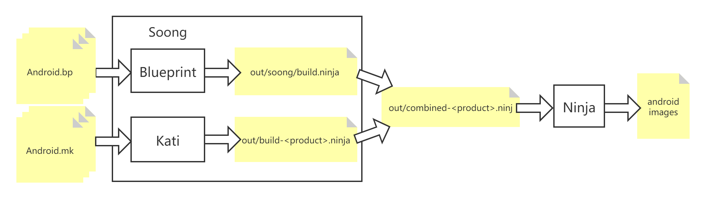

文章标题：**AOSP Build 背后涉及的相关知识汇总**

- 作者：汪辰
- 联系方式：<unicorn_wang@outlook.com> / <wangchen20@iscas.ac.cn>

文章大纲

<!-- TOC -->

- [1. AOSP 构造系统的演进](#1-aosp-构造系统的演进)
- [2. 涉及相关技术简介](#2-涉及相关技术简介)
    - [2.1. Ninja](#21-ninja)
    - [2.2. Soong 和 Blueprint](#22-soong-和-blueprint)
    - [2.3. Kati](#23-kati)

<!-- /TOC -->

# 1. AOSP 构造系统的演进

参考 AOSP 源码 `build/make/README.md`

> This Makefile-based system is in the process of being replaced with [Soong], a
new build system written in Go. During the transition, all of these makefiles
are read by [Kati], and generate a ninja file instead of being executed
directly. That's combined with a ninja file read by Soong so that the build
graph of the two systems can be combined and run as one.

查了一下，历史大致如下：Android 6.0 （包括 6.0）之前采用传统的纯 Makefile 编译。从 
7.0 开始引入 Soong 希望加速 Make，但由于改动太大，所以到目前为止 Soong 并没有全部替代 
make，一直在改进中，直到 10.0 依然还是一个混杂的系统。但 Soong 是主流，相信未来一定会
全面代替 make。

Soong 引入后的编译过程大致下图所示，后面有机会再详细分析具体的细节：

- Soong 的自举（bootstrap）。这个步骤会编译 Soong 的核心组件，从源码开始，无到有创建并
  搭建好 Soong 子系统。
- 目前已经迁移到 Soong 框架的模块都会在自己的模块目录下提供一个叫做 `Android.bp` 文件，
  Soong 会扫描并收集所有的 Android.bp，从而生成 `out/soong/build.ninja` 文件，这部分
  的 bp 文件语法处理涉及 Soong 中的 Blueprint 子模块。
- 目前还没有迁移到 Soong 框架的模块依然按照老规矩提供 `Android.mk` 文件，目前由 Kati 
  程序负责收集所有的 `Android.mk` 并生成 `out/build-<product>.ninja` 文件。
- Soong 负责将两个 ninja 文件组合成一个 `out/combined-<product>.ninja` 文件。
- 以最终的 `out/combined-<product>.ninja` 作为输入执行 Ninja，调用实际的编译工具，
  譬如 gcc 等执行实际的编译操作，完成最终的编译。

# 2. 涉及相关技术简介

## 2.1. Ninja

Ninja （这个词来源于日语的 “忍者”，是不是感觉够 “狠”;-)）是一个致力于速度的小型编译驱动
（类似于 Make）；它去除了 Make 中对编译过程的复杂的条件判断处理，只保留了对构建步骤的描述。

它具备两个主要特点：

1、简单，因为只保留了非常基本的对 build 操作的描述，所以执行 ninja 所花费的时间可以压缩
到极致。但这也意味着对于复杂的项目，ninja 必须依赖于其他 “前端” 程序，一般是采用像 
python 或者 go 等高级语言构造的更高一层的处理工具完成对项目编译步骤的前期处理，生成 
build.ninja 这样的构建步骤描述文件供 ninja 完成最终的编译操作；

2、快速。它的设计目标就是为了更快的编译，所以在功能实现上除了简单，如果和快速的目标有冲突
则优先考虑快速。

Ninja 核心是由 C/C++ 编写的，同时有一部分辅助功能由 python 和 shell 实现。由于其开源性，
所以可以利用 ninja 的开源代码进行各种个性化的编译定制。Ninja 的代码仓库地址：<https://github.com/ninja-build/ninja>。

Android 引入 Ninja 的主要目的就是为了加快编译速度。作为在具体生成 ninja 文件的前端，
Google 自创了 Soong 框架，下一章节介绍。

更详细的对 ninja 的介绍，以后有空再总结吧。

## 2.2. Soong 和 Blueprint

Soong 是 Google 采用 Go 语言搭建的一个项目构建体系，和 ninja 一起用于替代原先的基于 
make 的一套构建体系。Blueprint 和 Soong 都是由 Golang 写的项目。 从 Android Nougat 
开始，`prebuilts/go/` 目录下新增了 Golang 所需的运行环境，在编译时使用。

Soong 的源码在 AOSP 源码目录 `build/soong` 下。

有关 Soong 的介绍可以阅读 AOSP 源码的`build/soong/README.md`。

> The Soong build system was introduced in Android 7.0 (Nougat) to replace Make. 
> It leverages the Kati GNU Make clone tool and Ninja build system component to 
> speed up builds of Android.

就和基于 make 我们需要写 Makefile（在 AOSP 里是 Android.mk） 一样，基于 Soong 我们需
要为每个模块编写 Android.bp 文件来描述组件中各个编译目标（以 module 为单位）之间的依赖
关系和组成。之所以后缀名为 `.bp` 是因为 `Android.bp` 采用了一种叫做 Blueprint 语法，
这种语法格式类似于 [Bazel BUILD files](https://docs.bazel.build/versions/master/be/overview.html)。

对 BP 语法格式的解析由一个独立的 Blueprint 模块完成，Blueprint 的源码在 AOSP 源码的 
`build/blueprint` 目录下。该模块相对比较独立，可以单独编译、使用。任何实际的应用系统都
可以在 Blueprint 的基础上定制自己语法。而在 Android 系统上，这个实际的应用系统就是 Soong。
所以说 Soong 是 Android 强相关的，而 Blueprint 实际上相对独立一些，我们也可以基于 
Blueprint 模块开发自己的应用系统。

因为 Android 在 Blueprint 的基础上定制了 自己的 Soong 系统。所以针对 AOSP，其自身定义
了一套 Android 私有的 BP 语法，可以参考 AOSP 官方文档 
[“Android.bp file format”](https://source.android.google.cn/setup/build#androidbp_file_format) 
了解详细内容。

## 2.3. Kati

其代码在 AOSP 源码的 `build/kati` 目录下。如果相对 Kati 有更多了解，可以阅读 AOSP 源
码下的 `build/kati/README.md` 和 `build/kati/INTERNALS.md` 文件。

大概的情况是 Kati 出现得比 Soong 要早，当初担负了加速 AOSP 编译的重任。

> kati is an experimental GNU make clone.
> The main goal of this tool is to speed-up incremental build of Android.

随着 Soong 的出现以及成熟，Kati 的角色也发生了转变，目前退化为仅用于处理遗留的基于 
make 的 `.mk` 文件，将其转换 ninja 文件。

> Currently, kati does not offer a faster build by itself. It instead converts 
> your Makefile to a ninja file.

注意当前的 Kati 程序是由 C++ 编写的，而非 Google 官方御用的 Go。大致的历史是早期的 
Kati 的确是用 Go 编写的，但因为 Go 的某些 “低效” 原因，开发团队最后还是选择了 C++ :)，
所以目前的 Kati 有时候又叫 CKati。

后面我们主要关心 Soong，对 Kati 的了解就到此为止吧。

