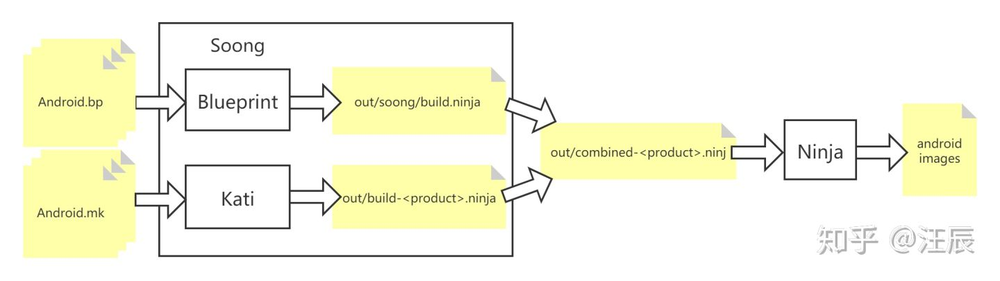
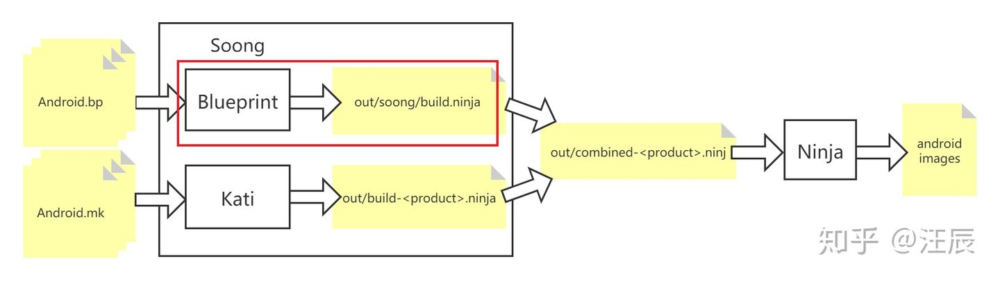
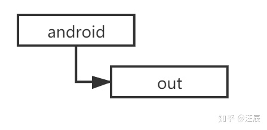
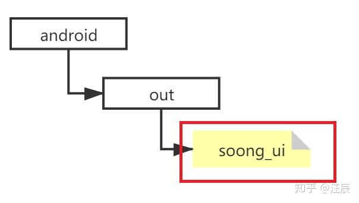
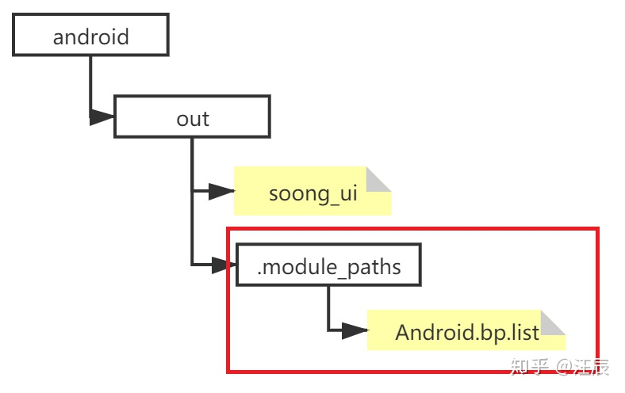
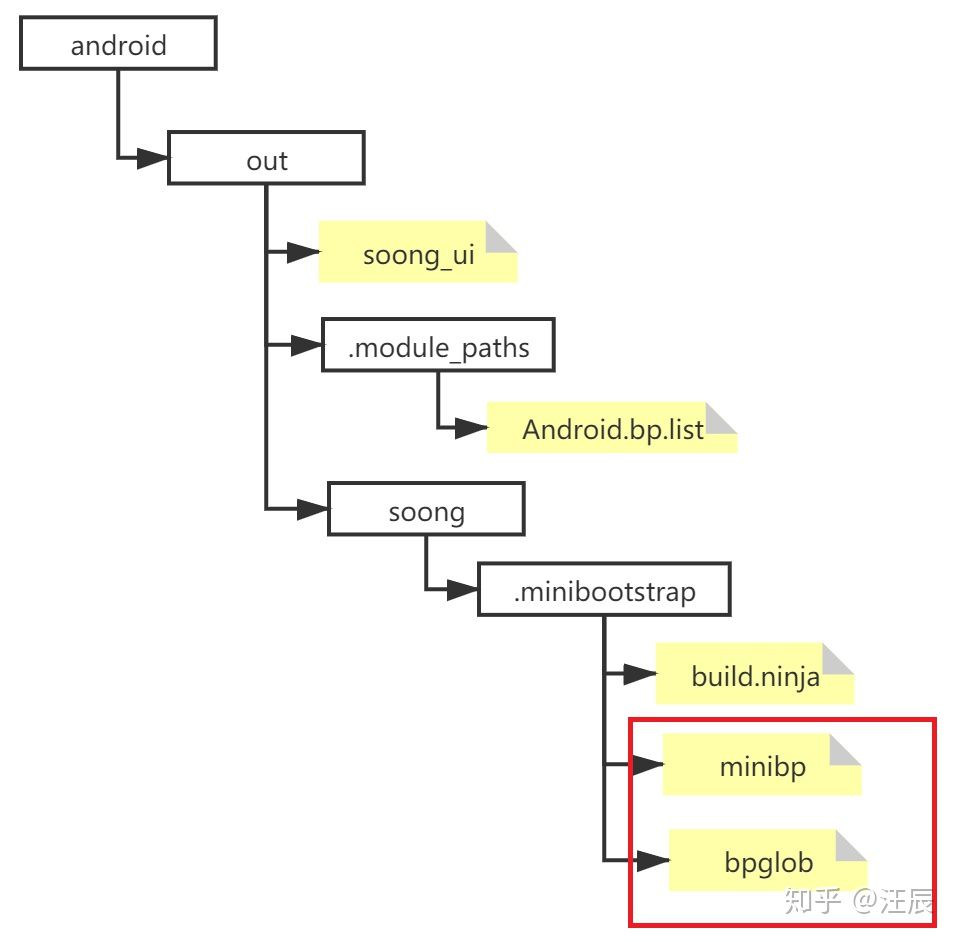
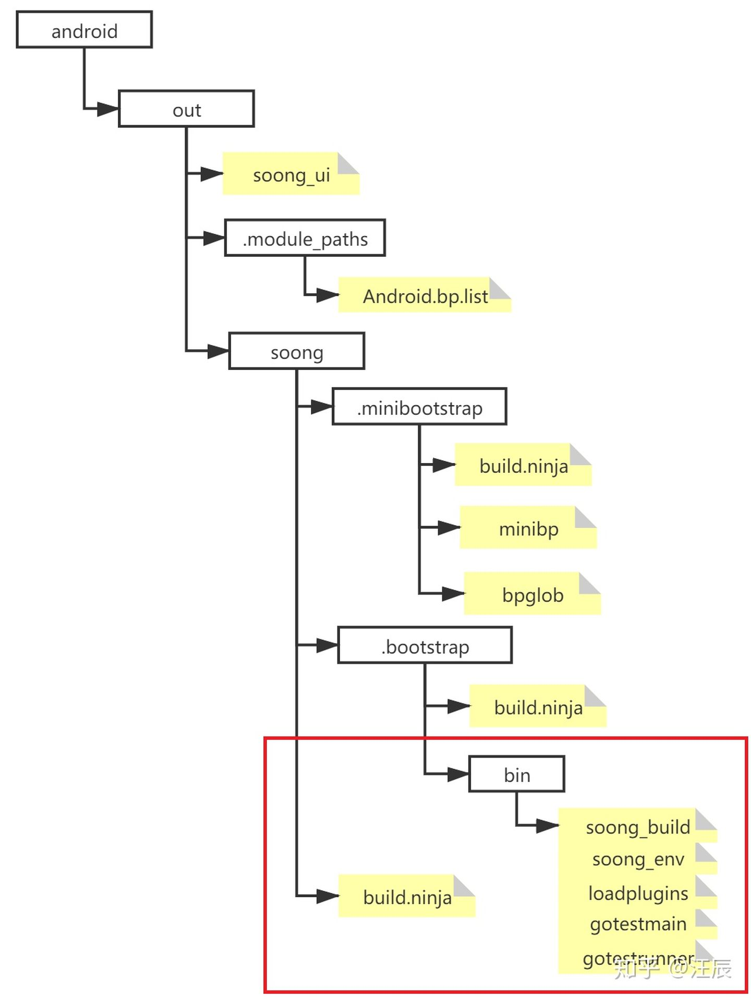

文章标题：**AOSP Soong 创建过程详解**

<!-- TOC -->

- [1. 前言](#1-前言)
- [2. 两个入口，一个结局](#2-两个入口一个结局)
    - [2.1. 入口之一：make](#21-入口之一make)
    - [2.2. 入口之二：m](#22-入口之二m)
- [3. 站在 Soong 的门前并踹上一脚](#3-站在-soong-的门前并踹上一脚)
- [4. 欢迎进入 Soong 的世界](#4-欢迎进入-soong-的世界)
- [5. 一步，两步，从 0 搭建一个 Soong](#5-一步两步从-0-搭建一个-soong)
    - [5.1. 第一阶段 minibootstrap（对应 Blureprint 定义的 Bootstrap stage）](#51-第一阶段-minibootstrap对应-blureprint-定义的-bootstrap-stage)
    - [5.2. 第二阶段 bootstrap](#52-第二阶段-bootstrap)
- [6. 总结](#6-总结)

<!-- /TOC -->

# 1. 前言

前阵子总结了一下 AOSP Build 背后涉及的相关知识，具体可以参考这篇知乎文章 [《AOSP Build 背后涉及的相关知识汇总》](./20201230-android-build-sum.md)。当时总结了 AOSP 引入 Soong 后的编译过程，参考如下图所示：



这个流程图是一个非常 high-level 的描述，特别是对 Soong 是如何将输入的各个模块的 Android.bp 文件转化为 `out/soong/build.ninja` 只是一笔带过了。由于移植的需要，最近还是仔细又看了一下，这篇文章就来把这个过程的细节再扒拉扒拉，顺便记着备忘。

首先提醒大家一下，今天这篇文章关注的是下图中用红色方框圈起来的部分。



# 2. 两个入口，一个结局

大家现在应该已经知道，当前 AOSP 的编译框架（截止我目前实验的 Android 10，貌似 11 也还没有完全清理干净）还是保留了 make 和 soong 两套，后续的 roadmap 会逐渐用 soong 方式替换掉剩余的 make，这样就完全统一为 Soong 了。但至少现在 AOSP 依然存在两套构造的入口，基于 make 的和基于 Soong 的。从后面的分析我们可以看出，在目前最新版本的 AOSP 中，缺省情况下，make 流程内部已经被悄悄替换为 soong 了。

## 2.1. 入口之一：make

我们先简单看一下基于 make 的构造流程。所谓 make 流程，指在操作上输入 `make` 方式的操作模式。当我们在 AOSP 总目录下 make 时，默认寻找当前路径下的 Makefile。看一下这个文件，发现没有什么特别的。

```
$ cat Makefile
### DO NOT EDIT THIS FILE ###
include build/make/core/main.mk
### DO NOT EDIT THIS FILE ###
```

无非就是导入了另一个文件 `build/make/core/main.mk`，看一下这个文件：

<pre>
$ cat build/make/core/main.mk
...
<b>ifndef KATI</b>
...
.PHONY: run_soong_ui
run_soong_ui:
    +@prebuilts/build-tools/$(host_prebuilts)/bin/makeparallel --ninja build/soong/soong_ui.bash --make-mode $(MAKECMDGOALS)

.PHONY: $(MAKECMDGOALS)
$(sort $(MAKECMDGOALS)) : run_soong_ui
    @#empty

<b>else # KATI</b>
... # 旧的 make 流程，已经被 KATI 宏开关整体括起来了
<b>endif # KATI</b>
</pre>

关注一下这里加黑加粗的 **`ifndef ... else ... endif`**。默认版本下 `KATI` 没有定义，所以走的就是 **`ifndef ... else`** 之间的这段流程。

其中 `MAKECMDGOALS` 这个变量是 make 执行时后面的参数赋值，以上写法的效果就是无论我们以任何方式执行 make 的时候都会执行 `run_soong_ui` 这个伪目标（.PHONY），而 `run_soong_ui` 这个伪目标的 action 本质上就是在调用 `build/soong/soong_ui.bash`。这个脚本干了什么我们稍后分析，但从脚本的名字上你是不是感受到了一丝丝 soong 的气息了呢？是的，正是这个脚本实现了 android 从 Make 切换为 Soong，后面就跟传统的 make 没有丁点关系了。有关 `run_soong_ui` 我们在分析正宗的基于 soong 的构造流程中再来看。

## 2.2. 入口之二：m

我们重点来看看标准的基于 soong 构建过程，这个只要是编译过 Android 的同学再熟悉不过的了，标准的构造操作步骤分三步：

```
$ source build/envsetup.sh
$ lunch [<product>-<variant>]
$ m [<options>] [<targets>] [<variable>=<value>...]
```

- 第一步执行 `. build/envsetup.sh`。`build/envsetup.sh` 实际只是一个符号链接，指向 `build/make/envsetup.sh`，这个脚本定义了用于编译的很多命令，包括标准构建流程中的 `m`/`mm`/`mmm` 等，所以 source 这个脚本相当于导入了这些命令函数，为第三步做准备。
- 第二步暂略不表，大致的行为是通过菜单选择定义了一些最基本的环境变量，执行后会打印出来，也是为第三步 m 做准备。
- 第三步执行构造，以执行 `m` 为例，我们来看看定义在 `build/make/envsetup.sh` 中的这个函数：

<pre>
function m()
{
    local T=$(gettop)
    if [ "$T" ]; then
        <b>_wrap_build $T/build/soong/soong_ui.bash --make-mode $@</b>
    else
        echo "Couldn't locate the top of the tree.  Try setting TOP."
        return 1
    fi
}
</pre>

是不是很熟悉，这个函数的核心同样是调用了 `build/soong/soong_ui.bash` 这个脚本。所以说所谓的 “殊途同归”，现在我们知道执行 make 和 m 最后都是同样的结果。而这个 `build/soong/soong_ui.bash` 脚本正是进入 Soong 世界的统一入口。下面我们就不再区分 make 和 m，重点来看看 Soong 的构造过程。

# 3. 站在 Soong 的门前并踹上一脚

严格地说，进入 `build/soong/soong_ui.bash` 的时候 Soong 这个东西除了一堆源码，还没有被创建出来，而 `build/soong/soong_ui.bash` 的主要作用就是先把这个门（UI）给做出来。



看一下 `build/soong/soong_ui.bash` 这个脚本：

<pre>
$ cat build/soong/soong_ui.bash
......
<b>source ${TOP}/build/soong/scripts/microfactory.bash</b>

<b>soong_build_go soong_ui android/soong/cmd/soong_ui</b>

cd ${TOP}
<b>exec "$(getoutdir)/soong_ui" "$@"</b>
</pre>

`soong_ui.bash` 脚本中加粗加黑的三行代码对应着三步核心处理逻辑：

- 第一步：导入 `${TOP}/build/soong/scripts/microfactory.bash`。这个脚本主要做了以下几件事情：

  - 设置 GOROOT 环境变量，指向 prebuild 的 go 编译工具链
  - 定义一些函数，特别地 `soong_build_go()` 这个函数会在第二步中被调用。
  - 导入 `${TOP}/build/blueprint/microfactory/microfactory.bash` 这个脚本，这个脚本中定义了其他辅助函数，特别注意 `build_go()` 这个函数，这个函数会被 `soong_build_go()` 调用执行实际的动作，结果是会根据参数编译 go 源码生成相应的程序，这里简单举个例子理解一下：`build_go soong_ui android/soong/cmd/soong_ui` 就是根据 AOSP 源码树目录 `soong/cmd/soong_ui` 的 package 生成一个可执行程序叫 soong_ui。

- 第二步：`soong_build_go soong_ui android/soong/cmd/soong_ui`。其作用是调用 `soong_build_go` 函数。这个函数有两个参数，从第一步的分析可以知道，`soong_build_go` 实际上是一个对 `build_go()` 函数的调用封装，所以以上语句等价于 `build_go soong_ui android/soong/cmd/soong_ui`。第一参数 `soong_ui` 是指定了编译生成的可执行程序的名字， `soong_ui` 是一个用 go 语言写的程序，也是 Soong 的实际执行程序。在第二个参数告诉 `soong_build_go` 函数，`soong_ui` 程序的源码在哪里，这里制定了其源码路径  `android/soong/cmd/soong_ui`（实际对应的位置是 `build/soong/cmd/soong_ui`）

- 第三步：就是在前述步骤的基础上通过 exec 命令创建进程执行上一步生成的 `soong_ui`, 并接受所有参数并执行，这一步相当于等价替换了原来传统意义上的 `make $@`。举个例子，假如我们调用了 `m libart`，最终等价于调用 `out/soong_ui --make-mode libart`，注意这里的 `--make-mode` 是在 `m` 函数里引入的。

总而言之，`build/soong/soong_ui.bash` 的最终效果就是帮助我们制作出了一个叫做 `soong_ui` 的应用程序，放在 `out` 下。然后一脚将门踹开，执行这个程序，从而进入 Soong 的世界。



到这里，我们可以顺便体会一下 `soong_ui` 是个啥意思，Google 官方的说法，就是 “soong native UI” 的缩写，我猜 `UI` 应该就是 user interface 的缩写吧，表示这是面向 Soong 用户的操作接口。

# 4. 欢迎进入 Soong 的世界

我们来看看 `soong_ui` 这个程序都干了些什么。Soong 子系统都是用 go 语言写的，其主文件是 `build/soong/cmd/soong_ui/main.go`

在 Android 10 中直接使用 `soong_ui` 命令编译 AOSP 时，必需要带下面这三个参数中的一个：

- `--dumpvars-mode`
- `--dumpvar-mode`
- `--make-mode`

没带这些参数就会报错 `The 'soong' native UI is not yet available.`，更要命的是如果什么参数都不带，会直接导致程序崩溃：`panic: runtime error: index out of range`，这绝对是个 bug，还没看 11 里有没有修正。

其中
- `--dumpvars-mode` 和 `--dumpvar-mode` 用于 `dump the values of one or more legacy make variables`
  譬如例子：
  ```
  ./out/soong_ui --dumpvar-mode TARGET_PRODUCT
  aosp_arm
  ```
- `--make-mode` 参数告诉 soong_ui，是正儿八经要开始编译。也就是说 `soong_ui --make-mode` 可以替代原来的 make， 所以后面还可以带一些参数选项。这些参数可能都是为了兼容 make 的习惯。

关键是看 `soong/cmd/soong_ui/main.go` 中的 main 函数。代码不多，为方便解释我就直接在关键代码周围加注释了（加粗加黑标出）。

<pre>
func main() {
	......

	<b>// 定义一个 build.Context 的对象，
	// build.Context 定义参考 `soong\ui\build\context.go`
	// 我理解 Context 对象是一个容器，包含了在 build 过程中可能会涉及的 log，
	// trace 等等辅助对象, 会传给其他函数，负责提供一些辅助功能，譬如
	// 我们可以条用 Context 对象在执行过程中打印日志</b>
	buildCtx := build.Context{ContextImpl: &build.ContextImpl{
		Context: ctx,
		Logger:  log,
		Metrics: met,
		Tracer:  trace,
		Writer:  writer,
		Status:  stat,
	}}

	<b>// 定义了一个 build.Config 类型的 config 对象
	// 这个 Config 对象的类定义参考 `soong\ui\build\config.go` 中的 configImpl,
	// 我们在输入命令行时会带入各种选项，`build.NewConfig()` 这个函数的作用就是
	// 解析这些参数并把它们记录在 config 对象中，这些参数会影响后面 make/m 的行为。</b>
	var config build.Config
	if os.Args[1] == "--dumpvars-mode" || os.Args[1] == "--dumpvar-mode" {
		config = build.NewConfig(buildCtx)
	} else {
		config = build.NewConfig(buildCtx, os.Args[1:]...)
	}

	......

	<b>// build.FindSources 会创建 `out/.module_paths` 这个目录并在这个目录下产生一些
	// 特殊的文件记录。譬如我们比较关心的 `out/.module_paths/Android.bp.list` 这个
	// 文件，打开这个文件我们会看到里面记录了 AOSP 项目中所有 Android.bp 文件的路径
	// 届时后面的操作会根据这里记录的项目对这些 Android.bp 文件进行分析，进而产生
	// 最终的 build.ninja 文件。</b>
	f := build.NewSourceFinder(buildCtx, config)
	defer f.Shutdown()
	build.FindSources(buildCtx, config, f)

	<b>// 前面的准备工作做好后，这里开始执行实质的构造动作，我们看到这里调用了一个关键的
	// 构造函数 `build.Build()`。这里传进入三个主要参数：buildCtx 和 config（这是
	// 前面创建的上下文对象和配置信息），还有一个 toBuild 是用来控制整个 Build 流程
	// 关键步骤的，我们可以通过这个第三个参数有选择地执行某些步骤，缺省是 BuildAll，
	// 也就是走一个完整的流程）</b>
	if os.Args[1] == "--dumpvar-mode" {
		dumpVar(buildCtx, config, os.Args[2:])
	} else if os.Args[1] == "--dumpvars-mode" {
		dumpVars(buildCtx, config, os.Args[2:])
	} else {
		......
		build.Build(buildCtx, config, toBuild)
	}
}
</pre>

进入 `build.Build()` 之前的 Soong 系统状态如下，和前面相比也就是多了一些数据文件，譬如 `out/.module_paths/Android.bp.list`。



看到这里读者可能会疑问，难道赫赫有名的 Soong 只是这么一个 `soong_ui` 么？答案当然不是，如果打个不恰当的比喻，`soong_ui` 只是 Soong 的大门，也就是说流程走到这里，我们进了 Soong 的大门，但会发现 Soong 的世界里除了一个大门（`out/soong_ui`）目前啥也没有。而 `build.Build()` 函数要做的事情就是从无到有将整个 Soong 系统构建起来。

# 5. 一步，两步，从 0 搭建一个 Soong

最后一步就是执行 `build.Build()` 这个核心函数, 这个函数定义在 `soong\ui\build\build.go`, 略去所有辅助的步骤，只保留核心的步骤，大家会发现和我们最早描述的下图是一样的，这里再贴一下，方便大家对照着理解。

<pre>
func Build(ctx Context, config Config, what int) {
	......

	<b>runSoong(ctx, config)</b>

	......

	<b>runKatiBuild(ctx, config)</b>

	......
	// Write combined ninja file
	<b>createCombinedBuildNinjaFile(ctx, config)</b>

	......

	<b>runNinja(ctx, config)</b>

	......
}
</pre>

对 Build 这个核心函数的分析来看，其实最重要的是 `runSoong()`, 这个函数为最终最终 `runNinja()` 生成了 build.ninja 文件。`runSoong()`这个函数定义在 `soong\ui\build\soong.go`，下面我们来重点看一下这个函数。

函数不算长，我这里不想直接贴代码，我们可以重点关注这个函数中的类似 `ctx.BeginTrace(XXX, "YYY")` 的地方，基本上就是在标注重点步骤。

<pre>
func runSoong(ctx Context, config Config) {
	......
   	<b>ctx.BeginTrace(metrics.RunSoong, "blueprint bootstrap")</b>
	......
   	<b>ctx.BeginTrace(metrics.RunSoong, "minibp")</b>
	......
	<b>ctx.BeginTrace(metrics.RunSoong, "bpglob")</b>
	......
	<b>ninja("minibootstrap", ".minibootstrap/build.ninja")</b>
	......
	<b>ninja("bootstrap", ".bootstrap/build.ninja")</b>
}
</pre>

我这里一共标注了五行比较重要的代码，可以分成两个阶段，前四行属于第一阶段，Soong 术语上称为 minibootstrap；第五行属于第二阶段，Soong 术语上称为 bootstrap。之所以叫 bootstrap，意思就是从无到有创建 Soong。

我这里一共标注了五行比较重要的代码，之间的关系具体可以参考 AOSP 源码树中 Blueprint 的文档 `build/blueprint/bootstrap/doc.go` 的 "The Bootstrapping Process" 章节。这里的五个步骤可以对应到 Blueprint 官方定义的 **bootstrap** 和 **primary** 两个阶段（顺便说一下第三个称之为 **main** 阶段，不在本文的介绍范围内）。其中代码中的前四行属于第一阶段，在 Soong 系统里其术语又称之为 **minibootstrap**；第五行属于第二阶段，Soong 术语上称为 **bootstrap**。注意这里稍微有些混淆，我们后面主要以 Soong 的术语为主，必要时会对应看一下 Blueprint 的术语。这里我们可以回忆一下，Blueprint 和 Soong 的关系，Blueprint 是一个公共模块， Soong 利用 Blueprint 搭建了 AOSP 的自动化构建系统。

之所以叫 bootstrap，意思就是从无到有创建 Soong。下面我们就来仔细看看 minibootstrap 和 bootstrap 这两个阶段分别做了些什么。

## 5.1. 第一阶段 minibootstrap（对应 Blureprint 定义的 Bootstrap stage）

整个 minibootstrap 阶段包含关键的四步

- 第一步 **`ctx.BeginTrace(metrics.RunSoong, "blueprint bootstrap")`**:

  执行 `build/blueprint/bootstrap.bash -t` 这个脚本，创建 `out/soong/.minibootstrap/` 目录并在这个目录下创建一系列文件，其中最重要的是 `out/soong/.minibootstrap/build.ninja` 这个文件。这个文件很关键，是构造下一个阶段 bootstrap 的 ninja build 文件。此时的 Soong 系统状态如下：

  

- 第二步 **`ctx.BeginTrace(metrics.RunSoong, "minibp")`**：

  利用 blueprint 的 microfactory 创建 minibp 这个可执行程序，minibp 的源码在 `build/blueprint/bootstrap/minibp`，这个应用程序也是用于构造第二阶段 bootstrap 的工具。

- 第三步 **`ctx.BeginTrace(metrics.RunSoong, "bpglob")`**：

  同上第二步，也是利用 blueprint 的 microfactory 创建另一个可执行程序 bpglob，其源码在 `build/blueprint/bootstrap/bpglob`。第二步和第三步做完后的 Soong 系统状态如下：

  

- 第四步：**`ninja("minibootstrap", ".minibootstrap/build.ninja")`**：

  调用 ninja，根据上面第一步生成的 `out/soong/.minibootstrap/build.ninja`，驱动第二步和第三步生成的 minibp/bpglob 这些程序构造第二阶段 bootstrap。最终的结果是生成了另一个 ninja 的 build 文件 `out/soong/.bootstrap/build.ninja`

  对照 `verbose.log`，输出了这么一段命令，可供参考：

  ```
  out/soong/.minibootstrap/minibp -t -l out/.module_paths/Android.bp.list -b out/soong -n out -d out/soong/.bootstrap/build.ninja.d -globFile out/soong/.minibootstrap/build-globs.ninja -o out/soong/.bootstrap/build.ninja Android.bp
  ```

  

## 5.2. 第二阶段 bootstrap

这个阶段对应 `runSoong()` 函数中的这一步：**`ninja("bootstrap", ".bootstrap/build.ninja")`**

调用 ninja，根据 minibootstrap 阶段生成的 `out/soong/.bootstrap/build.ninja`，逐步进行构造。

整个 bootstrap 阶段中首先会在 bin 目录下也生成了本阶段需要的一些工具程序：
```
$ ls ./out/soong/.bootstrap/bin
gotestmain  gotestrunner  loadplugins  soong_build  soong_env
```

注意其中的 `soong_build` 这个程序，按照官方的定义（具体参考文档 `build/blueprint/bootstrap/doc.go`），它就是整个 bootstrapping 流程 (包括我们这里给大家介绍的 minibootstrap 和 bootstrap 两个阶段) 最后生成的所谓 "primary builder"。它含有针对整个 AOSP 的工程的完整的构造逻辑，在 bootstrap 的最后一步会调用 `soong_build` 这个程序最终创建生成了针对整个 AOSP 项目的 ninja 的 build 文件 `out/soong/build.ninja`。

参考 `verbose.log` 中最后一行可以对应一下：

```
[117/117] out/soong/.bootstrap/bin/soong_build -t -l out/.module_paths/Android.bp.list -b out/soong -n out -d out/soong/build.ninja.d -globFile out/soong/.bootstrap/build-globs.ninja -o out/soong/build.ninja Android.bp
```

`out/soong/.bootstrap/bin/soong_build` 会逐个扫描前期记录在 `out/.module_paths/Android.bp.list` 中的 Android.bp 文件，所以这包含了整个 AOSP 项目的所有模块，所以这里生成的 `out/soong/build.ninja` 这个文件超级巨大，谨慎打开！



# 6. 总结

前面啰里啰唆讲了太多，这里直接回放一下整个过程吧，直观感受一下 AOSP 是如何从无到有构建了自己的构造系统 Soong。当然这个远远不是结局，接下来等待你的将是真正漫长的 AOSP 编译过程，对应 Blueprint 的定义就是所谓的 **main stage**！enjoy it ;)

- 初始状态

  

- Soong 的大门 soong_ui 盖起来了

  

- 进入 build.Build() 之前的样子

  

- 构造第一阶段 minibootstrap 所需要的 `build.ninja`

  

- 创建第一阶段 minibootstrap 需要的工具 `minibp/bpglob`

  

- 构造第二阶段 bootstrap 所需要的 `build.ninja`

  

- 第二阶段 bootstrap 的 输出，至此 Soong 系统搭建结束

  

