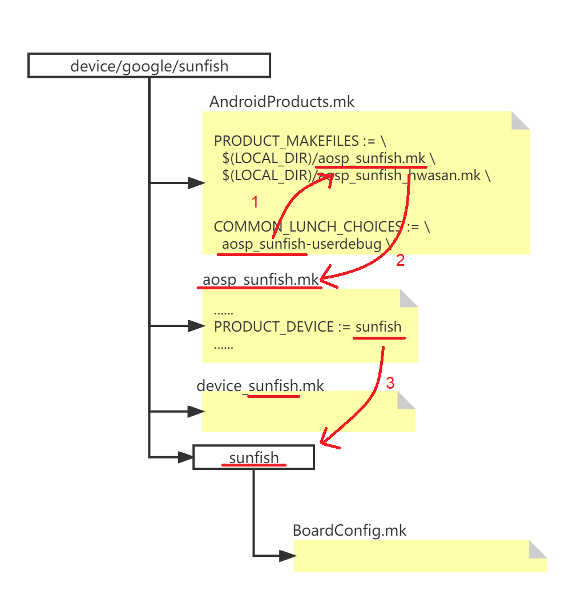
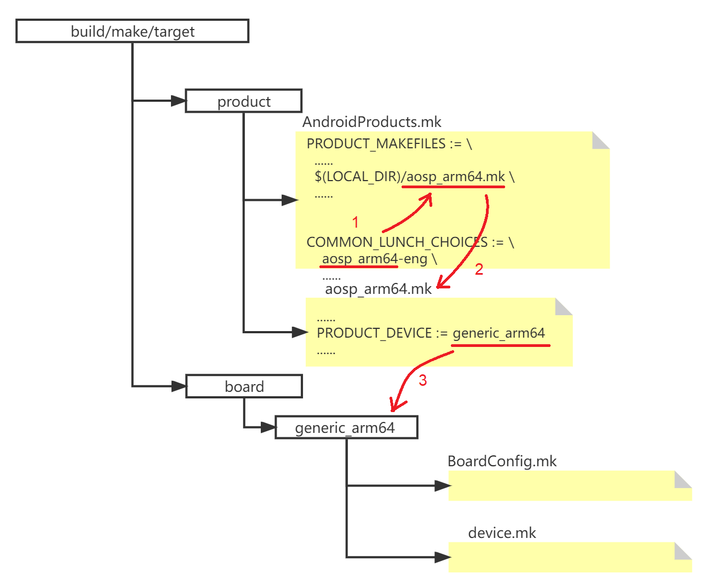
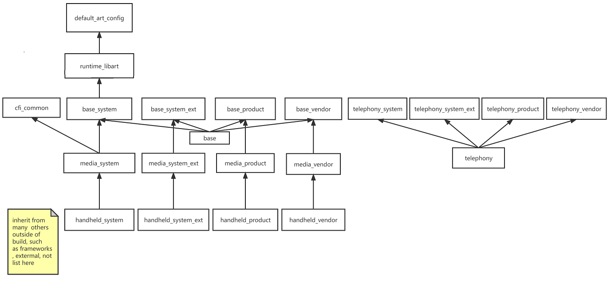

文章标题：**如何为 AOSP 的 lunch 新增一个菜单项**

- 作者：汪辰
- 联系方式：<unicorn_wang@outlook.com> / <wangchen20@iscas.ac.cn>

文章大纲

<!-- TOC -->

- [1. 如何定义一个普通的产品](#1-如何定义一个普通的产品)
- [2. lunch 过程中 Android Build System 是如何识别产品的](#2-lunch-过程中-android-build-system-是如何识别产品的)
- [3. 如何定义一个 GSI 产品](#3-如何定义一个-gsi-产品)
- [4. 总结：](#4-总结)
- [5. 附录：产品定义的继承关系](#5-附录产品定义的继承关系)

<!-- /TOC -->

注：本文内容基于 AOSP 12 (tag: `android-12.0.0_r3`)

AOSP 的 Product 分为两种：

- 普通 Product
- GSI Product

# 1. 如何定义一个普通的产品

本章节是对以下参考文章的内容整理。
- [Adding a New Device](https://source.android.google.cn/setup/develop/new-device)
- [Understanding 64-bit Builds](https://source.android.google.cn/setup/develop/64-bit-builds)


所谓普通的 Product，指的是在 AOSP 源码树中 `device` 目录下定义的一些产品，涉及如下概念：

- 首先，我们看一下 `device` 目录下的 **目录分层安排** 如下：`device/<company-name>/<device-name>` , 譬如 `device/google/sunfish/`。但注意这个 "device-name" 级别的目录一般不会只对应一个我们所谓的 Product，而是一个 Product family。在这个目录下我们会看到有一个 `AndroidProducts.mk` 文件，全路径是 `device/google/sunfish/AndroidProducts.mk`。  我们可以看看这个 `device/google/sunfish/AndroidProducts.mk` 文件：
  ```makefile
  PRODUCT_MAKEFILES := \
    $(LOCAL_DIR)/aosp_sunfish.mk \
    $(LOCAL_DIR)/aosp_sunfish_hwasan.mk \

  COMMON_LUNCH_CHOICES := \
    aosp_sunfish-userdebug \
  ```
  `PRODUCT_MAKEFILES` 定义了 `device/google/sunfish/` 这个目录下定义的 Proudct 的列表，一个 Product 是 `aosp_sunfish`, 另一个是 `aosp_sunfish_hwasan`。这也是上面我理解 "device-name" 级别的目录对应的是一个 Product family 的概念。
  
  这个 `AndroidProducts.mk` 文件是个入口文件，定义了我们在 lunch 的菜单列表中显示的 product list 名称以及每个 product 对应的自己的 **product 配置文件** 的位置。

- **product 配置文件**。PRODUCT 的概念可以理解成是在 DEVICE 更上一层的概念，譬如基于一款 board/device 定义的一款产品，譬如针对不同的国家。地区和运营商的定义。官方文档中的解释是:
  
  > Create a product definition makefile to create a specific product based on the device. 
  
  例如：`device/google/sunfish/aosp_sunfish.mk`。 

  我们查看这个文件发现其内容定义更侧重软件模块，主要是在描述该产品对应的文件系统 image 中会包含哪些模块和软件包等。

  在实际的产品开发中，产品的变化可能会十分丰富，所以有时候我们还会定义一些 base product，定义一些公共的产品特性，然后在这个基础上再定义派生的产品, 具体采用的就是形如 `call inherit-product` 的方法。这些产品定义存在继承的特性，具体的继承关系，可以参考本文附录部分。

  > A common method is to create a base product that contains features that 
  > apply to all products, then create product variants based on that base product. 
  > For example, two products that differ only by their radios (CDMA versus GSM) 
  > can inherit from the same base product that doesn't define a radio.`

  产品的 mk 文件中可以定义的 `PRODUCT_*` 的变量。参考 [官方文档定义][5]，AOSP 源码中所有的 `PRODUCT_*` 可以参考 `build/make/core/product.mk`。 特别注意一个系统预定义的变量 `PRODUCT_DEVICE`。
  
  > PRODUCT_DEVICE：Name of the industrial design. This is also the board name, 
  > and the build system uses it to locate BoardConfig.mk.`。

  我们来简单看看 `device/google/sunfish/aosp_sunfish.mk`，注意其中定义的 `PRODUCT_DEVICE := sunfish`
  
  ```makefile
  #
  # All components inherited here go to system image
  #
  $(call inherit-product, $(SRC_TARGET_DIR)/product/core_64_bit.mk)
  $(call inherit-product, $(SRC_TARGET_DIR)/product/generic_system.mk)

  # 省略 ......

  PRODUCT_MANUFACTURER := Google
  PRODUCT_BRAND := Android
  PRODUCT_NAME := aosp_sunfish
  PRODUCT_DEVICE := sunfish
  PRODUCT_MODEL := AOSP on sunfish
  ```

  因为每个 product 的定义内容比较多，不是一个 `aosp_sunfish.mk` 能说清楚，所以 `PRODUCT_DEVICE` 这个变量告诉我们需要到一个叫做 `sunfish` 的目录中去找所有和 `aosp_sunfish` 相关的配置文件。而完整的路径则是通过将 `device/google/sunfish/AndroidProducts.mk` 出现的 `$(LOCAL_DIR)` 和 `PRODUCT_DEVICE` 的值进行拼接而成，即 `$(LOCAL_DIR)/sunfish`。我们可以称该目录为 **"product 配置目录"**。

  对于另一个产品 `aosp_sunfish_hwasan`，我们似乎找不到其对应的自己的 "product 配置目录"，这是因为 `aosp_sunfish_hwasan` 复用了 `aosp_sunfish` 的 "product 目录"。这一点我们可以通过 `device/google/sunfish/aosp_sunfish_hwasan.mk` 看出来，`aosp_sunfish_hwasan` 复用了 `aosp_sunfish` 的 `PRODUCT_DEVICE`，但是 redefine 了 `PRODUCT_NAME`。

  ```makefile
  ......
  $(call inherit-product, device/google/sunfish/aosp_sunfish.mk)
  PRODUCT_NAME := aosp_sunfish_hwasan
  ......
  ```

- 在 **"product 配置目录"**，譬如 `$(LOCAL_DIR)/sunfish` 下我们会发现更多和 Product 相关的配置文件，譬如 **板级配置文件** `BoardConfig.mk` 即：`device/google/sunfish/sunfish/BoardConfig.mk`，这个文件中定义了更多 board 级别的编译构建变量定义。

  ```makefile
  # 省略 ......
  include device/google/sunfish/BoardConfig-common.mk
  ```

  感兴趣的可以去看看 `BoardConfig-common.mk` 这个文件。


- 除了 **"product 目录"** 下的 `BoardConfig.mk` 外，还有一些 DEVICE 级别的配置文件（`device.mk`），用来声明设备级别的信息。譬如 `device/google/sunfish/device-sunfish.mk`。这些文件并不是放在各个 **"product 目录"** 下，我理解是整个 product family 公用的配置信息而已，我这里先不展开，以后如果发现比较重要，或者的确是我理解上有偏差再补充。这种文件的排放似乎也很随意，只要能找到即可，在 `aosp_sunfish` 这个 product 例子中，就是直接在 `device/google/sunfish/aosp_sunfish.mk` 中继承引用了。
  
  ```makefile
  ......
  $(call inherit-product, device/google/sunfish/device-sunfish.mk)
  ......
  ```

# 2. lunch 过程中 Android Build System 是如何识别产品的

要进一步深刻理解如何为 AOSP 增加一个产品定义，除了上面介绍的概念外，还可以了解一下当我们输入 lunch 命令后，AOSP 是如何根据我们指定的 product-variant 找到 product 的相关配置文件的流程入手。理解了这个流程，再结合上面对此过程中涉及的文件的内容以及关键的变量定义，基本上就可以明白如何为 AOSP 增加一个产品定义了。

我们导入 `build/envsetup.sh` 后，就可以调用 lunch 命令。该命令的执行逻辑如下：

- 如果不指定 product-variant，则 lunch 内部会调用 `print_lunch_menu`，这个函数内部会触发 `out/soong_ui --dumpvar-mode COMMON_LUNCH_CHOICES`，打印输出我们看到的 product entry list
- 如果我们指定了 product，或者我们选择了 product 后，lunch 继续执行 `build_build_var_cache`，此时获取我们选择的 product 的配置信息。

更详细的处理可以参考另外两篇笔记
- [《envsetup.sh 中的 lunch 函数分析》][1]
- [《代码走读：对 soong_ui 的深入理解》][2]

AOSP 根据我们指定的 product-variant 找到 product 的相关配置文件的流程步骤大致如下：

- step 1：假设我们输入了 `lunch aosp_sunfish-userdebug`，则 build 系统会根据 `-` 将 product-variant 分离为两个部分，前半部分是 `TARGET_PRODUCT`，即这里的 `aosp_sunfish`, 后半部分是 `TARGET_BUILD_VARIANT`, 即这里的 `userdebug`。有关 "build variant" 的定义，参见 [这里][4]。

- step 2：lunch 命令会提前扫描所有 `device` 目录下的 `AndroidProducts.mk` 文件并或者这些文件的文件系统路径列表，并在这些文件中搜索是否定义了 `PRODUCT_MAKEFILES` 这个变量，如果定义了则根据 step 1 中获得 `TARGET_PRODUCT`，即字符串 `aosp_sunfish` 去匹配，根据 `TARGET_PRODUCT` 找到对应的 product 的 mk 文件。详细的介绍可以参考另一篇笔记 [《代码走读：对 soong_ui 的深入理解》][2] 中有关 `get-all-product-makefiles` 函数 的介绍。

  这里对应的文件就是 `device/google/sunfish/AndroidProducts.mk`。我们可以看看这个文件的内容：
  ```makefile
  PRODUCT_MAKEFILES := \
    $(LOCAL_DIR)/aosp_sunfish.mk \
    $(LOCAL_DIR)/aosp_sunfish_hwasan.mk \

  COMMON_LUNCH_CHOICES := \
    aosp_sunfish-userdebug \
  ```

  其中
  - `$(LOCAL_DIR)` 对应的是 `AndroidProducts.mk` 所在的目录路径 `device/google/sunfish`。
  - 和 `aosp_sunfish`（`TARGET_PRODUCT`）匹配成功的就是 `device/google/sunfish/aosp_sunfish.mk` 这个文件，
  - `COMMON_LUNCH_CHOICES` 中的字符串项会出现在当我们只输入 `lunch` 命令而没有指定 product-variant 时会显示的菜单项目列表中。

- step 3：找到的 `device/google/sunfish/aosp_sunfish.mk` 我们称之为 **Product 配置文件**，该文件中有一个重要的变量 `PRODUCT_DEVICE`。譬如 `PRODUCT_DEVICE := sunfish`。我们根据 step 2 中得到的 `$(LOCAL_DIR)`，拼上 `sunfish`，即可得到 `aosp_sunfish` 对应的 **Product 目录** `device/google/sunfish/sunfish`。在该目录下有 Product 对应的 board 级配置文件 `BoardConfig.mk`。

形象如下图所示，帮助理解整个过程。



# 3. 如何定义一个 GSI 产品

device 目录下的那些产品对应的是具体的一个厂家的设备，Google 还提供了一些官方的 Generic System Images，有关 GSI 可以参考 [Generic System Images](https://source.android.google.cn/setup/build/gsi)。

这些 product 和具体的硬件没有关系，不包含 vendor 相关的内容，只含有 aosp 官方源码下的软件。

这些 GSI product 的定义和我们定义一个普通设备 product 的过程是一致的，以 arm64 为例，和我们前面举例的产品 sunfish 对应关系简单总结如下：

|                 | 普通产品定义                                   | GSI 产品定义                                          |
|-----------------|-----------------------------------------------|------------------------------------------------------|
|Product entry    | `device/google/sunfish/AndroidProducts.mk`    |`build/make/target/product/AndroidProducts.mk`        |
|PRODUCT Config   | `device/google/sunfish/aosp_sunfish.mk`       |`build/make/target/product/aosp_arm64.mk`             |
|Board/BSP config | `device/google/sunfish/sunfish/BoardConfig.mk`|`build/make/target/board/generic_arm64/BoardConfig.mk`|
|DEVICE Config    | `device/google/sunfish/device-sunfish.mk`     |`build/make/target/board/generic_arm64/device.mk`     |

注意不像普通产品，针对每款产品，譬如 sunfish，我们会在 device 的厂家（google）下新建一个独立的产品目录（sunfish）。所有的 GSI 产品的配置文件统一放在 `build/make/target` 下的 product 和 board 子目录下。

参考和对比以上关系，我们可以尝试为 riscv64 增加一款 GSI 产品

- 首先修改入口 `build/make/target/product/AndroidProducts.mk`，在 `COMMON_LUNCH_CHOICES` 中增加一项 `aosp_riscv64-eng`，这意味着 `TARGET_PRODUCT` 是 `aosp_riscv64`，`TARGET_PRODUCT_VARIANT` 是 `eng`。

- 然后增加一个对应的 product 的 mk 文件 `aosp_riscv64.mk`，放在 `build/make/target/product/` 下。同时将该文件的全路径添加到 `build/make/target/product/AndroidProducts.mk` 文件中的 `PRODUCT_MAKEFILES` 变量中。注意这个文件的名字要和 `TARGET_PRODUCT` 的一样。这样 aosp 的构建系统就会找到它了。

  aosp_riscv64.mk 的内容可以参考 aosp_arm64.mk，其中关键要知名如下内容：
  ```
  PRODUCT_NAME := aosp_riscv64
  PRODUCT_DEVICE := generic_riscv64
  PRODUCT_BRAND := Android
  PRODUCT_MODEL := AOSP on RISCV64
  ```

- 注意 `PRODUCT_DEVICE` 的值用于对应找到该产品对应的 BOARD 配置内容，为此我们还要在 `build/make/target/board` 下新建一个同名的 `generic_riscv64` 的目录，基本上一个 ARCH 就占一个目录，从 `generic_arm64` 下复制一份并改名。这个目录下一般需要这么几个文件：

  - README
  - device.mk : board 级别的 mk 文件
  - system.prop
  - BoardConfig.mk：这个 BoardConfig.mk 比较重要，这个文件中定义了更多 board 级别的编译构建变量定义。譬如：
    ```
    TARGET_ARCH := riscv64
    TARGET_ARCH_VARIANT := riscv64
    TARGET_CPU_VARIANT := generic
    TARGET_CPU_ABI := riscv64
    ```

主要就是以上修改，此时运行 lunch 应该就会看到 `aosp_riscv64-eng` 这一项，选择这一项后如果成功会打印出以下 product 配置信息。
```bash
============================================
PLATFORM_VERSION_CODENAME=REL
PLATFORM_VERSION=10
TARGET_PRODUCT=aosp_riscv64
TARGET_BUILD_VARIANT=eng
TARGET_BUILD_TYPE=release
TARGET_ARCH=riscv64
TARGET_ARCH_VARIANT=armv8-a
TARGET_CPU_VARIANT=generic
TARGET_2ND_ARCH=arm
TARGET_2ND_ARCH_VARIANT=armv8-a
TARGET_2ND_CPU_VARIANT=generic
HOST_ARCH=x86_64
HOST_2ND_ARCH=x86
HOST_OS=linux
HOST_OS_EXTRA=Linux-4.15.0-108-generic-x86_64-Ubuntu-18.04.4-LTS
HOST_CROSS_OS=windows
HOST_CROSS_ARCH=x86
HOST_CROSS_2ND_ARCH=x86_64
HOST_BUILD_TYPE=release
BUILD_ID=QQ3A.200605.002.A1
OUT_DIR=out
============================================
```

和普通的产品类似，基于以上文件，AOSP 就可以根据我们在 lunch 过程中选择的 product-variant 找到 product 的相关配置文件。步骤大致如下图所示，大家可以自行描述：



# 4. 总结：

AOSP 中的产品定义文件是一些名为 `AndroidProducts.mk` 的文件，这些文件分两大类，存放在两个地方：
- 一类是 GSI 产品，由 Google 统一维护，统一存放在 `build/target/product/AndroidProducts.mk` 中。
- 一类是普通产品，由各个 vendor 维护，存放在 `device` 目录下，一般会按照 vendor 分目录分别存放。

`AndroidProducts.mk` 文件中关键是定义两个变量:

- `PRODUCT_MAKEFILES`: 定义真正的 **product 配置文件** 的路径，每个文件的命名必须符合 `$TARGET_PRODUCT.mk`
- `COMMON_LUNCH_CHOICES`: 定义可以出现在 lunch 菜单项中的条目，每个条目的命名格式是 `$TARGET_PRODUCT-$TARGET_BUILD_VARIANTS`

**product 配置文件**，其内容定义更侧重软件模块，主要是在描述该产品对应的文件系统 image 中会包含哪些模块和软件包等。**product 配置文件** 中我们比较关心的是其定义的 `PRODUCT_DEVICE` 这个变量，这个变量定义了 **"product 配置目录"**。

**"product 配置目录"** 中我们比较关心的典型文件包括 **板级配置文件** `BoardConfig.mk`。这个文件中定义了更多 board 级别的编译构建变量定义。


# 5. 附录：产品定义的继承关系

具体一个产品中要包含哪些 module，这个是需要用户自己定义的。有关 module 的定义方法，我总结了一篇笔记在 [《为 AOSP 添加一个 module》][3]。

AOSP 的 Build System 中为了方便我们定义 product，提高复用性，提供了一套 `inherit-product`/`inherit-product-if-exists` 的方法，同时也提供了一套预先定义好的 prodcut 父类供我们继承使用。这些预定义的 product 父类模板在 `build/make/target/product` 目录下，我简单整理了一下如下图所示：



分为两组，每一组按照 system/system_ext/prduct/vendor 区分，这是按照安装的 partition 分。

- 一组是和 telephony 有关的 packages, 包含了 `list of modules that are specific to products that have telephony hardware`

- 另一组是和除了 telephony 之外相关的 packages。非 telephony 部分的继承树大致为：`base->media->handheld`
  - base: Base modules and settings
  - media: contents for media-capable devices (non-wearables)
  - handheld: contents for a generic phone or tablet device.


[1]:./20211026-lunch.md
[2]:./20211102-codeanalysis-soong_ui.md
[3]:./20220908-add-app-in-aosp.md
[4]:https://source.android.google.cn/docs/setup/develop/new-device#build-variants
[5]:https://source.android.google.cn/setup/develop/new-device#prod-def