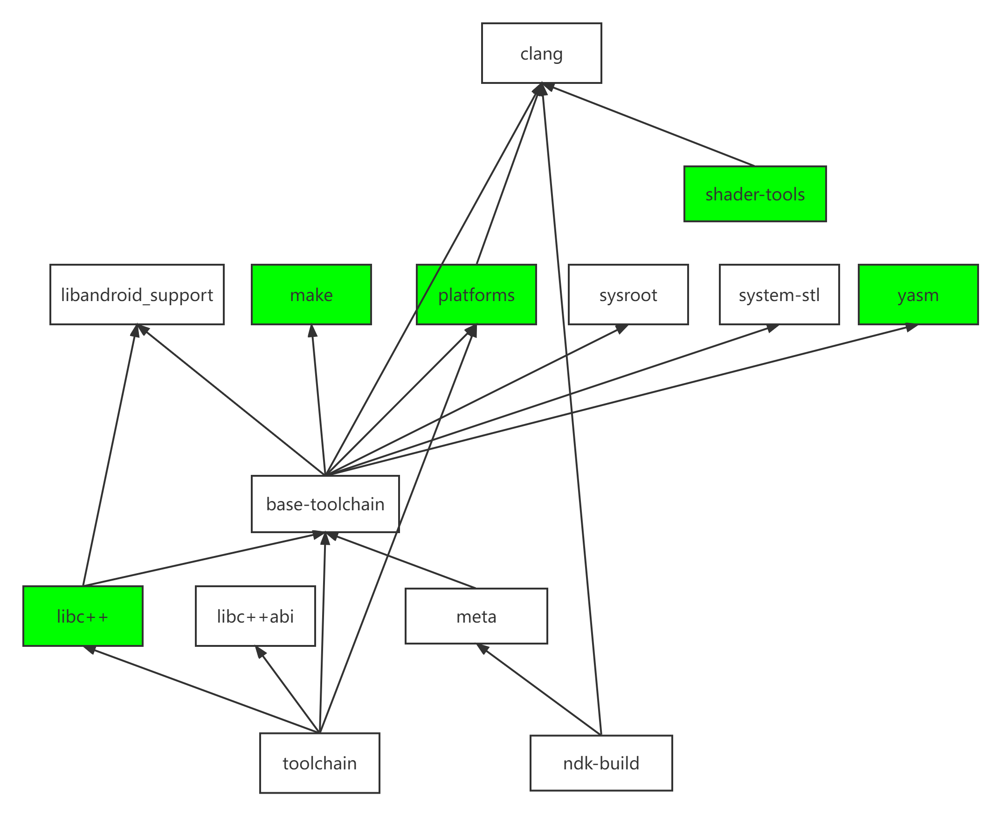
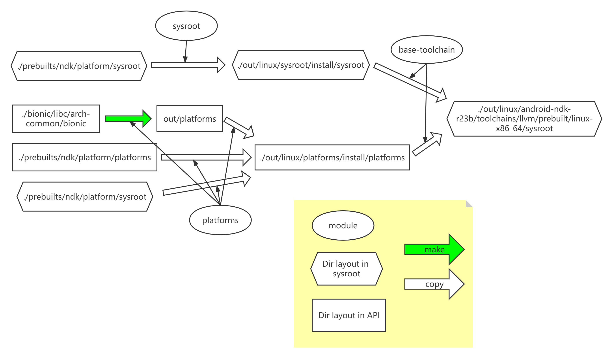

文章标题：**Android NDK 的构建分析**

- 作者：汪辰
- 联系方式：<unicorn_wang@outlook.com> / <wangchen20@iscas.ac.cn>

文章大纲

<!-- TOC -->

- [1. 什么是 Android NDK](#1-什么是-android-ndk)
- [2. 构建 NDK 发布包](#2-构建-ndk-发布包)
	- [2.1. 建立 python 构建环境](#21-建立-python-构建环境)
	- [2.2. 构建 master-ndk](#22-构建-master-ndk)
	- [2.3. 构建一个特定的 NDK release 版本](#23-构建一个特定的-ndk-release-版本)
- [3. NDK 发布包构建系统浅析](#3-ndk-发布包构建系统浅析)
- [4. NDK 发布包构建系统深入分析](#4-ndk-发布包构建系统深入分析)
	- [4.1. llvm 工具链的构建](#41-llvm-工具链的构建)
		- [4.1.1. clang](#411-clang)
		- [4.1.2. sysroot](#412-sysroot)
	- [4.2. C++ STL 的构建](#42-c-stl-的构建)
		- [4.2.1. libc++](#421-libc)
		- [4.2.2. system 运行时库](#422-system-运行时库)

<!-- /TOC -->


# 1. 什么是 Android NDK

有关什么是 Android NDK，可以参考另一篇笔记：[《深入理解 Android NDK》][3]。

只有深刻理解了 Android NDK 的组成构造，才能有良好的基础理解 NDK 发布包的构建步骤。

# 2. 构建 NDK 发布包

## 2.1. 建立 python 构建环境 

先建立 python 构建环境，参考 ["Building the NDK"][1] 的 "Python environment setup"，先安装 Poetry。我的系统环境是 Ubuntu 20.04。参考 参考 [Poetry 官方文档][2], 需要至少 Python 3.7 以上版本。

```bash
$ curl -sSL https://install.python-poetry.org | python3 -
Retrieving Poetry metadata

# Welcome to Poetry!

This will download and install the latest version of Poetry,
a dependency and package manager for Python.

It will add the `poetry` command to Poetry's bin directory, located at:

/home/wangchen/.local/bin

You can uninstall at any time by executing this script with the --uninstall option,
and these changes will be reverted.

Installing Poetry (1.3.1): Done

Poetry (1.3.1) is installed now. Great!

You can test that everything is set up by executing:

`poetry --version`
```

我实验时安装的 poetry 版本是 1.3.1。

## 2.2. 构建 master-ndk

然后下载 ndk 版本：

```bash
$ mkdir master-ndk
$ cd master-ndk
$ repo init -u https://android.googlesource.com/platform/manifest -b master-ndk
$ repo sync
```

如果访问 google 仓库受限，也可以换成国内的 mirror，譬如 tsinghua, 将上面的第 3 步换成如下：

```bash
$ repo init -u https://mirrors.tuna.tsinghua.edu.cn/git/AOSP/platform/manifest -b master-ndk
```

下载完后，进入 ndk 子目录，将项目配置为使用我们下载的 prebuilt 的 Python 而不是使用系统自带的 python。然后确保在每次执行过 repo sync 后同步依赖。

```bash
$ cd ndk
$ poetry env use ../prebuilts/python/linux-x86/bin/python3
Creating virtualenv ndk-IVJjSDzg-py3.10 in /home/wangchen/.cache/pypoetry/virtualenvs
Using virtualenv: /home/wangchen/.cache/pypoetry/virtualenvs/ndk-IVJjSDzg-py3.10
$ poetry install
```

开始构建，推荐使用 poetry 启动一个新的 shell 来运行 python。

```bash
$ poetry shell
Spawning shell within /home/wangchen/.cache/pypoetry/virtualenvs/ndk-IVJjSDzg-py3.10
wangchen@p9-plct:/aosp/wangchen/dev-ndk/master-ndk/ndk$ . /home/wangchen/.cache/pypoetry/virtualenvs/ndk-IVJjSDzg-py3.10/bin/activate
(ndk-py3.10) wangchen@p9-plct:/aosp/wangchen/dev-ndk/master-ndk/ndk$
```

此时可以执行 checkbuild.py 来开启构建了
```bash
(ndk-py3.10) wangchen@p9-plct:/aosp/wangchen/dev-ndk/master-ndk/ndk$ python checkbuild.py
Machine has 52 CPUs
Building modules: base-toolchain black canary-readme changelog clang cpufeatures gtest libc++ libc++abi libshaderc make meta mypy native_app_glue ndk-build ndk-build-shortcut ndk-gdb ndk-gdb-shortcut ndk-lldb-shortcut ndk-stack ndk-stack-shortcut ndk-which ndk-which-shortcut ndk_helper platforms pylint python-packages pythonlint readme shader-tools simpleperf source.properties sysroot system-stl toolbox toolchain vulkan wrap.sh yasm
Build finished
Building tests...

PASS 27216/27448 FAIL 0/27448 SKIP 232/27448

build: PASS 1484/1672 FAIL 0/1672 SKIP 188/1672

device: PASS 628/672 FAIL 0/672 SKIP 44/672

libc++: PASS 25104/25104 FAIL 0/25104 SKIP 0/25104


Installed size: 1653 MiB
Finished successfully
Build: 0:02:46
Packaging: 0:00:00
Testing: 0:09:08
Total: 0:11:54
```

可以运行 `python ./ndk/checkbuild.py --help` 查看帮助获取常用选项。

如果想缩短构建时间，可以跳过构建后执行的自动化测试，例子：`python ./ndk/checkbuild.py --no-build-tests`。

构建完后可以执行 exit 退出 poetry 的 shell
```bash
(ndk-py3.10) wangchen@p9-plct:/aosp/wangchen/dev-ndk/master-ndk/ndk$ exit
exit
wangchen@p9-plct:/aosp/wangchen/dev-ndk/master-ndk/ndk$
```

## 2.3. 构建一个特定的 NDK release 版本

以截至本文最新的 r25b 为例。

如果你已经下载了 master-ndk，则可以直接切换到 ndk-r25b 去。方法很简单，在刚才的基础上输入如下 repo 命令

```bash
$ cd master-ndk
$ repo init -b ndk-r25b
$ repo sync
```

或者直接新建一个目录下载 r25b 对应的仓库：

```bash
$ mkdir ndk-r25b && cd ndk-r25b
$ repo init -u https://android.googlesource.com/platform/manifest -b ndk-r25b
$ repo sync
```
如果访问 google 仓库受限，也可以换成国内的 mirror，譬如 tsinghua, 将上面的第二步换成如下：

```bash
$ repo init -u https://mirrors.tuna.tsinghua.edu.cn/git/AOSP/platform/manifest -b ndk-r25b
```

后面的构建命令和处理 master-ndk 操作是一样的，这里就不赘述了。

关于如何编译 ndk 发布包，可以读一下下载的仓库中的 `./ndk/docs/Building.md` 文档，或者访问在线文档 ["Building the NDK"][1]。

构建完成后，在 `./out` 目录下就会生成多个目录，其中 `./out/android-ndk-r25b` 下就是我们做出来的 ndk package （和从 Android NDK release 网站下载的是一样的），虽然仔细看会发现 `./out/android-ndk-r23b` 只是一个符号链接，它实际指向了 `./out/linux/android-ndk-r25b`。其他目录可以认为都是构建过程中间生成的临时目录。

# 3. NDK 发布包构建系统浅析

代码基于 ndk-r23b。假设 repo 顶层目录路径为 `<REPO>`。

假设构建完后生成的 NDK 发布包的目录 `<REPO>/out/android-ndk-r23b`布局如下，没有完全展开，部分目录展开到两级：


**[图一] 发布包目录结构**

我们读一下 `<REPO>/ndk/checkbuild.py` 这个 python 脚本的内容，发现这只是一个封装，实际的构建脚本是 `<NDK>/ndk/ndk/checkbuild.py` 

所有的构建动作通过 module 组织起来。每个 module 定义了一组动作，用于构建和安装前面 **图一** 上的某个部分。譬如 "LibAndroidSupport" 就是一个 module 所对应的类，这些类都继承自 `ndk.builds.Module`。这个类的构建特别简单，下面的代码实际上表达的意思就是将 `<REPO>/ndk/sources/android/support` 这个目录复制到 `<REPO>/out/linux/android-ndk-r23b/sources/android/support` 这个目录下就完成了对 LibAndroidSupport 这个 module 的构建和安装。

```python
class LibAndroidSupport(ndk.builds.PackageModule):
    name = 'libandroid_support'
    path = Path('sources/android/support')
    src = NDK_DIR / 'sources/android/support'
```

如果我们要单独指定构建和安装一个特定的 module，可以输入如下命令，以 LibAndroidSupport 为例，它的名字是 "libandroid_support"。

```bash
$ ./ndk/checkbuild.py --module libandroid_support
```

module 的名字可以看代码中 `class LibAndroidSupport` 的属性 `name`。我们也可以在运行 `./ndk/checkbuild.py --help` 时看到所有 module 的名字。

所有的 module 组织在一个 `ALL_MODULES` 数组中。

module 和 module 之间存在依赖关系，所谓的依赖就是说如果 module A 依赖于 module B，则我们如果指定构建 module A，则会自动带着构建 module B，并且确保 module B 先于 module A 构建。

module 之间的依赖关系，具体可以看 module 对应的类的 deps 属性定义。这里简单总结了一下一些主要 module 之间的依赖关系，图中箭头从依赖方指向被依赖方。绿色的 module 表示构建这个 module 时既有编译动作也有安装动作。白色 module 则只有安装动作。 


**[图二] NDK module 依赖关系**


# 4. NDK 发布包构建系统深入分析

回头看一下 **[图一] 发布包目录结构**，我们主要来分析一下 toolchain（llvm 部分）和 C++ STL 的构建，其他目录下的内容大部分都是简单的类似 LibAndroidSupport 的复制操作，而且也不是 NDK 发布包的核心内容，就不在这里赘述了。

## 4.1. llvm 工具链的构建

llvm 工具链的内容从安装的角度来看可以分为两大块
- clang
- sysroot

llvm 工具链做好后会安装在 `<REPO>/out/linux/android-ndk-r23b/toolchains/llvm/prebuilt/linux-x86_64` 下，由于这个路径比较长，为描述方便，我们定义个符号 `<NDK_TOOLCHAIN_LLVM>` 来表示它。

`NDK_TOOLCHAIN_LLVM=./out/linux/android-ndk-r23b/toolchains/llvm/prebuilt/linux-x86_64`

### 4.1.1. clang

clang 就是 android 里目前替代了 gcc 用来编译 c/c++ 的编译器。这部分是 llvm 工具链的核心部分，从 **图二** 上我们也可以看出很多其他 module 会依赖于它，主要是这些 module 的编译会用到我们安装好后的 clang。所以 clang 也是第一个需要执行的 module。

其构建过程相对比较简单，不涉及编译，只涉及安装，具体参考 `Clang::install()`。就是将预构建（prebuilt）的 clang 从 `<REPO>/prebuilts/clang/host/linux-x86/<CLANG_VERSION>` 拷贝到 `<NDK_TOOLCHAIN_LLVM>`。

需要值得注意的是，对 clang 的安装还有一个附加的动作，就是用 `<REPO>/prebuilts/clang/host/linux-x86/<CLANG_VERSION>/runtimes_ndk_cxx` 这个目录下的内容覆盖替换 `<NDK_TOOLCHAIN_LLVM>/lib64/clang/12.0.8/lib/linux` 下的 clang rt 库。这个原因是因为在基于 NDK 采用 clang 编译 c/c++ 源码时采用的那些 libclang_rt 库和用 clang 构建 aosp 系统（google 的文档也称其为 platform）所用的 libclang_rt 库不是一套。具体原因还要再看看。

### 4.1.2. sysroot

sysroot 指 clang 工具链中用于交叉编译时的逻辑系统目录，最终被安装在 `<NDK_TOOLCHAIN_LLVM>/sysroot`。

整个 sysroot 的构建和安装过程相对复杂，用下面这个图来辅助认识：


**[图三] ndk 中 toolchain 所使用的 sysroot 的构建和安装过程**

整个 sysroot 由两部分组成，一个是库的头文件部分，安装在 `<NDK_TOOLCHAIN_LLVM>/sysroot/usr/include`，走的是 **图三** 中上半部分的流程。另一个是库的二进制部分，安装在 `<NDK_TOOLCHAIN_LLVM>/sysroot/usr/lib`，其安装走的是 **图三** 的下半部分的流程。

sysroot 的头文件部分的安装分两个阶段，第一个阶段由 "sysroot" module 负责完成，它会首先
将 `<REPO>/prebuilts/ndk/platform/sysroot` 的内容完整地复制到 `<REPO>/out/linux/sysroot/install/sysroot` 这个临时安装路径下。同时会根据实际的版本信息自动生成一个 `<REPO>/out/linux/sysroot/install/sysroot/usr/include/android/ndk-version.h` 文件。第二个阶段由 "base-toolchain" module 负责完成，将 `<REPO>/out/linux/sysroot/install/sysroot` 进一步拷贝到 `<NDK_TOOLCHAIN_LLVM>/sysroot` 下，同时还会生成 `<NDK_TOOLCHAIN_LLVM>/sysroot/usr/local/include`。

注意在 sysroot 头文件部分的安装流程中：
- 三个目录从左到右，都是和 `<NDK_TOOLCHAIN_LLVM>/sysroot` 的目录布局安排是一致的。**图三** 中都用六边形表示。
- 在 **图三** 中上半部分的流程，会在最终的 `<NDK_TOOLCHAIN_LLVM>/sysroot` 下将 prebuilt 里的二进制部分也拷贝过来。但是不用担心，因为在实际的执行过程中，**图三** 中下半部分的执行是在上半部分之后，所以这部分多拷贝过来的二进制内容在下半部流程中会在对应 "base-toolchain" module 的操作中被覆盖掉。

下面我们来看看 sysroot 的二进制部分的构建和安装。sysroot 的二进制部分最终会被安装到 `<NDK_TOOLCHAIN_LLVM>/sysroot/usr/lib` 下，为方便起见，我们把整个路径记为 `<NDK_PLATFORMS>`。之所以叫 PLATFORMS, 感觉 ndk 里习惯把 sysroot的二进制部分叫这个。

`<NDK_PLATFORMS>` 目录的组织安排分两级：第一级 ARCH（分四个：`arm-linux-androideabi`/`aarch64-linux-android`/`i686-linux-android`/`x86_64-linux-android`），第二级再按照 API 分（注意 32 位的 arm 和 i686 是从 16 到 31，而 64 位的 aarch64 和 x86_64 是从 21 到 31），这种分级的思路体现的思想就是 32 位的 arm 和 i686 系统上 Android 的 Platform API 最小支持 16，而 64 位的 aarch64 和 x86_64 系统上最小支持的 Platform API 从 21 开始。

```
out/android-ndk-r23b/toolchains/llvm/prebuilt/linux-x86_64/sysroot/usr/lib
├── aarch64-linux-android
│   ├── 21
|   |   ├── crtbegin_dynamic.o
|   |   ├── ......
|   |   ├── libandroid.so
|   |   ├── ......
|   |   ├── libc.a
|   |   ├── ......
|   |   └── libz.so
│   ├── 22
│   ├── ......
│   ├── 31
│   ├── libc.a
│   ├── ......
│   └── libz.a
├── arm-linux-androideabi
│   ├── 16
│   ├── ...
│   ├── 31
│   ├── libandroid_support.a
│   ├── libc.a
│   ├── ......
│   └── libz.a
├── i686-linux-android
│   ├── 16
│   ├── ......
│   ├── 31
│   ├── libandroid_support.a
│   ├── ......
│   └── libz.a
└── x86_64-linux-android
    ├── 21
    ├── ......
    ├── 31
    ├── libc.a
    ├── ......
    ├── libcompiler_rt-extras.a
    ├── libc++_shared.so
    ├── libc++_static.a
    ├── ......
    └── libz.a
```
**图四 sysroot 的二进制部分安装目录布局**

sysroot 的二进制部分的安装同样分两个阶段，第一个阶段由 "platforms" module 负责完成。第一个阶段中文件会被安装到一个中间临时路径下。我们把这个目录记为 `NDK_PLATFORMS_IMMEDIATE=./out/linux/platforms/install/platforms`。值得注意的是该路径下的目录组织形式和最终安装路径 `NDK_PLATFORMS` 下的不同，采用的方式是第一级为 API，第二级是该 API 下支持的 ARCH。譬如 21 之前的 API 只支持 32 位系统，所以只有 `arch-arm` 和 `arch-x86`，而 21（包括 21）之后的 API 既支持 32 位系统又支持 64 位系统，所以有 `arch-arm` / `arch-x86` / `arch-arm64` / `arch-x86_64`。每个 ARCH 目录下又是一个小的类似 sysroot 的布局。这么做和最终的目录布局其实内容是一样的，只是表达形式不同，为什么会这样，是历史使然还是什么原因呢？

```
out/linux/platforms/install/platforms
├── android-16
│   ├── arch-arm/usr/lib
|   |   ├── crtbegin_dynamic.o
|   |   ├── crtbegin_so.o
|   |   ├── crtbegin_static.o
|   |   ├── crtend_android.o
|   |   └── crtend_so.o
│   └── arch-x86
├── android-17
├── ......
├── android-21
│   ├── arch-arm
│   ├── arch-arm64
│   ├── arch-x86
│   └── arch-x86_64
├── android-22
├── ......
└── android-31
```

**图五 .  NDK_PLATFORMS_IMMEDIATE 目录布局**

无论如何，之所以要搞这个中间目录，还有一个原因是因为 sysroot 的二进制部分由三个部分组成，来自不同的地方，我们需要在 `NDK_PLATFORMS_IMMEDIATE` 中将它们合并在一起，组装完毕后我们再一起复制到 `NDK_PLATFORMS` 去。

具体二进制部分由以下三个部分组成，我们分别来看看它们是怎么生成和组装的：

- 第一部分是 c runtime object files：譬如 `crtbegin_so.o`/`crtend_so.o` 这些 `.o` 文件。这些目标文件是现场制作的（区分于 prebuilt）。源文件来自 `./bionic` 仓库。制作需要使用 ndk 自己安装在 `NDK_TOOLCHAIN_LLVM` 下的 clang，注意在制作诸如 `crtbegin_dynamic.o` 过程中会使用 ndk 自己的 `./ndk/sources/crt/crtbrand.S`，而没有用 `./bionic` 仓库中的 `crtbrand.S`。这些 `.o` 文件的编译由 "platforms" module 负责完成，编好后放在 `./out/platforms` 下。注意 `./out/platforms` 这个目录的安排和 `NDK_PLATFORMS_IMMEDIATE` 类似。
  
  "platforms" module 在完成以上编译工作后会将这些 obj 文件从 `./out/platforms` 拷贝（安装）到 `NDK_PLATFORMS_IMMEDIATE` 下。

- 第二部分为动态库，指的是 **图三** 中的那些 `.so` 文件。"platform" module 负责将它们从 `./prebuilts/ndk/platform/platforms/` 下直接拷贝到 `NDK_PLATFORMS_IMMEDIATE`。具体代码可以参考 `./ndk/ndk/checkbuild.py` 中 `class Platforms` 的 `install()` 部分注释带有 `Copy shared libraries from prebuilts/ndk/platform/platforms.`。
 
- 第三部分为静态库，指的是 **图三** 中的那些 `.a` 文件。"platform" module 负责将它们从 `./prebuilts/ndk/platform/sysroot` 下下直接拷贝到 `NDK_PLATFORMS_IMMEDIATE`。和动态库的复制类似，唯一的不同是静态库对不同的 API 都是一样的，所以对每个 API 复制了一份。

以上第一阶段完成后进入第二阶段，第二个阶段由 "base-toolchain" module 负责完成。工作比较单纯，就是将所有的二进制文件从 `NDK_PLATFORMS_IMMEDIATE` 的 lib 目录中拷贝到 `NDK_PLATFORMS` 中去。

## 4.2. C++ STL 的构建
  
有关 libc++ 的介绍可以阅读 Android 官网介绍：<https://developer.android.com/ndk/guides/cpp-support>

NDK C++ 运行时支持两种库：

- libc++：libc++ 是 LLVM 的 C++ 标准库，自 Lollipop 以来 Android 操作系统便一直使用该库，并且从 NDK r18 开始成为 NDK 中唯一可用的 STL， 本文后面简称 libc++。
- system 运行时库：指的是 `libstdc++.so`。请勿将该库与 GNU 的 `libstdc++` 混淆。Android 系统中的 libstdc++ 只实现了 new 和 delete。Android 利用 LLVM 的 libc++ 来提供完整的 C++ 标准库功能。

下面我们来分别看一下这两个库在 ndk 中是如何制作的和安装的。

### 4.2.1. libc++

和 libc++ 有关的工作分三部分：

- 第一部分是 libc++ 库的二进制部分的编译和安装。这部分工作由 "libc++" 这个 module 完成。第一个阶段是编译，编译生成的内容在 `./out/libcxx`，而且会针对 aosp 支持的所有 ARCH（arm64-v8a/armeabi-v7a/x86/x86_64）分别构建 `libc++_shared.so`。编译时需要依赖 "clang" module 和 "ndk-build"/"ndk-build-shortcut" module，原因就是需要利用这些工具程序做编译链接。此外 "libc++" module 还依赖于 "libandroid_support" module，这是因为构建 `libc++_shared.so` 时会依赖于 `libandroid_support.a`，目前只对 16 位的 x86 和 armeabi-v7a 会存在这个依赖，因此在构建 `libc++_shared.so` 之前我们需要用 "libandroid_support" module 先将一些 android support 相关的源码安装到 `./out/linux/android-ndk-r23b/sources/android/support` 下去，而这些源码的源是位于 `./toolchain/llvm-project/libcxx` 下。

  编译完成后就可以安装了，安装内容也是分两部分，一部分是 libc++ 的相关头文件，这部分内容从 `./toolchain/llvm-project/libcxx/include/` 拷贝复制到 `./out/linux/android-ndk-r23b/sources/cxx-stl/llvm-libc++/include`。还有一部分就是二进制的库文件，从第一阶段编译输出的地方，也就是 `./out/libcxx/libs` 下拷贝复制到 `./out/linux/android-ndk-r23b/sources/cxx-stl/llvm-libc++/libs/` 就好了。

- 和 libc++ 有关的第二部分工作是 libc++ 的 abi 部分的源码，参考代码 `./ndk/ndk/checkbuild.py` 中 Libcxxabi 这个 class 完成。其工作就是简单的复制，从 `./toolchain/llvm-project/libcxxabi` 拷贝复制到 `./out/linux/android-ndk-r23b/sources/cxx-stl/llvm-libc++abi`，这些代码会被 ndk 的用户在构建应用时使用。

- 第三部分工作和 toolchain 有关，我们还需要将做好的 C++ STL （包括 libc++ 和 libc++abi）安装到 clang 工具链的 sysroot 下去。这部分工作参考代码 `./ndk/ndk/checkbuild.py` 中 Toolchain 这个 class，也就是 "toolchain" 这个 module。所以这个 module 会依赖于 "libc++"/"libc++abi"/"platforms" 这些 module 的完成。"toolchain" 这个 module 的名字让人迷惑，但阅读代码的注释，解释了 ""toolchain"" 和 "base-toolchain" 之间的关系：
  > BaseToolchain installs the core of the toolchain. This module installs the STL to that toolchain.

### 4.2.2. system 运行时库

这部分内容同样分二进制部分和头文件部分。

二进制内容即 "libstdc++.so" 随 "platform" module 的工作会被安装到 sysroot 的 lib 下去。

而头文件部分，对应的安装代码是 `./ndk/ndk/checkbuild.py` 中 SystemStl 这个 class。其工作就是简单的复制，从 `./ndk/sources/cxx-stl/system` 拷贝复制到 `./out/linux/android-ndk-r23b/sources/cxx-stl/system`。我们看一下 `./ndk/sources/cxx-stl/system` 下的内容，发现主要的就是 include 目录下这些 STL 封装的头文件。

[1]:https://android.googlesource.com/platform/ndk/+/master/docs/Building.md
[2]:https://python-poetry.org/docs/
[3]:./20221214-what-is-ndk.md