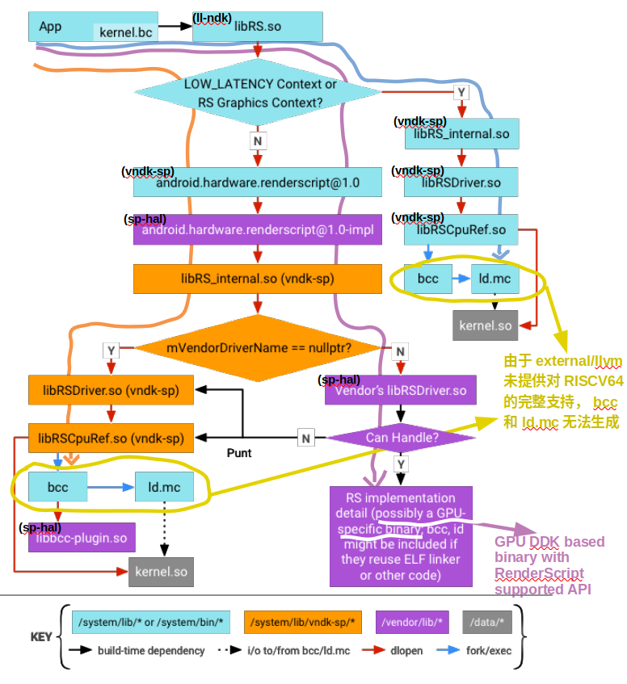
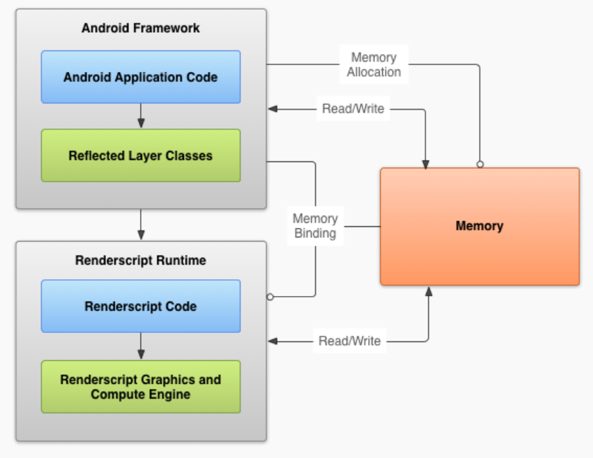
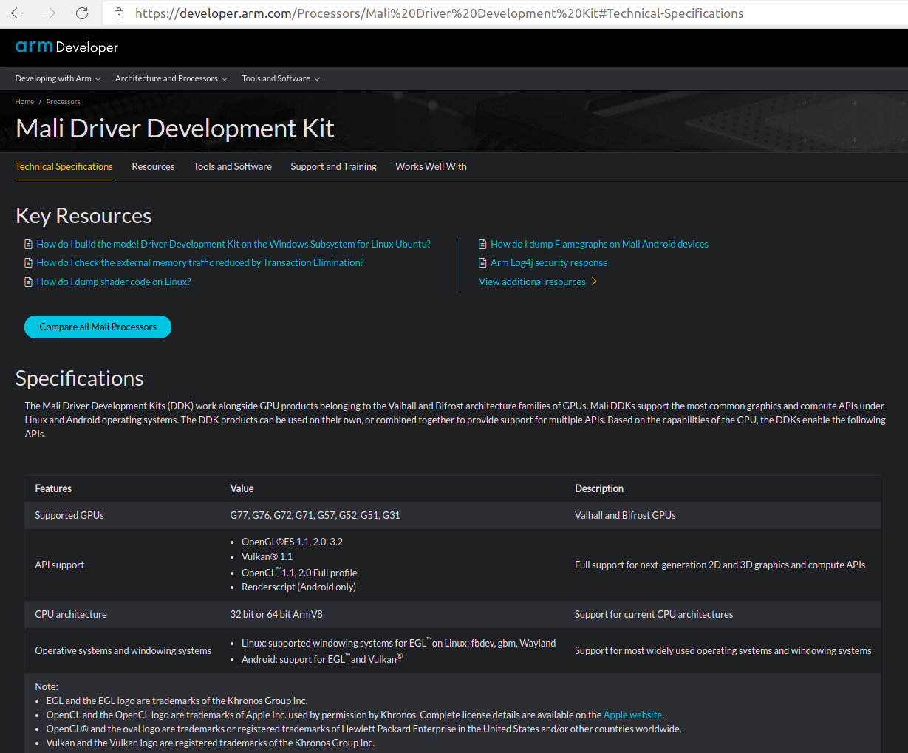

文章标题：**AOSP 12 移植 RISCV64 过程中针对 RenderScript 的适配方案分析**

- 作者：汪涛
- 联系方式：<tao.wang.22@outlook.com>

文章大纲

<!-- TOC -->

- [1. RenderScript 框架总览](#1-renderscript-框架总览)
- [2. RenderScript 工作原理](#2-renderscript-工作原理)
- [3. RenderScript 迁移计划](#3-renderscript-迁移计划)
- [4. RenderScript 移植分析](#4-renderscript-移植分析)
- [5. RenderScript 移植提案](#5-renderscript-移植提案)
- [6. 参考文档](#6-参考文档)

<!-- /TOC -->

# 1. RenderScript 框架总览

**[图一] RenderScript 框架总览**

(图片来源：https://source.android.com/devices/architecture/vndk/renderscript?hl=zh-cn)

RenderScript 框架的全面讲解请参见链接 <https://source.android.com/devices/architecture/vndk/renderscript?hl=zh-cn>。本文关心如下部分：
- “从 Android 12 开始，RenderScript API 已被弃用。它们将继续正常运行，但 AOSP 预计设备和组件制造商会逐渐停止提供硬件加速支持。为充分利用 GPU 加速功能，AOSP 建议停止使用 RenderScript“。
- “RenderScript 对于专注于图像处理、计算摄影或计算机视觉的应用来说尤其有用。“  
  根据该表述并结合移植过程中的实践，发现如 `frameworks/base/core/java/android/hardware/Camera.java` 中有使用 RenderScript API 。也因为 camera 这样的设备在其代码中还在使用，所以 Android 12 还保留着 RenderScript ，没做完整的代码移除。
- “一个进程中有两组 RenderScript 内部库的实例。一组用于 CPU 备用路径，直接来源于 `/system/lib`；另一组用于 GPU 路径，来源于 `/system/lib/vndk-sp`。“  
  该表述说明 RenderScript 脚本工作的两种方式。在移植中，可以根据需要考虑支持最小集还是全集。

# 2. RenderScript 工作原理

**[图二] RenderScript 系统结构**

(图片来源：https://stuff.mit.edu/afs/sipb/project/android/docs/guide/topics/renderscript/compute.html)

RenderScript 运行时在原生级别运行，仍然需要与 Android VM 通信，因此 RenderScript 应用程序的设置方式与纯 VM 应用程序不同。使 RenderScript 的应用程序仍然是在 VM 中运行的传统 Android 应用程序，但要为程序中需要它的部分编写 RenderScript 代码。无论使用它做什么，RenderScript 都保持平台独立，因此不必针对多个架构（例如， ARM 、 x86）多次编码。  

RenderScript 系统采用控制和从属架构，其中低级 RenderScript 运行时代码由运行在虚拟机 (VM) 中的高级 Android 系统控制。Android VM 仍然保留对内存管理的所有控制权，并将其分配的内存绑定到 RenderScript 运行时，因此 RenderScript 代码可以访问它。Android 框架对 RenderScript 进行异步调用，调用被放入消息队列并尽快处理。图二 显示了 RenderScript 系统的结构。  

RenderScript 的三个主要功能组件：  
- Offline Compiler (llvm-rs-cc)：将 RenderScript 的 *.rs 脚本转换为可移植的位码并利用 Clang (即 `external/clang`) 将信息和功能反射回 Java Layer ；  
- Online JIT Compiler (libbcc)：基于 LLVM (即 `external/llvm`) 将可移植的位码转译为目标硬件 (CPU/GPU/DSP/...) 的机器码；  
- 运行时库 (libRS.so)：管理来自于 Android VM (ART/Dalvik) 侧的 *.rs 脚本执行请求；  

# 3. RenderScript 迁移计划

RenderScript 迁移计划的全面讲解请参见链接 <https://developer.android.com/guide/topics/renderscript/migrate?hl=zh-cn>。本文关心如下部分：  
- “为充分利用 GPU 加速功能，我们建议将 RenderScript 脚本迁移到跨平台 Vulkan API。即使您不迁移，脚本也会继续运行，但这些脚本可能会针对 CPU（而非 GPU）执行，具体取决于驱动程序是否可用。”
- “尽管 RenderScript 内建函数在 RenderScript 弃用后将继续正常运行，但它们只能针对 CPU（而非 GPU）执行。”

如上表述说明 Android 官方后续只提供对基于 CPU（而非 GPU）工作路径的 RenderScript 应用的有限支持。当然这种支持不包含 RISCV，只是针对 ARM 、 x86 这些原来已支持的。  

# 4. RenderScript 移植分析

基于 android-12.0.0_r3 分支代码，RenderScript 对 RSICV64 的支持没有被提供。若要考虑 RenderScript 对 RSICV64 的支持，需首先考虑 `external/llvm` 和 `external/clang` 对 RSICV64 的支持。  
`external/llvm` 是一个特殊的存在，它只为 RenderScript 服务而区别于 `external/llvm-project`。这一点可以从 <https://android.googlesource.com/platform/prebuilts/clang/host/linux-x86/+/master/README.md> 中明确。 `external/clang` 的当前版本为 clang-3289846 且根据 `build/soong/cc/config/global.go` 中的注释可知 `external/clang` 的版本与 `external/llvm` 有对应和绑定关系。  
但是由于目前 `external/llvm` 的版本依然是基于 llvm 3.8 拉出的一个分支，且没有跟随 llvm 主线的后续演进引入对 RISCV 的支持。所以在 android-12.0.0_r3 分支的代码工程下 RISCV64 的 bcc 和 ld.mc 无法生成。  
而 bcc 和 ld.mc 对于 RenderScript 应用程序能否被转译成 Device 端的机器码并在 Device 端运行不可或缺。  
故根据上文分析，对于要在 AOSP 12 中提供对 RISCV64 RenderScript 应用支持的现状是：  
在 RenderScript 应用的三条工作路径中， 在 `external/llvm` 没有引入对 RISCV64 支持即 bcc 和 ld.mc 无法提供的情况下，  
1）图一中的橙色线 RenderScript GPU 工作路径和蓝色线 RenderScript CPU 工作路径都无法提供对 RISCV64 RenderScript 应用的完整支持；  
2）如果 GPU vendor 或 系统集成商提供对 RISCV64 RenderScript 应用支持的自有实现， 那么只有图一中紫色线的 RenderScript GPU 的工作路径是唯一可能完整支持 RISCV64 RenderScript 应用的。  

# 5. RenderScript 移植提案

**[图三] ARM Mali DDK 技术规格**

(图片来源：https://developer.arm.com/Processors/Mali%20Driver%20Development%20Kit#Technical-Specifications)

根据以上分析，在 RenderScript 要被迁移到 Vulkan 的大背景下，如果需要提供并延长 RISCV64 RenderScript 应用在 Android 生态的生命周期，只有图一中紫色线的 RenderScript GPU 工作路径是唯一可能，且这种可能的前提是 GPU vendor 或系统集成商提供对 RISCV64 RenderScript 应用支持的自有实现。  
而这种自有实现一般是基于 GPU vendor DDK (Driver Development Kit) 来提供的，这类 DDK 有 ARM Mali DDK 、Imagination PowerVR DDK 等，如图三所示 ARM Mali DDK <https://developer.arm.com/Processors/Mali%20Driver%20Development%20Kit#Technical-Specifications>。  
所以，如果要提供在 AOSP 12 中对 RISCV64 RenderScript 应用的完整支持，图一中紫色线的 RenderScript GPU 工作路径上的所有组件都要能编译通过并工作正常。  
基于此，依托于 android-12.0.0_r3 分支代码，我们需要引入如下改动：  
1）去掉对 RISCV64 的 bcc 和 ld.mc 的构建；  
2）在 `frameworks/compile/libbcc/include/bcc/Config.h` 中引入对 RISCV64 的支持;  
3）GPU vendor 或系统集成商提供对 RISCV64 RenderScript 应用支持的自有实现;  

# 6. 参考文档

* https://source.android.com/devices/architecture/vndk/renderscript?hl=zh-cn
* https://source.android.com/devices/architecture/images/vndk_design_android_o.pdf
* https://llvm.org/devmtg/2011-11/Hines_AndroidRenderscript.pdf
* https://stuff.mit.edu/afs/sipb/project/android/docs/guide/topics/renderscript/compute.html
