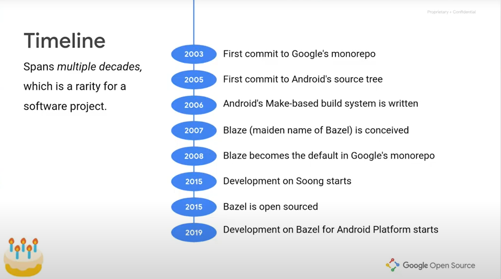
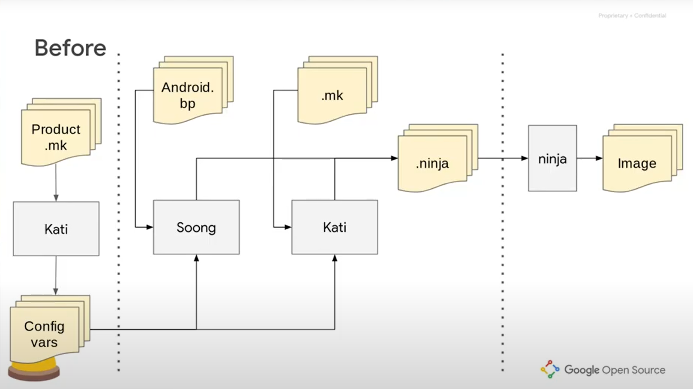
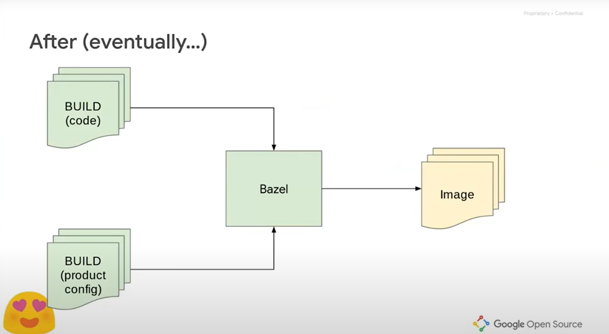
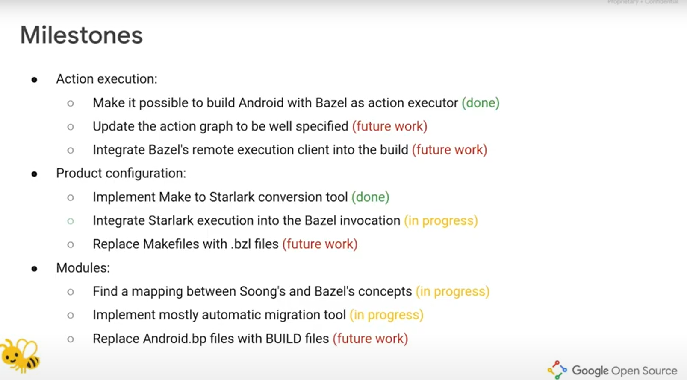

文章标题：**Bazel 和 AOSP 介绍**

- 作者：汪辰
- 联系方式：<unicorn_wang@outlook.com> / <wangchen20@iscas.ac.cn>

文章大纲

<!-- TOC -->

- [1. 参考](#1-参考)
- [2. 历史回顾](#2-历史回顾)
- [3. Bazel](#3-bazel)
    - [3.1. 安装 Bazel](#31-安装-bazel)
    - [3.2. 尝试一个例子](#32-尝试一个例子)
- [4. AOSP 中 Bazel 的进展](#4-aosp-中-bazel-的进展)
    - [4.1. Before](#41-before)
    - [4.2. After](#42-after)
    - [4.3. Now](#43-now)
    - [4.4. Bazel for AOSP 进展状态](#44-bazel-for-aosp-进展状态)

<!-- /TOC -->

# 1. 参考

本文主要参考了如下内容：

- 【参考 1】[Google Open Source Live "Bazel day" 上的主题演讲视频 “Bazel for Android Open Source Platform (AOSP)”][3], 2021 年 4 月 2 日。注：本文的插图主要截取自该视频。
- 【参考 2】[Bazel Will Be the New Build System for the Android Open Source Project][4] 2020 年 11 月 24 日
- 【参考 3】[Android Build System Concepts][5]
- 【参考 4】[Bazel 官网][6]

# 2. 历史回顾


**图（1）Timeline**

上面这张图主要讲述了 Bazel 和 AOSP 的发展时间线。这里解读一下，基本上对 Bazel 和 AOSP 的构建相关的历史可以有一个大致的了解。

大家可能知道，与世界上 99.99% 的公司不同，Google 将几乎整个公司所有项目（据说不包括 Chrome 和 Android），数十亿行代码都放在一个代码仓库中，这个仓库我们就叫它 monorepo。从上面得图上可见，这个 monorepo 项目的时间大致起始于 2003 年。

而 Android 项目，即我们本文中的 AOSP，在 Google 公司内部代码仓库的建立起始于 2005 年，也正是在这一年，Google 花了五千万美金收购了 Andy Rubin 创建的 Android Inc.。和所有很多其他软件项目一样，早期的 Android 的构建系统也是基于 Make 建立的，那还是在有点遥远的 2006 年，到了 2015 年的时候随着 Android 代码体积的迅速膨胀，Google 发现 Make 已经不堪大用，于是发起了 Soong 项目来替代 Make。当然整个替代过程比我们想象的要复杂的多，有关这些内容，下文还会谈到，也可以参考我们以前发布的另外一篇介绍 Soong 的文章 ["AOSP Build 背后涉及的相关知识汇总"][1]。

而那时 Bazel 项目还没有开始，直到 2007 年，才开始有了创建一个公司内部的构建系统（也就是 Blaze）的想法。Blaze 作为 Google 公司内部使用构建工具，目前已经发展成为 Google 的整个 momorepo 生态链中不可或缺，乃至最重要的一环。因为整个 Google 的 monorepo 代码库有几百万个代码文件，几十 TB 的数据，加上大家是代码级依赖，如果按照传统的开发和编译方法，即使只 check out 直接和间接依赖的代码，其数据规模和编译时间也不可接受。而 Blaze 配合 CitC 可以做到开发时只需 check out 需要修改的代码，编译时将所有依赖进行分布式编译，编译上万 C++ 文件也只需几分钟。Blaze还有一个好处就是为全公司提供了整齐划一的编译环境，使得编译器、三方库版本等都不再是问题。到了 2015 年的时候，Google 在 Blaze 的基础上发布了其开源移植版本，并命名为 Bazel。

时间到了 2019 年，Google 又发起了一个将 Android 的 Build 系统迁移到 Bazel 的计划。在此不得不对 Google 工程师的文化翘起我的大拇指，敢于创新，追求卓越已经深深地根植在这家公司的文化精髓中。但由于 Android 系统构建的复杂性，此迁移尚处于早期阶段。从 AOSP 12 开始，会发现 AOSP 的源码仓库下出现了一些和 bazel 有关的内容，这引起了我的好奇心，找了些资料来看了一下，于是总结了这篇文章与大家分享。

# 3. Bazel

参考 [Bazel 官网][6] 的介绍， Bazel 作为一款优秀的开源的软件构建和测试自动化工具，具备以下特点:

- 提供快速构建和测试能力：通过仅重新构建必要的资源。借助 Bazel 的高级本地和分布式缓存、优化的依赖项分析以及并行执行功能，我们可以快速进行增量构建。
- 跨平台，支持多种语言：Bazel 可在 Windows、macOS 和 Linux 上运行。 支持对 Java、C++、Go、以及许多其他语言进行构建和测试。
- Bazel 可以处理任何大小的代码库，无论是多个代码库还是大型的单个代码库。
- 支持通过编程语言，对规则进行扩展和重用。看网上有些资料说 Bazel 提供的编程语言就是一个阉割版的 Python（语言）并加了一些限定，但是 python 的常用基本语法给留着了。这个语言的名字叫 Starlark。它改过名，以前叫 Skylark。

具体的到底如何采用 Bazel 进行构建，我下面借用官网上提供的一个构建 C++ 的项目例子来给大家介绍一下，同时着重强调几个 Bazel 构建模型中的重点概念。

## 3.1. 安装 Bazel

首先安装一下 Bazel 环境。参考 <https://bazel.build/install>。我是在 Ubuntu 上实验的，所以安装过程参考的是：<https://bazel.build/install/ubuntu>，有很多种安装方法，我选择的是使用二进制安装程序。这个具体参考的又是 <https://bazel.build/install/ubuntu#binary-installer>。

首先安装依赖：

```console
$ sudo apt install g++ unzip zip
```
因为我测试构建 c++， 不是 java，所以我没有安装 jdk。

接下来，从 GitHub 上的 Bazel 版本页面下载名为 bazel-***version***-installer-linux-x86_64.sh 的 Bazel 二进制安装程序。我下载的是截至本文最新的 `bazel-5.2.0-installer-linux-x86_64.sh`。

运行安装程序：
```console
$ chmod +x bazel-5.2.0-installer-linux-x86_64.sh
$ ./bazel-5.2.0-installer-linux-x86_64.sh --user
```
`--user` 标志会将 Bazel 安装到系统的 `$HOME/bin` 目录中，安装好后我在 `$HOME/bin` 下看到多了一个 bazel 的符号链接，实际指向 `$HOME/.bazel/bin/bazel`。

官网的说明此时应该继续将 `.bazelrc` 路径设置为 `$HOME/.bazelrc` 以及将 `$HOME/bin` 目录添加到 PATH中，但我根据前面执行 `./bazel-5.2.0-installer-linux-x86_64.sh --user` 的输出提示，在 `$HOME/.bashrc` 中添加了一行 `source $HOME/.bazel/bin/bazel-complete.bash` 貌似也能正常工作。


## 3.2. 尝试一个例子

具体参考的是 Bazel 官网提供的一个例子：["Bazel Tutorial: Build a C++ Project"][2]。

这个例子分三个 stage，由简单到复杂介绍了一些 Bazel 构建的基本概念，我这里就直接根据第三个 stage3 例子来总结一下：

例子的代码可以直接从 github 下载：
```console
$ git clone https://github.com/bazelbuild/examples
```
示例项目位于 `examples/cpp-tutorial/stage3` 目录中，其结构如下所示:

```
examples
└── cpp-tutorial
    ├──stage1
    │  ├── main
    │  │   ├── BUILD
    │  │   └── hello-world.cc
    │  └── WORKSPACE
    ├──stage2
    │  ├── main
    │  │   ├── BUILD
    │  │   ├── hello-world.cc
    │  │   ├── hello-greet.cc
    │  │   └── hello-greet.h
    │  └── WORKSPACE
    └──stage3
       ├── main
       │   ├── BUILD
       │   ├── hello-world.cc
       │   ├── hello-greet.cc
       │   └── hello-greet.h
       ├── lib
       │   ├── BUILD
       │   ├── hello-time.cc
       │   └── hello-time.h
       └── WORKSPACE
```
**图（2）Sample**

具体构建的步骤大家可以自己去看在线文档的介绍，很详尽了，这里我结合上面这个例子总结了一下 Bazel 开发环境里的一些基本概念：

- **Workspace**：一个 workspace 可以认为就是一个 project。譬如上面 cpp-tutorial 目录下分别由 stage1、stage2 和 stage3 三个项目，每个项目的根目录下有一个 WORKSPACE 文件，空的就行，Bazel 就会将包含一个 WORKSPACE 文件的目录识别为一个项目。每个项目之间互不干扰是完全独立的。一个 workspace 里可以包含多个 packages。

- **Package**：一个 package 可以认为是一个软件模块，譬如一个库等。每个 package 由 workspace 目录下的一个子目录来标识，但不是说每个子目录都是一个 package，一个合法的 package 目录中必须要有一个叫做 BUILD 的文件，这个 BUILD 文件中采用 Starlark 语言对模块构建进行描述。描述的内容称之为一个个的 target。从逻辑上来说即每个 package 可以包含多个 Targets，而具体的 target 则采用 Starlark 语法定义在一个 BUILD 文件中。

- **Target**：是某个 rule 的一个实例。那么 Rule 又是什么，这个我们结合 `examples/cpp-tutorial/stage3/main/BUILD` 文件中的下面这段代码理解一下
  ```python
  cc_library(
      name = "hello-greet",
      srcs = ["hello-greet.cc"],
      hdrs = ["hello-greet.h"],
  )
  ```
  这里 `cc_library` 就是一个 rule，它规定了 **一类**构建规则。从 `cc_library` 这个规则名称上我们很容易猜测出来这 **一类规则** 描述了如何构建一个采用 C/C++ 编程语言编写的库（library，可以是静态库也可能是动态库）。一个 Rule 由很多 attribute 构成，这点采用面向对象的概念来看，Rule 就好比是 class，而 attribute 就好比是 class 的 member。定义 target 就是实例化了这个 rule，这样大家就理解了上面这段代码实际上就是定义了一个 target，每个实例必须要有一个名字在同一个 package 中和其他 target 实例进行区分。所以 name 这个 attribute 是必须有的，其他 attribute 是可选的，不写则按默认值定义。

- **Label**：所谓 label 可以认为是在一个 Bazel 的 workspace 范围中唯一标识一个 target 的 ID。我们可以用这个 label 来引用一个 target。label 的语法如下：
  ```
  //path/to/package:target-name
  ```
  以 `//` 开始，接下来的 `path/to/package` 也就是这个 target 所在 package 在 workspace 中的相对路径。然后是一个 `:` 后面跟着一个 `target-name` 即上面说的一个 target 中的 name 那个属性的字符串值。

  譬如我们要构建 `examples/cpp-tutorial/stage3` 这个 workspace 下的 main 这个 package 中的 "hello-greet" 这个 target。那么我们要做的就是先 cd 到 stage3 这个 workspace 下然后用 label 引用这个 target 执行构建。具体命令如下：

  ```console
  $ cd examples/cpp-tutorial/stage3
  $ bazel build //main:hello-greet
  ```
  就会生成 `libhello-greet.a` 和 `libhello-greet.so`

- **Dependency**: 各个 target 之间存在依赖关系，这是在所有构建系统中都存在的概念，同样在 Bazel 中也缺少不了。譬如在 stage3 这个例子中，target `//main:hello-world` 就依赖于 target `//main:hello-greet`，背后的含义就是我们要构建最终的可执行程序 hello-world，则首先要构建成功 `hello-greet` 这个规则的 obj 文件，这种依赖关系在 BUILD 文件中体现为 `deps` 这个 attribute 的描述。
  ```python
  cc_binary(
      name = "hello-world",
      srcs = ["hello-world.cc"],
      deps = [
          ":hello-greet",
      ],
  )
  ```
  注意以下两点：
  - `":hello-greet"` 这里也是一个 label 描述，由于 hello-greet 和 hello-world 这两个 target 在一个 package 中，所以前面的 `path/to/package` 可以省略。
  - 这里如果直接执行 `bazel build //main:hello-world` 并不会生成 `libhello-greet.a` 和 `libhello-greet.so`，原因是目前例子中上面的描述并没有给出构建 hello-world 需要依赖 so 或者 .a。所以默认只是依赖于 hello-greet 的 obj 文件。

# 4. AOSP 中 Bazel 的进展

我们前面提到 Google 从 2019 年开始启动在 AOSP 中使用 Bazel 做系统构建，具体现在是什么状态，我只能说还没有正是完成并推出。因为截至本文完成，AOSP 13 的源码并未公开，而且在最新的 AOSP 13 的 release notes 上我没有看到对 Bazel 太多的描述。网上搜索了一下公开的进度介绍也只有 [【参考 1】][3]。所以我还是基于这个视频来介绍。但我们要知道截至本文完成，距离这个视频已有 1 年多的时间，实际的 Bazel for AOSP 项目进展应该有很大的更新。

## 4.1. Before

我们先看一下没有加入 Bazel 支持之前 AOSP 项目的构建系统组成和构建的大致过程。如下图所示：


**图（3）Before**

这张图上内容分成三部分，其中灰色的模块是 AOSP 构建系统的组成部分，我们可以发现包含了 Kati，Soong 和 ninja 好几个东东，还是比较复杂的。黄色的可以认为是整个构建过程中各个构建组件的输出和输入：

- 最左边的内容指得是对 “产品配置信息” 的处理。所谓产品，就是形如我们在执行 `lunch aosp_arm-eng` 时指定的 `aosp_arm-eng` 就是一个 product。这个 product 定义了我们要构建的系统 image 中具体的组成内容。定义的内容目前是按照 Makefile 的语法写在一系列 `Product.mk` 文件中，然后通过 Kati 系统处理后输出生成一系列的配置信息（图上的 Config Vars），以 Make 变量和环境变量的形式保存下来并作为中间部分的输入。Kati 系统是 Google 为了提高构建速度，自己采用 C++ 开发的用来代替 Make 的一套构建系统，但是后来又给 Soong 替代了，只可惜一直到现在为止 Soong 都没有能够完全替换 Kati。所以就成了目前这个尴尬的局面。

- 中间部分体现的是对 “模块构建动作（action）” 的处理。总体上就是输入构建软件模块的描述，输出是供 ninja 读取的 `.ninja` 文件。而 `.ninja` 文件中的内容可以理解为就是实际的构建动作（action）描述，简单的打个比方就好像我们自己在命令行中输入的那些形如 `gcc ... -o a.out xxx.c` 这些命令，这些命令驱动了 ninja 完成最终的编译链接动作。在中间部分的处理上存在两套并行的处理系统。一套是 Soong，这是 Google 采用自家的 Go lang 编写的第二代构建系统（如果把 Kati 看成是第一代的话）。其输入的描述信息采用的是遵循 Blueprint 语法的定义，和上面我们介绍的 Bazel 系统的 BUILD 文件中的语法非常类似。这些 Blueprint 格式的描述存放在 AOSP 源码树下各个模块的子目录下的 `Android.bp` 文件中，每一个 `Android.bp` 描述了本模块构建的规则。和 Soong 并行的另外一套系统就是 Kati，它承接了剩下的那些还没有完全转为采用 `Android.bp` 描述的模块，这些没有完成的模块仍然采用 Makefile 语法描述的 `.mk` 文件来描述自身的构建规则，然后作为输入被 Kati 读取，输出供 ninja 使用的 `.ninja` 文件。同时在 Soong 和 Kati 以上的转化过程中还会参考左边产品配置信息构建产生的 Config vars 信息，决定哪些模块需要处理，哪些不需要。

- 最右边指的就是最终的 “实际构建动作的执行”，这部分在目前 AOSP 上在第一代 Kati 系统时已经采用了 ninja 并一直延续到现在。ninja 读入 Soong 和 Kati 生成的 `.ninja` 描述文件，驱动实际的工具链程序完成最终模块的构架和系统 Image 的组装。

## 4.2. After

在 [【参考 1】][3] 中 Google 希望的第三代基于 Bazel 的 AOSP 构建系统完成后整个构建过程是变成如下情况，见下图所示：


**图（4）After**

也就是说上一节中涉及的 “产品配置信息” 的定义信息（见图中左边下部标注为 “product config” ）和涉及 “模块构建动作（action）”（见图中左边上部标注为 “code” ）统一采用 BUILD 文件进行描述和定义。由 Bazel 统一处理后，并由 Bazel 负责驱动实现上一节中的第三部分 “实际构建动作的执行”（ninjia 也不再需要了）。整个构建过程全部统一由 Bazel 完成。

而且根据 Bazel 的文档说明，现有 AOSP 中的自动化测试部分的驱动组件也由 Bazel 系统承接，整个替换是全方位的，更详细的针对 Android buid system component 执行 Bazel 替换的对比，可以看 [【参考 3】][5] 。


## 4.3. Now

虽然理想很丰满，但现实却是骨感的。完整的替换过程相当的复杂，不仅仅在于现有 Android 构建系统的复杂性，也在于 Android 系统本身就是一个巨型复杂系统。

Google 的计划是逐步完成这个过程的替换，就像当初从 Kati 到 Soong 的转变一样。替换的方案还是从上面提到的三个方向入手：
- 对 “产品配置信息” 的处理
- 对 “模块构建动作（action）” 的处理
- 最终的 “实际构建动作的执行”

而且为了保证替换不会影响现有用户的使用体验，包括构建速度和使用习惯。

大致的替换方案如下图所示，我根据我的而理解解释一下，如果有什么不对的地方请大家不吝指出。其中注意下图中增加啊的绿色部分就是为实现 Bazel 替换引入的新组件。


**图（5）Now**

- 在对 “产品配置信息” 的处理上，Google 会引入两个新的工具 `convert` 和 `product_config`。`convert` 负责将含有产品配置信息处理的 `.mk` 文件转换为以 Starlark 语法描述的替代文件，在图上标识为后缀为 `.bzl` 的 文件，我理解就是对应 **图（4）** 中标识为（product config）的 BUILD 文件。而 `product_config` 则负责将 `.bzl` 文件进一步转化为 Config vars。我猜想分成两步的方式可能是为了在演变成最终的 **图 （4）** 后，`.bzl` 文件可以作为包含 product config 信息的 BUILD 文件保留下来。

- 在对 “模块构建动作（action）” 的处理上，Google 会新开发一个叫做 bp2build 的工具，负责将现有系统中的 `Android.bp` 文件转化为 BUILD 文件。而为了兼容目前在该阶段生成 `.ninja` 文件的需要，Bazel 系统还要改造一下，能够输入 BUILD 文件，输出 `.ninja` 文件（目前的 Bazel，读入 BUILD 就直接驱动构建了，并没有 ninja 的介入）。从图上来看，会存在一段时间，AOSP 构建系统中将同时存在三套处理系统。是不是很复杂 :(。

- 在对最终的 “实际构建动作的执行”上，同样需要改动 Bazel，使其能够像 ninja 一样读入 `.ninja` 文件，即基于 `.ninja` 文件驱动实际的构建动作。也就是说在过渡阶段，AOSP 的构建系统将同时支持两种构建模式：一种是 legacy mode with ninja；另一种是 the new mode with Bazel。

在完整的替换过程结束后，**图（5）** 中的某些组件将被废弃，最终留下的就是形如 **图（4）** 这样的。不禁再次感叹，实在是很复杂啊。

## 4.4. Bazel for AOSP 进展状态

仍然是基于 [【参考 1】][3], 注意视频时间标注为 2021 年 4 月 2 日 。所以不能说是最新的，而是截至本文完成前一年的状态，我看了一下大致和我们移植 AOSP 12 的 [aosp-riscv][7] 采用的 tag：`android-12.0.0_r3` 差不多的时间。


**图（6）Milestone**

从当时的进展来看，只能说 “任重而道远” 啊！

不多说了，大家可以对照上面的介绍估计一下 Google 的进度。最近的状态我们还是要等 13 的代码放出来再看。也希望本文的介绍能对大家了解 Bazel for AOSP 有所帮助。


[1]: ./20201230-android-build-sum.md
[2]: https://bazel.build/tutorials/cpp?hl=en
[3]: https://www.youtube.com/watch?v=VyW04BwiBSs&t=935s
[4]: https://www.infoq.com/news/2020/11/android-aosp-bazel/
[5]: https://android.googlesource.com/platform/build/bazel/+/refs/heads/master/docs/concepts.md
[6]: https://bazel.build/
[7]: https://gitee.com/aosp-riscv