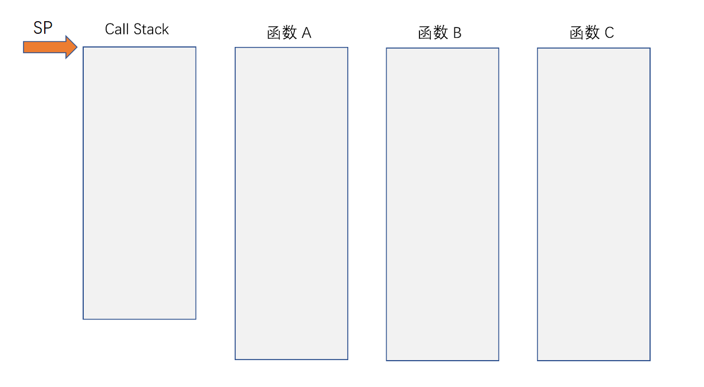
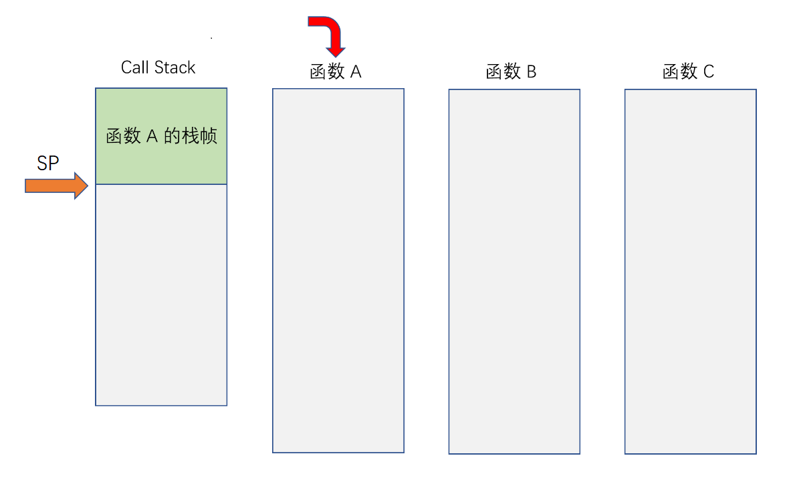
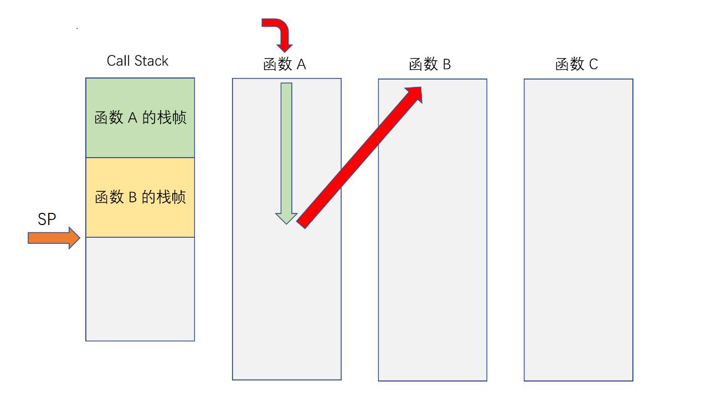
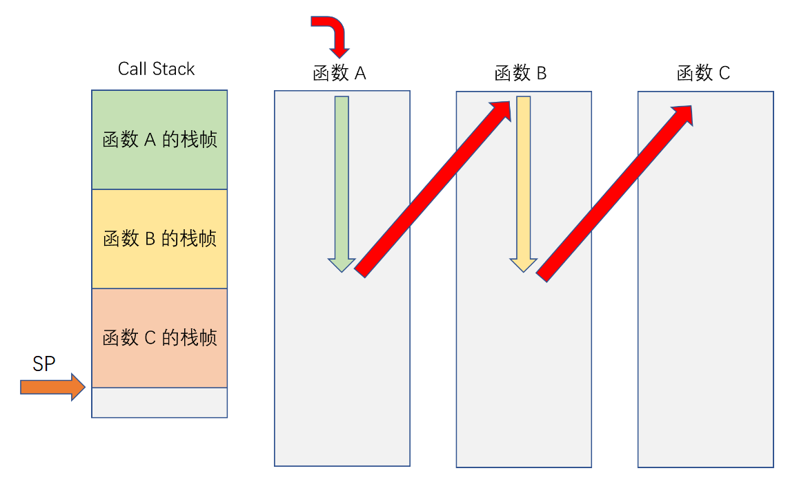
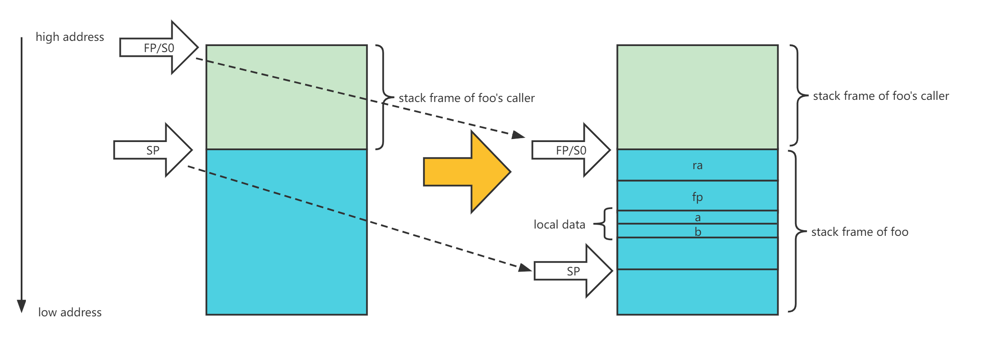

文章标题：**Call Stack (RISC-V)**

- 作者：汪辰
- 联系方式：<unicorn_wang@outlook.com> / <wangchen20@iscas.ac.cn>

文章大纲

<!-- TOC -->

- [1. 参考](#1-参考)
- [2. 什么是 Call Stack](#2-什么是-call-stack)
- [3. Call Stack 的组成](#3-call-stack-的组成)
- [4. Stack frame 中的具体内容](#4-stack-frame-中的具体内容)
    - [4.1. 返回地址（Return Address）](#41-返回地址return-address)
    - [4.2. 帧指针（Frame Pointer）](#42-帧指针frame-pointer)
    - [4.3. 局部变量（Local data storage）](#43-局部变量local-data-storage)
    - [4.4. 函数参数（Parameter passing）或返回值](#44-函数参数parameter-passing或返回值)
    - [4.5. Others](#45-others)
- [5. 例子](#5-例子)

<!-- /TOC -->

# 1. 参考

本文主要参考了如下内容：

- 【参考 1】[Call stack from wikipedia][1]


# 2. 什么是 Call Stack

在大多数现代计算机系统中，考虑到存在函数调用这种场景，程序执行过程中会保留一块特殊的内存区域，当进入一个函数执行时，程序可能会将一些信息添加到这块内存中保存起来；当函数退出时，程序由会删除先前备份的数据。针对这块内存的数据操作类似于我们在数据结构中用到的 “栈”（stack）的方式，遵循后进先出（Last In First Out，简称 LIFO）的原则。所以我们在计算机科学中，将计算机程序执行过程中用到的这块内存称之为 “call stack”，也称为 “execution stack”、“program stack”、“control stack”、“run-time stack” 或 “machine stack”。注意和数据结构中 “栈” 的概念相区别，所以本文使用 “call stack” 而不是 "stack"。

和数据结构中对 “栈” 的描述类似，对程序中将数据添加到 “call stack” 中的动作，我们称其为 “压栈”（push），反之，称其为 “出栈” 或者 “弹出”（pop）。如果压栈动作占用的内存超出了分配给 call stack 的所有空间，就会发生称为 “栈溢出”（stack overfow）的错误，这通常会导致程序崩溃而且很难 debug，所以我们要特别注意。
 
尽管可能会为信号处理或 cooperative multitasking（如 setcontext）创建额外的 call stack，但通常只有一个 call stack 与正在运行的程序相关联（或者更准确地说，与 process 的每个 thread 相关联），这也是本文关注的 call stack，其他类型的 call stack 工作原理类似，在此不再赘述。

尽管对 “call stack” 的维护对于大多数软件的正常运行很重要，但细节通常在高级编程语言中对程序员是隐藏和自动实现的。当我们涉及计算机体系架构层面的相关内容时，譬如采用汇编语言编程时往往需要程序员直接参与操作 “call stack” ，各种计算机指令集（instruction sets）也提供了用于操作 “call stack” 的特殊指令。

# 3. Call Stack 的组成

函数调用过程中，当一个函数调用其他函数时，我们称其为 “caller”，当一个函数被其他函数调用时，我们称其为 “callee”。

当一个函数作为 callee 被调用时（这个函数常被称为 active subroutine），与这个函数相关的一些信息被 push 进 call stack，这部分内容所占据的内存我们通常称之为与这个函数对应的 “栈帧”（stack frame），当这个函数退出时这些数据会 pop，每个 stack frame 对应着一个正在运行，尚未终止和返回的 active subroutine。所以如果我们将 call stack 中的数据以 stack frame 为单位，则一个 call stack 由多个 stack frame 构成，函数调用过程中存在 stack frame 的 push 和 pop 过程。

在学习 Stack 这种数据结构的过程中我们知道在描述一个栈的时候我们需要维护一个 Stack 的 Top，在计算机体系架构中一般都会专门指定一个寄存器用于保存 call stack 的 TOP 位置，也即 active subroutine 对应的 stack frame 的 TOP 位置。这个寄存器我们一般称之为 stack pointer，简称 SP。在 RISC-V 上，这个寄存器是 x2，其 ABI name 就叫 sp。

假设存在 “函数 A” 调用 “函数 B”；以及 “函数 B” 调用 “函数 C” 的关系，我们来画一下函数调用过程中 Call stack 的组成和变化，形象地理解一下我们前面描述的概念。注意在绘制 call stack 时需要明确内存地址的增长方向，不同的硬件架构在调用堆栈是向更高地址还是向更低地址增长方面可能有所不同。大部分情况下我们习惯高地址在上，低地址在下。

一开始 SP 指向 Call Stack 的 BOTTOM 位置：


【图一】 初始状态

当 “函数 A” 被调用时，程序在 call stack 中 push “函数 A” 的 stack frame，同时 SP 的值被更新，指向当前 Call Stack 的 TOP。当然这个 stack frame 中的内容如果存在多项的话，并不是一次性 push 的，而是需要多次 push，具体会有哪些内容，这个我们在下一节讨论。


【图二】 “函数 A” 被调用

当 “函数 A” 调用 “函数 B” 时，程序在 call stack 中 push “函数 B” 的 stack frame，同时 SP 的值被更新，指向当前 Call Stack 的 TOP。


【图三】 “函数 B” 被调用

当 “函数 B” 调用 “函数 C” 时，程序在 call stack 中 push “函数 C” 的 stack frame，同时 SP 的值被更新，继续指向当前 Call Stack 的 TOP。


【图四】 “函数 C” 被调用

当函数调用逐级返回时，会逆向发生 Call Stack 的 pop 操作。在 call stack 中创建子程序的 stack frame 有时称为 "winding"；相反，删除该内容叫做 "unwinding"。wind 英文有 “缠绕” 的意思，而函数调用 Call stack 中 push 过程类似于我们绕绳子的绕的过程，而 pop 过程则对应松开绕的绳子（原路返回），记住这个就比较好理解为啥叫 winding 或者 unwinding 了。

# 4. Stack frame 中的具体内容

下面我们具体来看看一个 stack frame 中会存放哪些数据。

## 4.1. 返回地址（Return Address）

call stack 的主要用途是存储 “返回地址”（Return Address）。如果一个函数会调用子函数，则需要将调用子程序的指令的位置（地址）或者是该条指令的下一条指令的位置保存在某个地方记下来，因为稍后（被调用的子程序执行完毕后）需要根据这个地址信息返回到调用子程序的地方继续执行（这个动作简单地称为 resume）。与其他调用约定相比，使用 call stack 保存返回地址具有重要优势。一是每个 thread 都有自己的 call stack 空间，因此子程序是线程安全（thread-safe）的，也就是说，可以在多个线程中同时执行相同的一段程序（包括函数调用）而不需要考虑它们互相之间的影响。另一个好处是可以提供可重入性（reentrancy），自动支持递归，即函数递归调用自身。

## 4.2. 帧指针（Frame Pointer）

stack pointer 总是指向当前 active subroutine 的 stack frame 的 TOP，那么有同学可能会问，我们是否有必要再定义个寄存器用来保存当前 active subroutine 的 stack frame 的 BOTTOM 呢，这在数据结构的 stack 的操作中也是需要的呀。但我们需要了解，在计算机程序运行中，这个 BOTTOM 并不是必须的，因为正常函数执行过程中，当 callee 函数返回时，当前 active subroutine 的 stack frame 会被全部弹出，并通过上面介绍的记录在 call stack 中的的 Return Address 返回到 caller 函数中调用 callee 的地方继续执行。所以整个 BOTTOM 并不是必要的。但在调试和异常处理过程中，我们会需要在确保不退出当前 active subroutine 的前提下回溯函数的调用过程，也就是说不实际发生 stack frame 的 pop 操作也能够回到上一级 caller 函数的 stack frame 的 TOP 处（等同于当前 callee 函数的 stack frame 的 BOTTOM），为了实现这个目的，我们有时候会希望在程序执行过程中维持一个 BOTTOM 指针，这就是我们常说的 frame pointer，不同的计算机体系架构会定义自己的 frame pointer 寄存器，在 RISC-V 中，这个寄存器是 x8，其 ABI name 是 s0 或者 fp。有关栈回溯的问题不是本文的重点，我后面再专门写。大家只需要知道有这么回事而且要知道实现栈回溯的方法有很多种，利用 frame pointer 只是其中的一种方法，所以总结下来在 call stack 中保存 frame pointer 仍然不是必须的。后面的代码例子中我们可以发现优化选项会优化掉在 call stack 中保存 frame pointer。

## 4.3. 局部变量（Local data storage）

一个函数经常需要内存空间来存储函数内部的局部变量的值，这些变量的生命周期仅在当前函数中可以访问并且在函数返回后并不需要保留它们的值。局部变量的这些需求正好可以通过在 call stack 来满足。我们可以通过简单地移动 stack pointer 来为它们分配足够的空间，这与使用堆的动态内存分配相比要快的多，当然前提是我们编程时不要定义太大的局部变量，因为 call stack 的大小是有限的。要访问这些 call stack 中的局部变量也很方便，通过 stack pointer 加上一个正的 offest 或者通过 frame pointer 加上一个负的 offset 就可以轻松地得到这些局部变量的地址。

## 4.4. 函数参数（Parameter passing）或返回值

函数定义时通常会要求在调用它们时提供参数，但直接使用 call stack 来传递参数的的情况并不多见。通常，如果只有几个小参数，将使用处理器的寄存器来传递，但如果参数过多，则需要借用 call stack。这么做的好处和在 call stack 上定义局部变量的原因是类似的。在 RISC-V 函数调用规范中定义，最多可以使用 8 个通用寄存器（a0 ~ a7）来传递参数，如果传递的内容超过 8 个通用寄存器的大小则需要借用 call stack。

返回值一般也有类似的限制，在 RISC-V 函数调用规范中定义，最多可以使用 2 个通用寄存器（a0 和 a1）来传递返回值，超过了则借用 call stack。

## 4.5. Others

除了以上我们提到的内容之外，call stack 还会被利用来存放其他一些类型的内容，但不是普遍现象。譬如一些面向对象的语言（例如 C++）在调用一个成员函数（或称之为 methods）时会将 this 指针放在 call stack 中；除了返回地址之外，在某些环境中，当子程序返回时，可能还有其他机器或软件状态需要恢复。这可能包括特权级别、异常处理信息、算术运算模式等。如果需要，它可以像返回值一样存储在 call stack 中。更多的描述请见 [【参考 1】][1]。

总结一下：典型的 stack frame 中（本质上也是 call stack 中）会存放返回地址、帧指针、局部变量和函数参数。在某些情况下，还会利用 stack frame 来实现其他一些或多或少的功能。

# 5. 例子

啰里啰唆写了这么多，我们来结合一些实际的例子看看在 RISC-V 这种体系架构上，call stack 的处理。

基本的 call stack 例子代码见 [callstack.c][2]，代码非常简单

```cpp
extern int bar(int a, int b);

void foo(void)
{
    int a = 1;
    int b = 2;
    bar(a, b);

}
```

我们采用最常见的方式编译一下 `riscv64-unknown-linux-gnu-gcc -g -c callstack.c`，注意我们在编译 `callstack.c` 时，没有带任何优化选项，所以编译器默认为 `-O0`，这等同于默认启用了 `-fno-omit-frame-pointer` 选项，编译器会把某个特定的寄存器当 frame pointer，用来保存当前函数 stack frame 的 BOTTOM（起始地址），前面说过，在 RISC-V 中，这个寄存器是 x8，其 ABI name 是 s0 或者 fp。同时编译器在对高级语言进行汇编处理时，针对 callee 函数的 prologue 阶段生成的指令中会插入指令，将 caller 对应的 fp 中的值保存到 callee 的 stack frame 中同时将 fp 更新为指向 caller 的 sp。

我们用 objdump 仔细看一下反汇编的结果，特别关注一下函数的 prologue 和 epilogue 部分生成的指令：

```cpp
extern int bar(int a, int b);

void foo(void)
{
   0:   1101                    addi    sp,sp,-32
   2:   ec06                    sd      ra,24(sp)
   4:   e822                    sd      s0,16(sp)
   6:   1000                    addi    s0,sp,32
    int a = 1;
   8:   4785                    li      a5,1
   a:   fef42623                sw      a5,-20(s0)
    int b = 2;
   e:   4789                    li      a5,2
  10:   fef42423                sw      a5,-24(s0)
    bar(a, b);
  14:   fe842703                lw      a4,-24(s0)
  18:   fec42783                lw      a5,-20(s0)
  1c:   85ba                    mv      a1,a4
  1e:   853e                    mv      a0,a5
  20:   00000097                auipc   ra,0x0
  24:   000080e7                jalr    ra # 20 <foo+0x20>
}
  28:   0001                    nop
  2a:   853e                    mv      a0,a5
  2c:   60e2                    ld      ra,24(sp)
  2e:   6442                    ld      s0,16(sp)
  30:   6105                    addi    sp,sp,32
  32:   8082                    ret
```

我们可以对照下图来理解一下这段汇编实现的效果。


【图五】 RISC-V 的函数

从 line 0 ~ line 6，是 `foo()` 函数的 prologue 处理，
- `0: addi    sp,sp,-32`：将 SP 从左边的位置向下移到右边的 SP 位置，可以认为就是为 `foo()` 函数预留了 32 个字节的 stack frame 空间。该指令执行完后，SP 指向 stack frame 的 TOP。
- `2: sd      ra,24(sp)`：将 ra 入栈，注意在这里因为 stack pointer 保存着 active subroutine 对应的 stack frame 的 TOP 位置，所以可以基于 stack pointer 加上一个正的 offset 访问该 stack frame 内的任意位置。
- `4: sd      s0,16(sp)`：将原 S0/FP 入栈，
- `6: addi    s0,sp,32`：修改 FP，指向新的位置，即 `foo()` 函数对应的 stack frame 的 BOTTOM，我们这里可以发现，这个位置实际上就是调用 `foo()` 函数的 caller 的原 SP 的位置。

从 line 8 ~ line 10 是在存放 `foo()` 函数的 local data 变量 a 和 b，我们看到实际就是放在 `foo()` 函数的 stack frame 中了。同时我们还注意到，line a 和 line 10 在访问 a 和 b 的过程中采用的是基于 fp 向低地址偏移一个 offest 的方式。

从 line 2a ~ line 32 是 `foo()` 函数的 epilogue 处理，这里我就不赘述了。

需要注意的是: fp 是否需要其实并不是必须的，不定义 fp 并不会影响程序的执行，我们可以在上面的编译命令中加上 `-fomit-frame-pointer`, 编译器就不会生成 fp 相关的指令了。执行 `riscv64-unknown-linux-gnu-gcc -g -c callstack.c -fomit-frame-pointer` 后 objdump 如下，大家可以比较一下：

```cpp
0000000000000000 <foo>:
extern int bar(int a, int b);

void foo(void)
{
   0:   1101                    addi    sp,sp,-32
   2:   ec06                    sd      ra,24(sp)
    int a = 1;
   4:   4785                    li      a5,1
   6:   c63e                    sw      a5,12(sp)
    int b = 2;
   8:   4789                    li      a5,2
   a:   c43e                    sw      a5,8(sp)
    bar(a, b);
   c:   4722                    lw      a4,8(sp)
   e:   47b2                    lw      a5,12(sp)
  10:   85ba                    mv      a1,a4
  12:   853e                    mv      a0,a5
  14:   00000097                auipc   ra,0x0
  18:   000080e7                jalr    ra # 14 <foo+0x14>
}
  1c:   0001                    nop
  1e:   60e2                    ld      ra,24(sp)
  20:   6105                    addi    sp,sp,32
  22:   8082                    ret
```

有同学问，那为啥我们要专门浪费一个寄存器来存放 fp 呢，还增加了 prologue 和 epilogue 的指令处理。这个原因涉及到 “Stack Unwinding” 的处理问题，我会专门另外写一篇笔记来总结。

另外利用 call stack 传参的例子可以见 [param.c][3]，我这里就不解释了。


[1]: https://en.wikipedia.org/wiki/Call_stack
[2]: ./code/20220717-call-stack/callstack.c
[3]: ./code/20220717-call-stack/param.c
