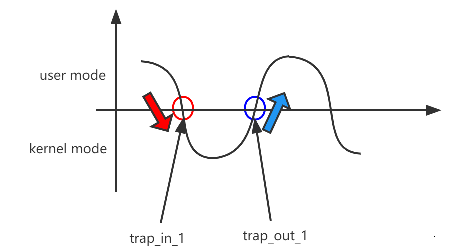
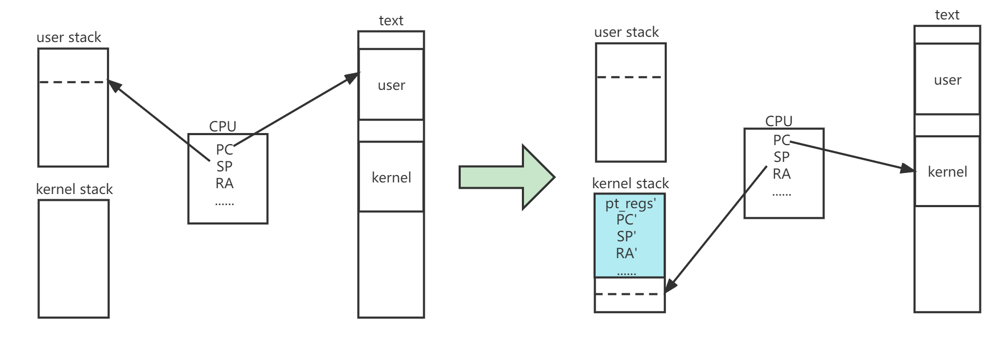
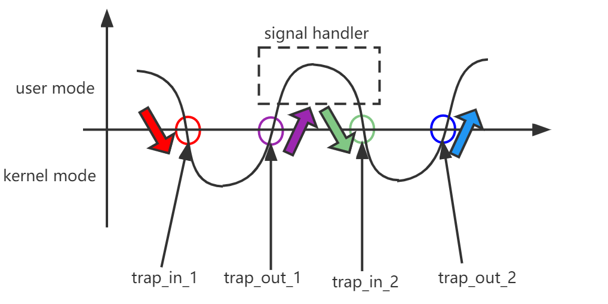
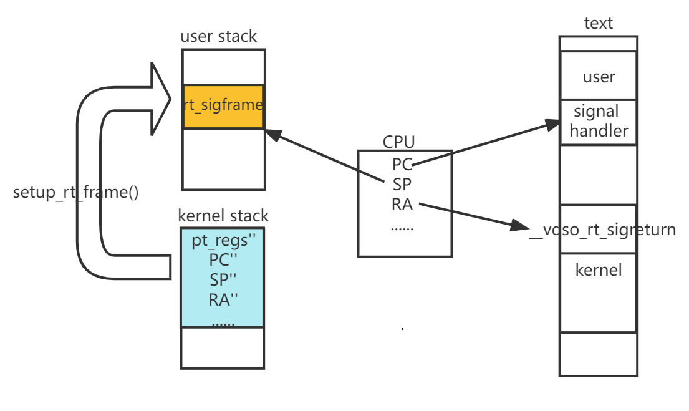
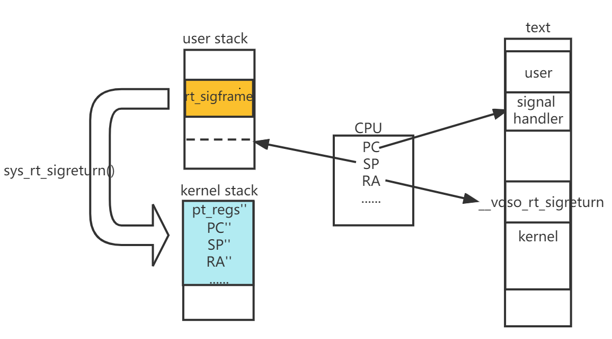

文章标题：**聊一聊 Linux 上信号处理过程中的信号栈帧**

- 作者：汪辰
- 联系方式：<unicorn_wang@outlook.com> / <wangchen20@iscas.ac.cn>

文章大纲
<!-- TOC -->

- [1. 参考](#1-参考)
- [2. 信号的基本概念](#2-信号的基本概念)
- [3. 信号处理与信号帧](#3-信号处理与信号帧)
    - [3.1. Trap 处理的基本机制](#31-trap-处理的基本机制)
    - [3.2. 增加支持信号处理后的 trap 处理机制](#32-增加支持信号处理后的-trap-处理机制)
- [4. 通过 glibc 的 backtrace 函数实现栈回溯的例子](#4-通过-glibc-的-backtrace-函数实现栈回溯的例子)

<!-- /TOC -->


信号作为一种进程间通信的方式，在 Linux 中被广泛使用。这篇技术总结不打算对 Linux 内核中信号的具体实现细节全面介绍，而是聚焦于内核调用信号处理函数过程中栈帧的处理，目的是为了更好地理解信号处理函数调用过程中如何进行栈回溯（Stack Unwinding）。在涉及到 ARCH 相关的内容时，本笔记以 RISC-V 为主，必要时也会涉及一点其他 ARCH，譬如 X86_64 或者 AARCH64。

至于什么是 “Stack” 以及什么是 “Stack Unwinding”，请阅读我的另外两篇总结 [《Call Stack (RISC-V)》][1] 和 [《Stack Unwinding - Overview》][2]。

# 1. 参考

- 【参考 1】[linux 内核信号机制需要解决的两个关键问题][3]

# 2. 信号的基本概念

信号处理是 Linux 上支持的一个历史悠久，用于支持进程间通讯的特性，其实现也相对比较复杂的。本文不打算详细总结信号的基本概念，本文提到的一些概念完全是为了说清楚本文的目的而服务。

从内核的角度来看，信号有可能是内核处理过程中发送给内核线程的，也可能是在用户态触发的，我们这里主要讨论用户态触发的信号，内核线程的信号处理不是本文关心的内容，因为内核线程的信号处理不涉及用户态 signal handler 函数也不涉及本文关心的 signal frame。

信号的生命周期主要包括以下几个方面：
- 信号的部署（dispostion），即用户通过调用 `signal()`/`sigaction()` 设置当信号发生时的处理方式，譬如 ignore、default 或者是触发调用用户部署的 handler 函数 部署的 handler 函数。因为我们重点讨论 signal frame 所以我们这里只考虑 signal handler 的处理方式。
- 信号的发送（send），用户可以通过 `kill()`/`raise()`/... 等方式向进程发送信号，但我们要注意的是，我们调用这些函数向进程发送信号后信号并不会立即被执行（术语上称之为 deliver）。send 行为可以理解成我们仅仅通过这些函数（系统调用）通知内核，而内核何时 deliver 这些信号则发生在内核的代码从内核态返回用户态的过程中。而内核何时从用户态进入内核态，这往往是由于发生了中断，异常等。我们不用担心信号会长时间不被 deliver，因为整个系统运行期间频繁地在内核态和用户态之间发生着切换，所以系统从内核态返回用户态的时间点会频繁地发生，只要有信号被 sent，很快就会被 delivered。
- 信号的处理（delivery）：上面已经大致说过，也是本文主要涉及的部分。

# 3. 信号处理与信号帧

前面说过信号的处理（delivery）发生在系统从内核态返回用户态的过程，那么就离不开对 Trap 的分析。先看一下 RISC-V 上 Trap 的基本处理机制，然后看一下涉及信号处理后的 Trap 处理过程。

## 3.1. Trap 处理的基本机制

简单总结一下 trap 发生后内核的处理过程，以下以 RISC-V 为例，Linux 内核版本 v5.19：



【图 1】 Linux 内核 trap 处理基本流程

【图 1】是从时间轴的角度观察到的系统在用户态和内核态之间的切换的过程。我们再补充一个 【图 2】 从上下文切换的角度看一下 trap 发生时内核的现场状态，主要包括内存中的 stack 和 text，以及 CPU（Hart）的情况，有助于我们更好地理解 【图 1】 背后系统中到底发生了些什么。



【图 2】 Linux 中上下文切换现场

【图 2】告诉我们，上下文切换现场中存在以下要素：

- CPU（Hart），CPU 上有很多寄存器，这里我们只列出我们尤其关心的几个：
  - PC：用来指向当前程序执行的指令的位置，在 RISC-V 中 ISA 里并没有定义 PC，但是考虑到和其他 ARCH 的兼容，我们可以认为存在这个 PC。
  - SP：指向当前程序的 call stack 的 TOP
  - RA：指向当前程序的 active subroutine 的返回地址，也可以认为是 active subroutine 中最后一条 ret 指令会跳转到的目的地址。 

- Call Stack，这里存在两个 call stack
  - 用户栈：用户态程序的 call stack，这个是我们运行应用程序时使用的 call stack。
  - 内核栈：Linux 内核使用自己的 call stack 和用户态程序分离

- 程序 text 段，可以认为是存放程序指令的地方，我们看到 【图 2】 中存在 user 的程序区以及 kernel 的程序区。

回到 【图 1】，`trap_in_1` 这个点表示处理器发生 trap，这可能是同步异常，也可能是异步的中断发生了，总之 Hart 的状态发生切换，此时，Hart 作为硬件会跳转到 trap 入口，也就是对应代码的 [`handle_exception()` 入口函数](https://elixir.bootlin.com/linux/v5.19/source/arch/riscv/kernel/entry.S#L21)，截取下面一段代码，其中 `_save_context` 这个 label 起始往下的一段指令就是在将 Hart 的寄存器内容备份保存到内核栈中一个 `struct pt_regs` 中，见 【图 2】中右边部分的 kernel stack 中的蓝色部分：

```asm
ENTRY(handle_exception)
	/*
	 * If coming from userspace, preserve the user thread pointer and load
	 * the kernel thread pointer.  If we came from the kernel, the scratch
	 * register will contain 0, and we should continue on the current TP.
	 */
	csrrw tp, CSR_SCRATCH, tp
	bnez tp, _save_context

_restore_kernel_tpsp:
	csrr tp, CSR_SCRATCH
	REG_S sp, TASK_TI_KERNEL_SP(tp)
_save_context:
	REG_S sp, TASK_TI_USER_SP(tp)
	REG_L sp, TASK_TI_KERNEL_SP(tp)
	addi sp, sp, -(PT_SIZE_ON_STACK)
	REG_S x1,  PT_RA(sp)
	REG_S x3,  PT_GP(sp)
	REG_S x5,  PT_T0(sp)
	REG_S x6,  PT_T1(sp)
	REG_S x7,  PT_T2(sp)
	REG_S x8,  PT_S0(sp)
	REG_S x9,  PT_S1(sp)
	REG_S x10, PT_A0(sp)
	REG_S x11, PT_A1(sp)
	REG_S x12, PT_A2(sp)
	REG_S x13, PT_A3(sp)
	REG_S x14, PT_A4(sp)
	REG_S x15, PT_A5(sp)
	REG_S x16, PT_A6(sp)
	REG_S x17, PT_A7(sp)
	REG_S x18, PT_S2(sp)
	REG_S x19, PT_S3(sp)
	REG_S x20, PT_S4(sp)
	REG_S x21, PT_S5(sp)
	REG_S x22, PT_S6(sp)
	REG_S x23, PT_S7(sp)
	REG_S x24, PT_S8(sp)
	REG_S x25, PT_S9(sp)
	REG_S x26, PT_S10(sp)
	REG_S x27, PT_S11(sp)
	REG_S x28, PT_T3(sp)
	REG_S x29, PT_T4(sp)
	REG_S x30, PT_T5(sp)
	REG_S x31, PT_T6(sp)
    ......
```

这个内核结构体 [`structuralpt_regs`](https://elixir.bootlin.com/linux/v5.19/source/arch/riscv/include/asm/ptrace.h#L15) 很重要，截取这个结构体的定义如下，可见这里保存了 RISC-V 中定义的所有 general registers，除了 x0，而是代替为一个叫做 epc 的成员，而 epc 并不是用来保存 x0 的，具体用处见后面的内容。

```cpp
struct pt_regs {
	unsigned long epc;
	unsigned long ra;
	unsigned long sp;
	unsigned long gp;
	unsigned long tp;
	unsigned long t0;
	unsigned long t1;
	unsigned long t2;
	unsigned long s0;
	unsigned long s1;
	unsigned long a0;
	unsigned long a1;
	unsigned long a2;
	unsigned long a3;
	unsigned long a4;
	unsigned long a5;
	unsigned long a6;
	unsigned long a7;
	unsigned long s2;
	unsigned long s3;
	unsigned long s4;
	unsigned long s5;
	unsigned long s6;
	unsigned long s7;
	unsigned long s8;
	unsigned long s9;
	unsigned long s10;
	unsigned long s11;
	unsigned long t3;
	unsigned long t4;
	unsigned long t5;
	unsigned long t6;
	/* Supervisor/Machine CSRs */
	unsigned long status;
	unsigned long badaddr;
	unsigned long cause;
	/* a0 value before the syscall */
	unsigned long orig_a0;
};
```

可见 Linux 内核用 `struct pt_regs` 备份了 trap 发生时 Hart（处理器核心）的寄存器状态，也就是我们说的上下文现场。这个结构体就放在内核栈中的起始部位（高地址处）。也就是说通过 `_save_context` 保存了异常或者中断发生时用户态程序运行的处理器上下文现场，在 trap 返回时，也就是 【图 1】 的 `trap_out_1` 点内核会执行对应的恢复上下文现场的操作，这样退出 trap 后原来被中断的用户程序继续运行。

## 3.2. 增加支持信号处理后的 trap 处理机制

如果用户进程在运行过程中又收到信号，那么整个处理过程会变得复杂一点，还是先从内核状态跃迁的角度看一下增加信号处理后的变化图如下：



【图 3】 增加信号处理后的 trap 处理流程

进程对用户态信号的处理 deliver 是在进程从内核态返回到用户态之前的过程中做的，内核会在最终返回用户态（`trap_out_2`）之前先临时返回用户态（`trap_out_1`），确保在用户态执行用户在 dispostion 中安装的 signal handler 处理函数，这么做的原因我觉得应该还是为了安全考虑，从内核的角度考虑，在内核态执行一个用户定义的函数，怎么看也是怎么别扭。所以 signal handler 必须要在用户态执行，执行完成后会再次返回到内核中（`trap_in_2`）继续检查是否有其他的处理，直到内核检查确定没有什么剩余工作了才会最终返回到用户态之前被中断的地方继续执行(`trap_out_2`)。

和通常的异常处理流程相比，增加支持信号处理后中间多了一次返回用户态和再次返回内核态的过程（注：如果有 N 个信号需要处理，这个过程还会反复发生 N 次，严格说如果进程同时收到多个信号的处理过程我还没有完全研究清楚，所以这里为简单起见，暂时只考虑收到一个信号的情况）。为此我们需要增加额外的处理，保证以下情况能够顺利发生：

- **问题 1**：`trap_out_1` 处 Hart 开始执行 signal handler，而不是像上一节介绍的那样继续 `trap_in_1` 处被打断的用户程序。
- **问题 2**：`trap_in_2` 处，signal handler 函数执行完，调用 ret 指令后 Hart 会再次返回内核态。
- **问题 3**：`trap_out_2` 处，Hart 返回用户态后，原来 `trap_in_1` 之前用户态的 Hart 上下文信息能被正确地恢复，考虑到中间每从用户态到内核态切换一次，pt_regs 的内容都会被更新一次，所以如果不做特殊的处理，原先在 `trap_in_1` 处保存的上下文现场肯定早已被替换破坏了。

我们来看一下内核的处理流程是如何解决上面几个问题的。

先看一下内核在异常处理中和信号处理的函数调用链, 为节省篇幅，中间详细代码过程略去：

```
handle_exception
--> do_notify_resume
    --> do_signal
        --> handle_signal
```

对用户注册的一个信号的处理最终走到 [`handle_signal()` 函数](https://elixir.bootlin.com/linux/v5.19/source/arch/riscv/kernel/signal.c#L234) 实现。截取我们关心的代码如下，从注释上看，这里调用 `setup_rt_frame()` 函数构建了一个 stack frame：

```cpp
static void handle_signal(struct ksignal *ksig, struct pt_regs *regs)
{
	sigset_t *oldset = sigmask_to_save();
	int ret;
    ......
	/* Set up the stack frame */
	ret = setup_rt_frame(ksig, oldset, regs);

	signal_setup_done(ret, ksig, 0);
}
```

`setup_rt_frame()` 这个函数很重要，我们把这个函数整体摘录在这里看一下，并嵌入了一些注释

```cpp
static int setup_rt_frame(struct ksignal *ksig, sigset_t *set,
	struct pt_regs *regs)
{
    // struct rt_sigframe 这个结构体很重要，下面单列，这就是和 signal 处理最
    // 有关系的 signal frame
	struct rt_sigframe __user *frame;
	long err = 0;

    // get_sigframe 这个函数内部默认会在用户栈上压一个 struct rt_sigframe
    // 作为 signal frame。这里所谓的压一个 stack frame，本质是在 get_sigframe()
    // 函数中我们看到它调整了 pt_regs.sp
	frame = get_sigframe(ksig, regs, sizeof(*frame));
	if (!access_ok(frame, sizeof(*frame)))
		return -EFAULT;

	err |= copy_siginfo_to_user(&frame->info, &ksig->info);

    // 下面这些操作相当于将内核栈中的 pt_regs 中的信息备份到用户栈的 rt_sigframe 中
	/* Create the ucontext. */
	err |= __put_user(0, &frame->uc.uc_flags);
	err |= __put_user(NULL, &frame->uc.uc_link);
	err |= __save_altstack(&frame->uc.uc_stack, regs->sp);
	err |= setup_sigcontext(frame, regs);
	err |= __copy_to_user(&frame->uc.uc_sigmask, set, sizeof(*set));
	if (err)
		return -EFAULT;

    // 我们这里仅考虑 CONFIG_MMU 分支
	/* Set up to return from userspace. */
#ifdef CONFIG_MMU
    // 修改 ra，使其指向一个特殊的内核函数 __vdso_rt_sigreturn，这个函数
    // 的目的是为了让 signal handler 函数执行完时能重新返回内核态。
    // 具体看下面对 __vdso_rt_sigreturn 函数的分析
	regs->ra = (unsigned long)VDSO_SYMBOL(
		current->mm->context.vdso, rt_sigreturn);
#else
	/*
	 * For the nommu case we don't have a VDSO.  Instead we push two
	 * instructions to call the rt_sigreturn syscall onto the user stack.
	 */
	if (copy_to_user(&frame->sigreturn_code, __user_rt_sigreturn,
			 sizeof(frame->sigreturn_code)))
		return -EFAULT;
	regs->ra = (unsigned long)&frame->sigreturn_code;
#endif /* CONFIG_MMU */

	/*
	 * Set up registers for signal handler.
	 * Registers that we don't modify keep the value they had from
	 * user-space at the time we took the signal.
	 * We always pass siginfo and mcontext, regardless of SA_SIGINFO,
	 * since some things rely on this (e.g. glibc's debug/segfault.c).
	 */
    // 修改 epc 是保证 trap 返回用户态的时候，实际上是返回到 signal handler 函数，
    // 而不是原先用户态程序被中断的地方，
	regs->epc = (unsigned long)ksig->ka.sa.sa_handler;
    // 修改 sp，指向新的 signal frame 的 TOP
	regs->sp = (unsigned long)frame;
    // 下面的三个修改 a0,a1,a2 只是为跳转到 signal handler 函数的入参做准备。
	regs->a0 = ksig->sig;                     /* a0: signal number */
	regs->a1 = (unsigned long)(&frame->info); /* a1: siginfo pointer */
	regs->a2 = (unsigned long)(&frame->uc);   /* a2: ucontext pointer */

#if DEBUG_SIG
	pr_info("SIG deliver (%s:%d): sig=%d pc=%p ra=%p sp=%p\n",
		current->comm, task_pid_nr(current), ksig->sig,
		(void *)regs->epc, (void *)regs->ra, frame);
#endif

	return 0;
}
```

`struct rt_sigframe` 这个结构体定义在 [`arch/riscv/kernel/signal.c`](https://elixir.bootlin.com/linux/v5.19/source/arch/riscv/kernel/signal.c#L26), 摘录如下，感兴趣的同学可以关注一下 [`struct ucontext`](https://elixir.bootlin.com/linux/v5.19/source/arch/riscv/include/uapi/asm/ucontext.h#L13), 我们会发现这个结构体中的 `uc_mcontext` 成员中包含了所有我们关心的寄存器的信息，和 [`struct pt_regs`](https://elixir.bootlin.com/linux/v5.19/source/arch/riscv/include/asm/ptrace.h#L15) 有着异曲同工之妙 ：

```cpp
struct rt_sigframe {
	struct siginfo info;
	struct ucontext uc;
#ifndef CONFIG_MMU
	u32 sigreturn_code[2];
#endif
};
```

总结一下 `setup_rt_frame` 函数所作的工作，其实可以归纳为主要以下三件：
- **第一件事**：在用户栈上压一个 `struct rt_sigframe`，并将内核栈中 `struct pt_regs` 中的信息备份到用户栈的 `struct rt_sigframe` 中
- **第二件事**：修改内核栈中的 `struct pt_regs`，为返回用户态执行 signal handler 以及 signal handler 结束后的 ret 做好准备。

此时 trap 就可以返回了，就是来到 【图 3】中的 `trap_out_1` 这个点。由于 `setup_rt_frame()` 函数作的第二件事，这会导致内核对上下文的 restore 操作在 Hart 返回用户态时，CPU 的 PC/SP/RA 这些关键寄存器分别指向 【图 4】所示位置。也就是说返回的上下文现场和 `trap_in_1` 备份的并不一样，而是开始执行 signal handler，并使用 user stack。也就解决了上文所提到的 **问题 1**。




【图 4】信号处理过程中的 `trap_out_1`

signal handler 的 prologue 会将 Hart 中的 RA 等保存到自己的栈中，signal handler 函数执行的最后会 restore RA 然后调用 ret 指令，因为 RA 指向 `__vdso_rt_sigreturn` 函数，而这个函数自然就是为了完成系统再次返回内核态作准备。我们来看一下 [`__vdso_rt_sigreturn` 这个函数](https://elixir.bootlin.com/linux/v5.19/source/arch/riscv/kernel/vdso/rt_sigreturn.S#L10)。摘抄如下：

```asm
ENTRY(__vdso_rt_sigreturn)
	.cfi_startproc
	.cfi_signal_frame
	li a7, __NR_rt_sigreturn
	scall
	.cfi_endproc
ENDPROC(__vdso_rt_sigreturn)
```

注意整个函数是用汇编写的，其中的 `.cfi_signal_frame` 这个 directive 是 `Mark current function as signal trampoline.`。所以我们经常把 `__vdso_rt_sigreturn` 这个函数称为 trampoline，翻译过来就是 “蹦床”。形象地看，`__vdso_rt_sigreturn` 的作用就是要把系统状态从用户态再次 “弹” 回内核态。采用的技术其实也很简单，就是主动发起系统调用，发起 trap。所以说 `setup_rt_frame()` 做的第二件事也解决了 **问题 2**。

RISC-V 的 trampoline 函数实现为 vdso 形式，vdso 是内核提供的一个加速系统调用执行过程的动态库，它由内核初始化的时候加载，并为所有的程序共享。回顾 `setup_rt_frame` 函数中设置 trampline 函数的代码如下：

```cpp
    regs->ra = (unsigned long)VDSO_SYMBOL(
		current->mm->context.vdso, rt_sigreturn);
```
`VDSO_SYMBOL` 类似于用户态的 `dlsym` 函数，可以从动态库中检索到函数的地址。

需要额外补充一点的是, 并不是所有的 ARCH 都采用和 RISC-V 一样的方式实现 trampoline。另外一种比较普遍的方式是采用 c 库注册 `sa_restorer` 的方式。以 x86 为例，当采用这种方式时，c 库中针对 x86 的 sigaction 封装函数实现会将返回内核态的代码的起始地址放到 sigaction 结构体的 `sa_restorer` 字段中，返回的方式仍然是触发 `__NR_rt_sigreturn` 系统调用，这点和 RISC-V 中 `__vdso_rt_sigreturn` 函数的实现没有什么区别，只不过这里是实现在 C 库中，而不是由内核的 vsdo 提供。除此之外，sigaction 封装函数设定 `sa_flags` 的 `SA_RESTORER` 标志。为了配合 c 库的实现，[内核中的代码](https://elixir.bootlin.com/linux/v5.19/source/arch/x86/kernel/signal.c#L347) 实现如下:

```cpp
    if (ksig->ka.sa.sa_flags & SA_RESTORER)
		restorer = ksig->ka.sa.sa_restorer;

	/* Set up to return from userspace.  */
	unsafe_put_user(restorer, &frame->pretcode, Efault);
```
同样可以实现类似的功能，x86 没有这样设计的原因在于 x86 中没有专门设计一个保存返回地址的寄存器，只能够依靠栈帧来完成，所以其过程相对复杂。

现在还剩 **问题 3** 没有解决。继续看 `__NR_rt_sigreturn` 系统调用做了什么。这个函数定义在 [arch/riscv/kernel/signal.c](https://elixir.bootlin.com/linux/v5.19/source/arch/riscv/kernel/signal.c#L100)

```cpp
SYSCALL_DEFINE0(rt_sigreturn)
{
	struct pt_regs *regs = current_pt_regs();
	struct rt_sigframe __user *frame;
	struct task_struct *task;
	sigset_t set;

	/* Always make any pending restarted system calls return -EINTR */
	current->restart_block.fn = do_no_restart_syscall;

	frame = (struct rt_sigframe __user *)regs->sp;

	if (!access_ok(frame, sizeof(*frame)))
		goto badframe;

	if (__copy_from_user(&set, &frame->uc.uc_sigmask, sizeof(set)))
		goto badframe;

	set_current_blocked(&set);

	if (restore_sigcontext(regs, &frame->uc.uc_mcontext))
		goto badframe;

	if (restore_altstack(&frame->uc.uc_stack))
		goto badframe;

	return regs->a0;

badframe:
	task = current;
	if (show_unhandled_signals) {
		pr_info_ratelimited(
			"%s[%d]: bad frame in %s: frame=%p pc=%p sp=%p\n",
			task->comm, task_pid_nr(task), __func__,
			frame, (void *)regs->epc, (void *)regs->sp);
	}
	force_sig(SIGSEGV);
	return 0;
}
```

参考上面的代码，在系统调用中，特别是 `restore_sigcontext` 函数的作用会从我们保存在用户栈中的 `struct rt_sigframe` 中将 `trap_in_1` 处的上下文现场恢复到内核栈中的 `struct pr_rets` 中, 这样以后如果我们要最终返回用户态（`trap_out_2`），就能回到过去真正应用程序被中断的位置继续执行了。可见 `setup_rt_frame` 函数所作的 **第一件事** 和系统调用 `sys_rt_sigreturn` 联合起来解决了我们的 **问题 3**。这里也可以理解为设计 `struct rt_sigframe` 的一个很重要的目的，就是在 `trap_out_1` 之前，也就是调用 signal handler 之前将 `trap_in_1` 之前用户态的现场保护起来，保护的方法就是暂时保存在用户栈中，等 signal handler 执行完后在 `trap_in_2` 处返回内核态后由内核负责再将现场恢复到内核栈的 `struct pt_regs` 中，这样就基本恢复到 `trap_out_1` 之前，signal handler 的 deliver 过程对于用户程序来说完全被透明化处理了，保证了 `trap_out_2` 处正常回到原来中断的用户程序处继续执行。

系统调用 `sys_rt_sigreturn` 的调用发生在【图 3】的 `trap_in_2` 之后，参考下图



【图 5】信号处理过程中的 `trap_in_out`


# 4. 通过 glibc 的 backtrace 函数实现栈回溯的例子

参考 [《Stack Unwinding 之基于 Call Frame Information》][4] 中的例子。这里加入 signal handler 的处理。[代码参考这里][5]。

用 qemu 尝试运行一下, 因为我们是动态链接，所以执行 qemu 时加一下 `-L` 选项，指定动态链接器所在的 sysroot 路径。
```
a.out(unwind_by_backtrace+0x14) [0x109e8]
a.out() [0x109ac]
[0x400081f000]
/lib/libc.so.6(gsignal+0x92) [0x400086a48c]
a.out(main+0x16) [0x109ca]
/lib/libc.so.6(__libc_start_main+0x86) [0x400085b70c]
a.out(_start+0x2c) [0x1092c]
```

这个第三行对应的就是 `__vdso_rt_sigreturn`。这里没显示出来怀疑是 qemu 的原因，找了一台真机试了一下：

```
./a.out(unwind_by_backtrace+0x14) [0x109e8]
./a.out() [0x109ac]
linux-vdso.so.1(__vdso_rt_sigreturn+0) [0x3fbea50800]
/lib/riscv64-linux-gnu/libc.so.6(gsignal+0xa2) [0x3fbe967fec]
./a.out(main+0x16) [0x109ca]
/lib/riscv64-linux-gnu/libc.so.6(__libc_start_main+0x86) [0x3fbe958b58]
./a.out(_start+0x2c) [0x1092c]
```

参考 [《Stack Unwinding 之基于 Call Frame Information》][4] 的分析过程，同样的处理，唯一的区别就是这里中间多了一个 trampoline 函数。针对这种方式 stack unwind 的函数内部是如何实现的呢，后面再组织一篇文章总结一下。


[1]: ./20220717-call-stack.md
[2]: ./20220719-stack-unwinding.md
[3]: https://blog.csdn.net/Longyu_wlz/article/details/109350395
[4]: ./20220721-stackuw-cfi.md
[5]: ./code/20220816-signal-frame/

