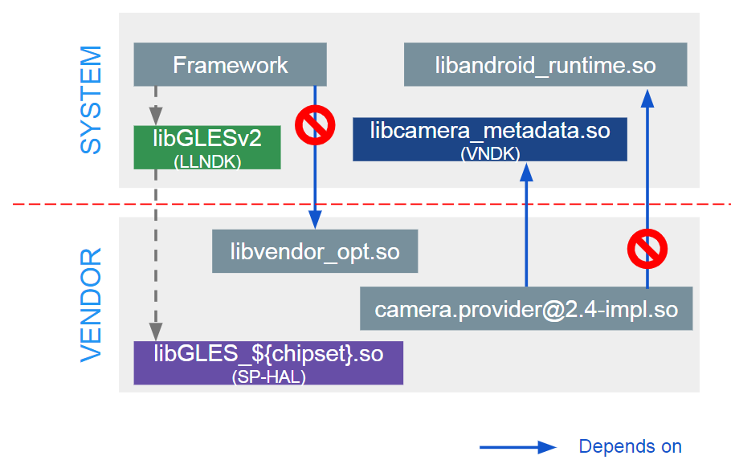
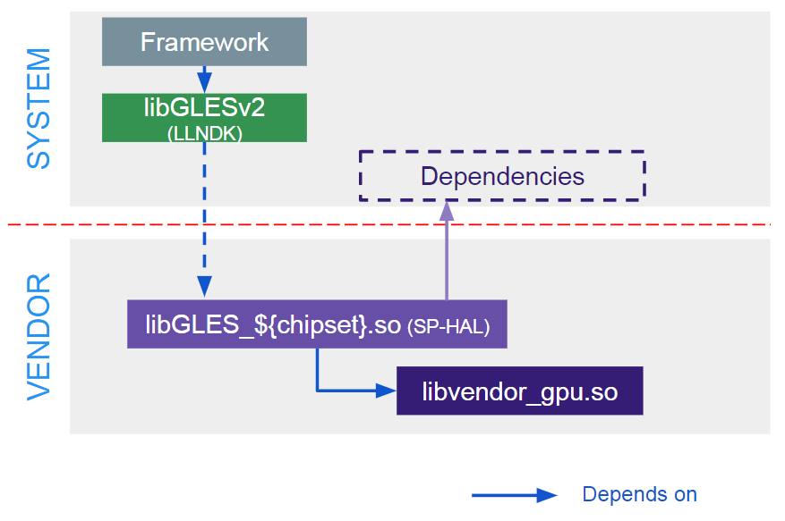
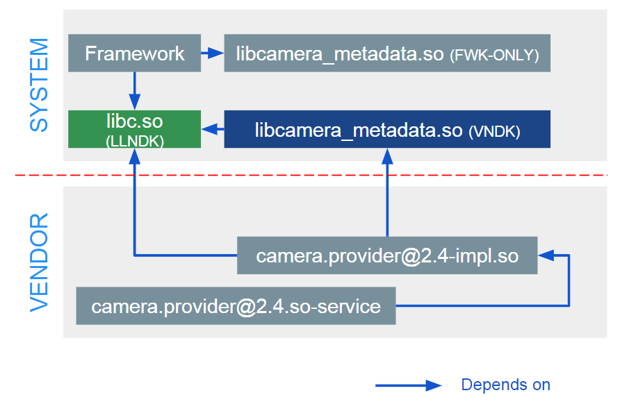
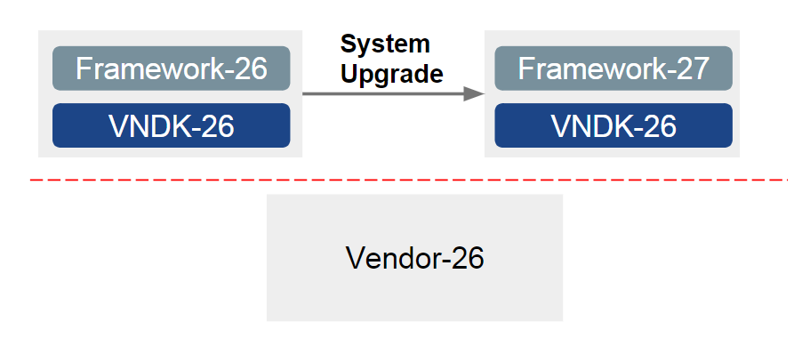
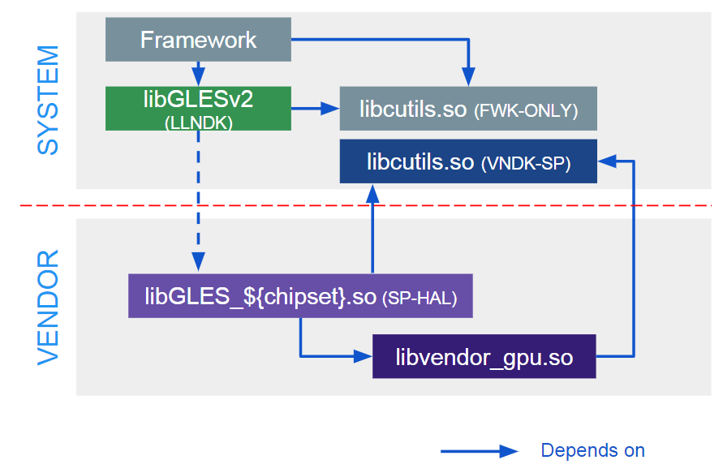

文章标题：**学习笔记: VNDK 基本概念**

- 作者：汪辰
- 联系方式：<unicorn_wang@outlook.com> / <wangchen20@iscas.ac.cn>

最近调试遇到了一些 HAL 的问题，阅读相关资料文档时遇到了一个绕不过去的 VNDK 的概念，做了些笔记整理如下备忘。

感觉 VNDK 的相关概念完全是 Android 特有的，非常工程化的概念。

代码基于 AOSP 12 for riscv ( <https://github.com/riscv-android-src>, branch: `riscv64-android-12.0.0_dev`)

文章大纲

<!-- TOC -->

- [1. 参考：](#1-参考)
- [2. VNDK](#2-vndk)
	- [2.1. VNDK 是什么](#21-vndk-是什么)
	- [2.2. VNDK 在系统中存放的位置](#22-vndk-在系统中存放的位置)
- [3. VNDK-SP](#3-vndk-sp)

<!-- /TOC -->

# 1. 参考：

个人体会：Android 官网上的资料一定要反复仔细看，由于 VNDK 这个概念对初次接触的人不是很好懂，一定要结合实际代码和案例再深入理解。

- 【参考 1】[Treble VNDK - Design Principles and Practical Migraton](https://source.android.com/docs/core/architecture/images/vndk_design_android_o.pdf)
- 【参考 2】[Vendor Native Development Kit (VNDK)](https://source.android.google.cn/docs/core/architecture/vndk)
- 【参考 3】[Enabling the VNDK](https://source.android.com/docs/core/architecture/vndk/enabling)
- 【参考 4】[VNDK Build System Support](https://source.android.com/docs/core/architecture/vndk/build-system)
- 【参考 5】[Here comes Treble: A modular base for Android](https://android-developers.googleblog.com/2017/05/here-comes-treble-modular-base-for.html)
- 【参考 6】[GPU 驱动自升级及其原理](https://blog.simowce.com/all-about-updated-driver/)
- 【参考 7】[HAL Types](https://source.android.com/docs/core/architecture/hal-types)

本笔记主要是结合 【参考 1】加上自己的理解注释，必要的地方我会引用 【参考 2】~【参考 4】中官方文档表述。

# 2. VNDK

## 2.1. VNDK 是什么

VNDK 的全称是 Vendor Native Development Kit，本身实际上指的是 Google 提供给 Vendor 用来开发自己 HAL 的一套库。但实际上这个概念的引入有一个很大的背景，就是 Treble 项目，具体参考 【参考 5】。自 Android O（8.0）以来，Google 引入了 Treble 架构，希望对 vendor 和 system 分区进行解耦处理。期望实现的目标在 【参考 2】中有这么一段话：

> In an ideal Android 8.0 and higher world, framework processes do not load vendor shared libraries, all vendor processes load only vendor shared libraries (and a portion of framework shared libraries), and communications between framework processes and vendor processes are governed by HIDL and hardware binder.

注解：Google（AOSP）负责维护 system 分区里的内容和升级；vendor 负责维护 vendor 分区中的内容。为了解耦（所谓解耦，在官方文档上常用 dependency 指代，实际可以理解为动态库链接意义上的依赖），位于 system 分区的 framwork 进程不可以加载 vendor 分区中的共享库等资源，vendor 分区中的 vendor 进程（我理解这指的应该主要是提供 HAL 服务的后台进程）仅加载 vendor 分区中的共享库（vendor 编写的 HAL so）以及也可能会加载部分 system 分区中的共享库（具体是什么后面会总结），而 framework 进程和 vendor 进程之间按照 HIDL/AIDL 方式定义的接口，通过 IPC/hwbinder 的方式来实现通信。

【参考 1】中对这种依赖性给出了下面这张图：

【图 1】

这张图的红色虚线上面就是 system 分区，下面就是 vendor 分区。其中几个概念 LLNDK、VNDK、SP-HAL 的概念下面再聊。这里关键是要注意的红色禁止符号强调的内容，就是上面我们说的引入解耦后不允许出现的链接和加载情况。

注意该图中的 `libcamera_metadata.so` 被标注为 VNDK，这个就是我们关注的 VNDK。

那么 VNDK 到底是什么？这张图由于偏重全貌，所以其实还说的不是很清楚。

我们先读一下官方的定义：在 【参考 2】 中有这么一段话：

> Eligible VNDK Libraries (VNDK) are Framework Shared Libraries that are safe to be copied twice. Framework Modules and Vendor Modules can link with their own copies. A framework shared library can become an eligible VNDK library only if it satisfies the following criteria:
> - It does not send/receive IPCs to/from the framework.
> - It is not related to ART virtual machine.
> - It does not read/write files/partitions with unstable file formats.
> - It does not have special software license which requires legal reviews.
> - Its code owner does not have objections to vendor usages.

我的理解是，之所以 framework 和 vendor 的 modules（注，这里的 modules 包括了 so 和 exe 等资源） 存在耦合，关键是因为它们都依赖于同一份公共的库，系统升级时一旦这些库的 ABI/API 发生变化，那么负责 framework modules 的 Google 和负责 vendor modules 的各个 Vendor 都要同步升级，这是一件很麻烦的事情，详细见 【参考 5】 中的描述。

所以改造的核心对象就是 framework modules 和 vendor modules 都依赖的那份公共的库。也就是下图中的那个 **Dependencies**。这些 **Dependencies** 其实就是在引入 Treble 设计之前原先 framework 维护的那组 framework modules（当时的世界好单纯啊！）。

【图 2】

经过深入的分析，Google 把这些 **Dependencies** 基于解耦的需要又再次分为两大类：

- **Dependencies** 中的第一类库的 API/ABI 相对稳定的，不会因为 AOSP 的升级而轻易改变，我们把它们叫做 LL-NDK，即 Low Level NDK。这都是一些非常底层的基础库，具体包括：

  > libEGL.so, libGLESv1_CM.so, libGLESv2.so, libGLESv3.so, libandroid_net.so, libc.so, libdl.so, liblog.so, libm.so, libnativewindow.so, libneuralnetworks.so, libsync.so, libvndksupport.so, and libvulkan.so,

  对于 LL-NDK，仍然保持一份就好，framework modules 和 vendor modules 共享同一套 LL-NDK 库。

- 除了 LL-NDK，**Dependencies** 中还有一些 framework modules 会被 vendor modules 访问。注意如果出现这种依赖情况我们对这些 framework modules 还是和原来一样只维护一份就不合适了。如下 【图 3】所示，假设 `libcamera_metadata.so` 这个库既会被 Framework 中的 modules 访问，又会被 vendor modules（图上是 `camera.provider@2.4-impl.so`）访问。那么这里的 `libcamera_metadata.so` 就是一个耦合点。Google 采用的解耦方法也很简单，就是对于 `libcamera_metadata`，我们在编译时会将其做成两份，一份给 Framework 的 modules 用，即图中的 `libcamera_metadata.so (FWK-ONLY)`，一份给 vendor modules 用，即图中的 `libcamera_metadata.so (VNDK)`。而给 vendor modules 用的这份 so 就叫 VNDK。在 【参考 4】 中基于 build system 的上下文环境，`libcamera_metadata.so (FWK-ONLY)` 也叫做 "core variant"，`libcamera_metadata.so (VNDK)` 也叫做 "vendor variant"。

  

  【图 3】

分成两份后，即引入多出来的那份 VNDK 后对升级的影响见下图（这个图也来自【参考 1】）。假设我们在构建某个 AOSP 版本，譬如 Android 8 时，采用的 Framework 和 VNDK 版本都是 26，结合上图，`libcamera_metadata.so (FWK-ONLY)` 属于 Framework-26 部分，`libcamera_metadata.so (VNDK)` 属于 VNDK-26，`camera.provider@2.4-impl.so` 属于 Vendor-26 部分。那么 vendor module 构建时都是基于 VNDK-26 的，工作正常。升级系统时，我们制作 system image 时，里面可以带上新的 Framework-27，其中 `libcamera_metadata.so (FWK-ONLY)` 升级到新的 27，而 VNDK 部分依然采用 VNDK-26。这样新系统启动后，Vendor-26 部分的 `camera.provider@2.4-impl.so` 依然会链接 VNDK-26 版本中的停留在 26 版本的 `libcamera_metadata.so (VNDK)`，framework 会链接 27 版本的 `libcamera_metadata.so (FWK-ONLY)`。也就是说，一式两份后，FWK-ONLY 和 VNDK 两部分可以单独升级，互不干扰，也就是解耦了。而且注意 FWK-ONLY 和 VNDK 这两部分还都在 Google 所掌控的 system image 中，Google 的控制权依然稳固。

【参考 1】中的【图 4】实际上就是在解释上面对升级的解耦支持：

【图 4】

值得注意的一点是，**Dependencies** 中的这第二类 framework modules 并不是都需要一式两份，这个实际 build 时也要看情况而定，具体见 【参考 4】的描述如下：

> If some framework modules depend on this module, the core variant is built. If some vendor modules depend on this module, the vendor variant is built.

## 2.2. VNDK 在系统中存放的位置

【参考 4】 VNDK APEX 章节有以下描述：

> In Android 10 and lower, modules with vndk.enabled were installed in `/system/lib[64]/vndk[-sp]-${VER}`. In Android 11 and higher, VNDK libraries are packaged in an APEX format and the name of VNDK APEX is `com.android.vndk.v${VER}`. Depending on the device configuration, VNDK APEX is flattened or unflattened and is available from the canonical path `/apex/com.android.vndk.v${VER}`.

我实验的系统是 aosp 12，所以我们可以去看一下 `out/target/product/emulator_riscv64/system/apex`, 下面的确存在一个 `com.android.vndk.current.apex` 文件。这个文件在系统启动阶段会被解压开后挂载在 `/apex/com.android.vndk.v${VER}` 下。

开模拟器登录会看到 `/apex` 下有个 `com.android.vndk.v31` 和 `com.android.vndk.v31@1`，具体解压开的是哪个我还没去仔细看，但这两个目录的文件都是一样的。以 `/apex/com.android.vndk.v31@1/lib64/android.hardware.audio.common@2.0.so` 为例，我们会发现 `/system/lib64/` 下也有一个同名的 `android.hardware.audio.common@2.0.so`。`/system/lib64/android.hardware.audio.common@2.0.so` 就是 "core variant"，而 `/apex/com.android.vndk.v31@1/lib64/android.hardware.audio.common@2.0.so` 就是 "vendor variant"。

# 3. VNDK-SP

VNDK-SP 其本质也是一种 VNDK，唯一的例外是这些 so 专用于 SP-HAL。所以上面涉及 VNDK 的内容对 VNDK-SP 也是适用的。这里我们重点关心一下 VNDK-SP 和普通 VNDK 的区别。

SP-HAL 的定义 【参考 2】 中有详细定义，摘录如下，更多的 SP-HAL 的介绍也可以见 【参考 7】 ：

> Same-Process HAL (SP-HAL) is a set of predetermined HALs implemented as Vendor Shared Libraries and loaded into Framework Processes. 

> SP-HALs must depend only on LL-NDK and VNDK-SP.

> VNDK-SP is a predefined subset of eligible VNDK libraries.

在 【参考 1】 中有下面这幅图很好地给出了 SP-HAL 和 VNDK-SP 的例子

【图 5】

图中 `libGLES_${chipset}.so` 就是一个 SP-HAL。譬如 surfaceflinger 这个 framework 维护的system 进程要进行 GPU 合成的时候，需要访问位于 vendor 分区的 GPU 驱动（`libvendor_gpu.so`），此时需要通过 `libGLES_${chipset}.so` 这个 HAL 代理，和普通 HAL 通过 IPC 方式不同，SP-HAL 是将 该 so 直接 dlopen 加载到 surfaceflinger 进程。由于属于 framework module 的 surfaceflinger 和来自 vendor module 的 `libGLES_${chipset}.so` 都要依赖 `libcutils.so`，所以为了升级解耦的需要，我们同样要遵循 VNDK 的要求，将 `libcutils.so` 一式两份，其中我们称给 `libGLES_${chipset}.so` 链接的那份 so 为 VNDK-SP。

注意这里和普通 VNDK 有所不同的是，【图 3】 中 HAL service 和 client 之间采用 IPC，所以 `libcamera_metadata.so (FWK-ONLY)` 和 `libcamera_metadata.so (FWK-VNDK)` 实际加载在两个不同的进程中，不存在名字冲突的问题。但是在 【图 5】 中 `libcutils.so (FWK-ONLY)` 和 `libcutils.so (VNDK-SP)` 两个 so 都会被加载到 surfaceflinger 这个进程中，为了解决加载冲突的问题，Google 又引入了 linker namespace 解决方案。这个专题也比较大，这里暂不展开。

