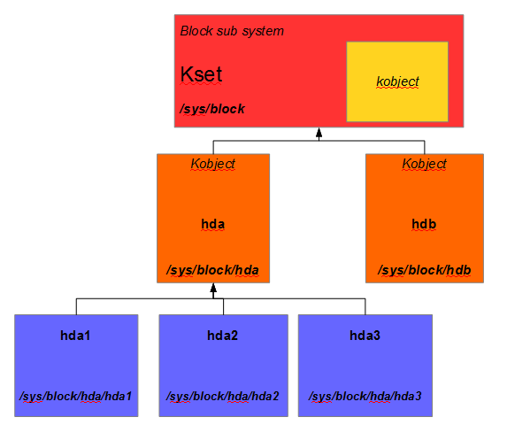
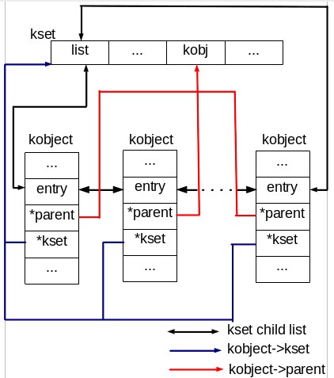

文章标题：**Linux 设备模型之 kobject 和 kset**

- 作者：汪辰
- 联系方式：<unicorn_wang@outlook.com> / <wangchen20@iscas.ac.cn>

本文主要记录了一些学习 Linux 设备模型（Device Model）过程中对 kobject 和 kset 数据结构的理解，这部分的内容网上其实已经很丰富了，这里更多的是对网上资料的摘抄以及根据自己的理解的重新整理。有什么雷同或者不足之处欢迎批评指正。

文章大纲

<!-- TOC -->

- [1. 参考：](#1-参考)
- [2. kobject](#2-kobject)
- [3. kset](#3-kset)
- [4. 总结](#4-总结)

<!-- /TOC -->

# 1. 参考：

- 【参考 1】ldd3
- 【参考 2】lkd3
- 【参考 3】ulk3
- 【参考 4】[Linux设备模型 (2)](http://www.cnblogs.com/wwang/archive/2010/12/16/1902721.html) 该文章有实际的代码例子讲解 kobject。
- 【参考 5】[kset example in Device Driver Module](https://embeddedbuddies555.wordpress.com/2020/04/12/kset-example-in-device-driver-module/) 该文章有实际的代码例子讲解 kset。
- 【参考 6】[linux device model简述](https://www.cnblogs.com/tanghuimin0713/p/3826904.html)
- 本文代码基于 Linux 内核代码 v6.0

本文侧重 Linux 设备模型中低层部分的两个核心数据结构 - kobject 和 kset。

# 2. kobject

kobject 是 Linux 设备模型中最基本的对象，它的功能是提供引用计数和维持父子(parent)结构、平级(sibling)目录关系。按照 OOP 的概念来看可以认为是设备模型中其他类的基类，上面的 `device`, `device_driver` 等类型都是在 `kobject` 的基础功能之上实现的子类；具体定义参考 `include/linux/kobject.h`

```cpp
struct kobject {
	const char		*name;
	struct list_head	entry;
	struct kobject		*parent;
	struct kset		*kset;
	const struct kobj_type	*ktype;
	struct kernfs_node	*sd; /* sysfs directory entry */
	struct kref		kref;
#ifdef CONFIG_DEBUG_KOBJECT_RELEASE
	struct delayed_work	release;
#endif
	unsigned int state_initialized:1;
	unsigned int state_in_sysfs:1;
	unsigned int state_add_uevent_sent:1;
	unsigned int state_remove_uevent_sent:1;
	unsigned int uevent_suppress:1;
};
```

其中:
- name：分配给 kobject 的名字就是我们在 sysfs 中看到的对应的目录名。这意味着处于 sysfs 分层结构同一层的 kobject 的名字必须唯一，而且名字必须是合法的文件名，不能包括 `/`，而且强烈建议不可以包含空格。
- entry：配合 kset 使用，kset 中会保存多个 kobject，采用链表维护，这个就是链表的挂载点，用于将这些 kobject 对象串联在一起。具体 kset 的介绍见下面 kset 的章节。
- parent：保存了另一个 kobject 的指针，这里不是 OOP 的父类的概念，而是拓扑（TOPO）上的概念，主要用途是用于表达模型的分层特性。也就是说 parent 所指向的 kobject 对象位于本 kobject 对象在 topo 层次的上一层。譬如一个 kobject 对象表示了一个 USB 设备，他的 parent 可能指向了该 USB 设备所连接的 USB 集线器对象，即表达了拓扑上 USB 设备是插在 USB 集线器上的概念。【参考 4】 所述：“内核里的设备之间是以树状形式组织的，在这种组织架构里比较靠上层的节点可以看作是下层节点的父节点，反映到 sysfs 里就是上级目录和下级目录之间的关系，在内核里，正是 kobject 帮助我们实现这种父子关系。”
- kset：指向该 kobject 所归属的 kset 对象。具体用途见下文 kset 的介绍。
- ktype：ktype 的类型 `struct kobj_type` 定义如下：

  ```cpp
  struct kobj_type {
   	void (*release)(struct kobject *kobj);
  	const struct sysfs_ops *sysfs_ops;
  	const struct attribute_group **default_groups;
  	const struct kobj_ns_type_operations *(*child_ns_type)(struct kobject *kobj);
  	const void *(*namespace)(struct kobject *kobj);
  	void (*get_ownership)(struct kobject *kobj, kuid_t *uid, kgid_t *gid);
  };
  ```
  - 函数指针 release 是给 kref 使用的，当引用计数为 0 这个指针指向的函数会被调用来释放内存。
  - `sysfs_ops` 和 `default_attrs`: 前文里提到，一个 kobject 对应 sysfs 里的一个目录，而目录下的每个文件对应一个该 kobject 的属性（attribute），`default_attrs` 定义了 kobject 的一个或者多个属性，实现为一个指针数组。`sysfs_ops` 用来定义读写这些属性文件的方法。从名字上可以看出来，`default_attrs` 是默认的属性，我们还可以动态添加属性。
- kref：`struct kref` 内含一个 `atomic_t` 类型，用于实现引用计数。
- sd：和 sysfs 展现有关，看到的是一个 dirent，所以一个 kobject 对应的是一个目录。
- uevent 相关项：和热插拔有关
 
# 3. kset

```cpp
/**
 * struct kset - a set of kobjects of a specific type, belonging to a specific subsystem.
 *
 * A kset defines a group of kobjects.  They can be individually
 * different "types" but overall these kobjects all want to be grouped
 * together and operated on in the same manner.  ksets are used to
 * define the attribute callbacks and other common events that happen to
 * a kobject.
 *
 * @list: the list of all kobjects for this kset
 * @list_lock: a lock for iterating over the kobjects
 * @kobj: the embedded kobject for this kset (recursion, isn't it fun...)
 * @uevent_ops: the set of uevent operations for this kset.  These are
 * called whenever a kobject has something happen to it so that the kset
 * can add new environment variables, or filter out the uevents if so
 * desired.
 */
struct kset {
	struct list_head list;
	spinlock_t list_lock;
	struct kobject kobj;
	const struct kset_uevent_ops *uevent_ops;
} __randomize_layout;
```

- list：一个 kset 维护了一个链表，链表的节点是 kobject。
- kobj：内嵌 kobject 对象表达的是 OOP 中继承的概念，说明我们可以把 kset 看成是 kobject 的子类。也就是说从设备模型的角度来说，一个 kset 对象也是一个 kobject，我们可以对其应用所有 kobject 的方法。
- uevent_ops：热插拔相关。

kset 是多个 kobject 的容器。从 OOP 的概念来看，表达的是多个 kobject 的聚集或者说是集合的概念。参考代码中的注释，这组放在同一个 kset 中的 kobject 并不要求是同一个 type，放在一起的原因是因为这些 kobject 具有类似的行为，适合统一的处理（统一的处理也体现在相同的 `uevent_ops`）。一旦定义了一个 kset 对象并将其添加到系统中，在 sysfs 中相应地创建一个目录。一个例子见下图：



【图 1】此图来自【参考 5】

# 4. 总结

用下面这张图来总结一下：



【图 1】此图来自【参考 6】

内核用 kobject 结构将各个对象组织起来组成一个分层的结构体系。每个 kobject 对应 sysfs 中的一个目录项。

体现在 sysfs 上的拓扑上的层次关系通过 kobject 中的 parent 指针实现。代表子节点的 kobject 的 parent 指针指向代表父节点的 kobject。

同一类行为类似的 kobject 还可以通过 kset 组织起来，其实 kset 也不过就是一个特殊的 kobject，但重要的是 kset 结构体中包含了一个 kobject 的链表，遍历该链表上的 kobject 会更方便。
