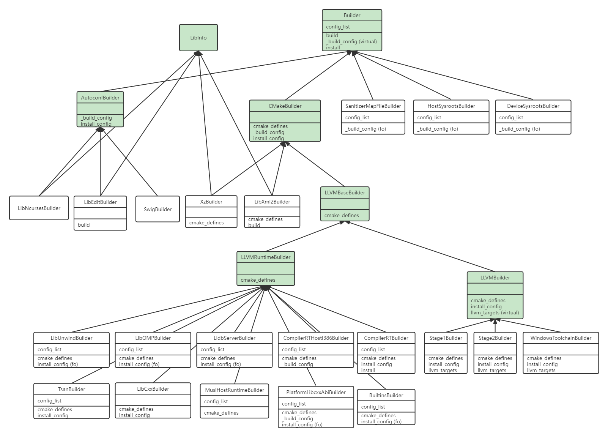

文章标题：**代码笔记：Android LLVM toolchain 构建系统**

- 作者：汪辰
- 联系方式：<unicorn_wang@outlook.com> / <wangchen20@iscas.ac.cn>


文章大纲

<!-- TOC -->

- [1. Build system overview](#1-build-system-overview)
	- [1.1. 构建入口](#11-构建入口)
	- [1.2. 构建主程序](#12-构建主程序)
	- [1.3. build system](#13-build-system)
- [2. builders](#2-builders)
	- [2.1. builder.registry](#21-builderregistry)
	- [2.2. base builders](#22-base-builders)
		- [2.2.1. Builder](#221-builder)
		- [2.2.2. CMakeBuilder](#222-cmakebuilder)
		- [2.2.3. LLVMBaseBuilder](#223-llvmbasebuilder)
		- [2.2.4. AutoconfBuilder](#224-autoconfbuilder)
	- [2.3. builders](#23-builders)
- [3. 主流程](#3-主流程)
	- [3.1. 命令选项](#31-命令选项)
	- [3.2. 构建主函数 main](#32-构建主函数-main)

<!-- /TOC -->

Android 采用 LLVM 框架构建 clang 工具链，本文是在阅读相关源码后的一些笔记总结。

具体构建的指导可以参考 [Android Clang/LLVM Toolchain](https://android.googlesource.com/toolchain/llvm_android/+/refs/heads/master/README.md)。

参考上文的 "Build Instructions" 中的指导下载代码后，可以在 `llvm-toolchain/toolchain` 看到和构建 clang 最相关的一些仓库的目录。其中：

- llvm-project: 这个是 LLVM/clang 的源码，Google 的仓库紧跟 LLVM 的官方上游。
- llvm_android: 这个是 Google 自己的仓库，这个仓库下主要是用 python 编写的用来构建 LLVM/clang 的自动化脚本，也是本文关注的核心，即 Android LLVM toolchain 的构建系统（Build System）。学习这个 Build System 的处理逻辑，对自己编译 llvm 项目也有很大的帮助。

下文定义源码树根目录路径为 `$TOP`，即对应官方说明中的 `llvm-toolchain`。

本文代码对应 `https://android.googlesource.com/toolchain/llvm_android` 的 commit: 4b86da2b29ef3f9a268f887c9554eb437823a2b9。

# 1. Build system overview

## 1.1. 构建入口

`$TOP/toolchain/llvm_android/build.py`

构建执行的命令入口如下

```bash
$ cd $TOP
$ python toolchain/llvm_android/build.py
```

`build.py` 的代码很简单，就是调用了 `py3_utils.run_with_py3`

```python
import py3_utils

py3_utils.run_with_py3('do_build.py')
```

而 `py3_utils` 封装了对 python3 的调用，阅读 `py3_utils.py`，可知其中 `run_with_py3` 实际就是调用的 `$TOP/prebuilts/python/linux-x86/bin/python3`。所以核心是看 `do_build.py` 这个 python 脚本。

## 1.2. 构建主程序

参考 `$TOP/toolchain/llvm_android/do_build.py` 中的 `main()` 函数。主程序的主干流程如下。

- parse_args()
- stage1：使用 prebuilt 的 clang 工具，具体版本定义在 `CLANG_PREBUILT_VERSION`，构建 stage1
- stage2：使用 stage1 生成的 clang 继续构架 stage2，以及 runtime 等

以执行 `python toolchain/llvm_android/build.py > build.log 2>&1` 为例，在生成的 `build.log` 中搜索关键字 "INFO:builder_registry" 可以看到构建的主要步骤如下，具体参考下文 `builder_registry` 在构建 builder 中的介绍。

```
INFO:builder_registry:Building stage1.

INFO:builder_registry:Building swig.
INFO:builder_registry:Building libxml2.
INFO:builder_registry:Building liblzma.
INFO:builder_registry:Building libncurses.
INFO:builder_registry:Building libedit.

INFO:builder_registry:Building stage2.

以下为构建 runtime 库，参考 `build_runtimes()`
{
    INFO:builder_registry:Building device-sysroots.
    INFO:builder_registry:Building builtins.
    INFO:builder_registry:Building libunwind.
    INFO:builder_registry:Building platform-libcxxabi.
    INFO:builder_registry:Building compiler-rt.
    INFO:builder_registry:Building tsan.
    INFO:builder_registry:Building compiler-rt-i386-host.
    INFO:builder_registry:Building compiler-rt-linux-musl.
    INFO:builder_registry:Building libomp.
    INFO:builder_registry:Building lldb-server.
    INFO:builder_registry:Building sanitizer-mapfile.
}

INFO:builder_registry:Building host-sysroots.

以下为构建 windows 版本的 llvm 项目，参考 `build_llvm_for_windows()`
{
    INFO:builder_registry:Building libcxx.
    INFO:builder_registry:Building libxml2.
    INFO:builder_registry:Building liblzma.
    INFO:builder_registry:Building windows-x86-64.
}
```

## 1.3. build system

LLVM Android 的 build system 采用 python 编写，由 builders 和 configs 两组类构成。其中

- 每个需要构建的对象实体对应一个 builder，这里的构建对象并不要简单理解为一个构建生成的程序，而可能是一组程序，但我们把这些整体称为一个构建对象，譬如 stage1 就是一个构建对象，由 Stage1Builder 负责定义构建这个对象的所有步骤。

  所有的 builder 规则定义有类的继承关系，分两类定义在两个主要文件中：
  - `$TOP/toolchain/llvm_android/base_builders.py`，这个文件中定义的可以认为都是一些基类，不会创建实际的执行构建的类对象。
  - `$TOP/toolchain/llvm_android/builders.py`，这个文件中定义了从 base builders 派生而来，会创建实际的执行构建的类对象的类，所谓执行构建指的是执行实际的 `build()` 方法。

  所有 builders 类的类图总结如下，图中：
  - 绿色的类定义在 `base_builders.py` 中为基础类，定义了有些公共的行为和属性。但我们不会基于这些类定义实际的构建驱动对象。
  - 白色的类定义在 `builders.py` 中，这些是实际的构建驱动对象

  

- configs 用于管理以下概念，某个 builder 可能需要针对不同的配置，构建多种变体，譬如区分该项目是否为 platform 构建（即只作为 prebuilts 的 clang 供编译 aosp 使用）还是 ndk 构建（即作为 ndk 的发布包的一部分）；是否构建静态库版本，等等，排列组合后会有多种变体。每一个变体通过一个 config 表示。
  
  所有的 configs 定义在 `$TOP/toolchain/llvm_android/configs.py` 中。

  
  
  以 BuiltinsBuilder 为例，搜索关键字 `INFO:base_builders:Building builtins for` 会看到同一个 BuiltinsBuilder 会构建 9 次，其中 `builtins` 是 BuiltinsBuilder 的 name 属性。

  ```
  INFO:base_builders:Building builtins for Android-ARM (platform=False static=False None)
  INFO:base_builders:Building builtins for Android-AARCH64 (platform=False static=False None)
  INFO:base_builders:Building builtins for Android-I386 (platform=False static=False None)
  INFO:base_builders:Building builtins for Android-X86_64 (platform=False static=False None)
  INFO:base_builders:Building builtins for Baremetal
  INFO:base_builders:Building builtins for Android-ARM (platform=False static=False {'is_exported': True})
  INFO:base_builders:Building builtins for Android-I386 (platform=False static=False {'is_exported': True})
  INFO:base_builders:Building builtins for Linux / hosts.Arch.AARCH64
  INFO:base_builders:Building builtins for Linux / hosts.Arch.ARM
  ```

# 2. builders

## 2.1. builder.registry

代码文件：`$TOP/toolchain/llvm_android/builder_registry.py`

可以认为就是调用 builder 的一个封装类，利用 decorate 语法糖, 调用方式参考 Builder 类的 `build()` 方法的写法如下，效果就是当我们在对从 Builder 派生的子类执行 `build()` 方法时，程序会首先执行 BuilderRegistry 类的 `register_and_build()` 方法。

```python
@BuilderRegistry.register_and_build
    def build(self) -> None:
```

再看 BuilderRegistry 类的 `register_and_build()` 方法：

```python
@classmethod
    def register_and_build(cls, function):
        """A decorator to wrap a build() method for a Builder."""
        def wrapper(builder, *args, **kwargs) -> None:
            name = builder.name
            cls._builders[name] = builder
            if cls.should_build(name):
                logger().info("Building %s.", name)
                function(builder, *args, **kwargs)
            else:
                logger().info("Skipping %s.", name)
        return wrapper
```

其效果就是，当我们调用实际的 builder 的 `build()` 方法时会在 log 中打印 "INFO:builder_registry:Building XXXX"，然后在调用实际的 `build()` 方法，起到一种封装调用的效果。

## 2.2. base builders

这里定义了一些基类， 挑几个主要的看一下：

### 2.2.1. Builder

主要属性：

- `name: str = ""`：这个在 Builder 中定义为空，具体派生子类中会给自己起一个名字，会被用在 log 中。

- `config_list: List[configs.Config]`
  每个 Builder 以及其派生的子类对象都会维护一个 Config 的 list。每个 Config 顶对应一个构建的配置，也同时对应一个对应的构建动作。

- `toolchain: toolchains.Toolchain = toolchains.get_prebuilt_toolchain()`
  
  代表了用来执行构建所用的 toolchain，默认取 prebuilt 的 toolchain。如果是 stage2 中则会更新其为 stage1 中制作的 new toolchain

重要的方法：
- build 
  
  ```python
  @BuilderRegistry.register_and_build
  def build(self) -> None:
        """Builds all configs."""
        for config in self.config_list:
            self._config = config

            logger().info('Building %s for %s', self.name, self._config)
            self._build_config()
        self.install()
  ```
  
  几乎所有从 Builder 派生的子类的都会执行 `build()`，这个函数实现了构建的主框架流程，`build()` 内部会遍历 `config_list` 这个列表， 取出每个 config，针对每个 config 调用 `_build_config()`, 最后统一调用 `install()`。
  
  `_build_config()` 和 `install()` 这是两个非常重要的虚方法，会被子类重载实现，执行具体的构建和安装动作。
  
- `_build_config()`：根据当前的 config，也就是 `self._config` 进行构建。Builder 的这个函数是一个纯虚函数，需要子类重写实现，最主要的实现者包括：
  
  - AutoconfBuilder
  - CMakeBuilder：实现了基本的 build 过程， 包括 cmake -> ninja -> ninja install, 其中 ninja install 由调用 install_config 实现 
    - LLVMBaseBuilder： n/a
      - LLVMRuntimeBuilder: n/a
        - CompilerRTHostI386Builder
        - PlatformLibcxxAbiBuilder
  - SanitizerMapFileBuilder: full-overwrite
  - HostSysrootsBuilder：full-overwrite
  - DeviceSysrootsBuilder ：full-overwrite

- `install()` 基类的虚函数，Builder 什么也没有实现。会被子类重写，定义对应的安装过程规则。会重写整个虚函数的子类很少，目前只看到 CompilerRTBuilder


### 2.2.2. CMakeBuilder

如果一个项目实际基于 cmake 实现其 build system，则其对应的 builder 从 CMakeBuilder 派生，触发执行 cmake 定义的构建动作。

llvm 下的大部分项目的 build-system 采用 cmake，参考本文提供的 builder 类图可以有个总体把握。

主要方法：

- `cmake_defines()`: 这是是针对采用 cmake 这种方式来定义 cmake 的 configure 的，所以这个函数是 CMakeBuilder 以及其派生类才会有，如果采用其他的 build system，应该会有另外的 xxx_defines。cmake_defines 中引用 `self._config`（也就是 Config，在父类的 build() 中传入）。

- `_build_config()`: 所有从 Builder 派生的子类都需要实现这个方法，Builder 的该方法是一个纯虚方法，实际并没有实现什么，所以 CMakeBuilder 覆盖了父类 Builder 同名方法， 定义了基于 cmake 的构建的主要动作。

  ```python
      def _build_config(self) -> None:
          if self.remove_cmake_cache:
              self._rm_cmake_cache(self.output_dir)
  
          if self.remove_install_dir and self.install_dir.exists():
              shutil.rmtree(self.install_dir)
  
          # 下面这三句话就是在组装第一条执行cmake的命令
  	cmake_cmd: List[str] = [str(paths.CMAKE_BIN_PATH), '-G', 'Ninja']
          cmake_cmd.extend(f'-D{key}={val}' for key, val in self.cmake_defines.items())
          cmake_cmd.append(str(self.src_dir))
  
  	# 创建输出路径
          self.output_dir.mkdir(parents=True, exist_ok=True)
  
          # 这里创建的 out/stage1/cmake_invocation.sh 不知道有什么用，感觉就是可以让我们看看实际的 cmake 的选项供调试用
          env = self.env
          utils.create_script(self.output_dir / 'cmake_invocation.sh', cmake_cmd, env)
          # 执行第一条 cmake 的命令，
  	# 参考 toolchain/llvm_android/utils.py 中 会 check_call -> subprocess_run
  	# 每次执行会打印 "subprocess.run:%s %s"
  	# 然后创建子进程传入 cmd，cd 进入 out 目录后执行 
  	utils.check_call(cmake_cmd, cwd=self.output_dir, env=env)
  
  	# _ninja 内部同样调用 check_call 执行 ninja 命令
          self._ninja(self.ninja_targets)
  	# 调用 check_call 执行 ninja install
          self.install_config()
  ```

- `install_config()`: CMakeBuilder 开始有这个函数，原因是 `_build_config()` 会调用该函数。这个函数和 install 的区别是，`install_config()` 是针对当前 config 的，而 `install()` 是对所有 config 的，可以再仔细看一下 Builder 中对 `build()` 和 `install()` 的说明。
  
  CMakeBuilder 的 `install_config()` 本质上就是执行 "ninja install"，这意味这凡是没有 full-overwrite 的继承子类，都是会先执行 "ninja install"，然后在执行自己的特定 install 步骤，而那些 full-overwrite 的子类则一般不执行 ninja install，而是只执行自定义的安装步骤

  有以下派生自 CMakeBuilder 的子类会 overwrite install_config，其中部分子类会 full-overwrite
  - LLVMBuilder
    - Stage1Builder
    - Stage2Builder
    - WindowsToolchainBuilder
  - LLVMRuntimeBuilder: n/a
    - LibUnwindBuilder：full-overwrite
    - LibOMPBuilder: full-overwrite
    - LldbServerBuilder: full-overwrite
    - CompilerRTBuilder
    - TsanBuilder
    - LibCxxBuilder
    - PlatformLibcxxAbiBuilder: full-overwrite
    - BuiltinsBuilder: full-overwrite

### 2.2.3. LLVMBaseBuilder

Base builder for both llvm and individual runtime lib.

从 CMakeBuilder 派生，说明这些项目都是用 cmake

会直接派生两个子类：
- LLVMRuntimeBuilder： Base builder for llvm runtime libs. 下面会直接派生一些 builder
  - LibUnwindBuilder
  - CompilerRTBuilder
  - ......
- LLVMBuilder： Builder for LLVM project. 下面会直接派生一些最终的 builder，譬如
  - Stage1Builder
  - Stage2Builder
  - WindowsToolchainBuilder


指的一提的是 LLVMBuilder 定义了一个纯虚函数 llvm_targets，这个纯虚函数会被 LLVMBuilder 派生的 Stage1Builder/Stage2Builder/WindowsToolchainBuilder overwrite，而最终会被 LLVMBuilder::cmake_defines 使用，用于定义 `LLVM_TARGETS_TO_BUILD` 的值。


### 2.2.4. AutoconfBuilder

这个类和 CMakeBuilder 一样都派生于 Builder

从 AutoconfBuilder 派生的子类有：

- LibNcursesBuilder
- LibEditBuilder
- SwigBuilder

和 CMakeBuilder 类似，AutoconfBuilder 有如下几个重要的成员函数

- `_build_config()`, 大致逻辑如下
  - 运行 configure， 具体的 config 命令会写入到 output_dir / 'config_invocation.sh'。搜索这个文件会看到有：
  ```bash
  find out -name "config_invocation.sh"
  out/lib/libncurses-linux/config_invocation.sh
  out/lib/libedit-linux/config_invocation.sh
  out/lib/swig-linux/config_invocation.sh
  ```
  - 执行 make
  - 执行 make install

## 2.3. builders

builders 比较多，这里就简单记录一个 Stage1Builder，其他的类似

Stage1Builder 是从 CMakeBuilder 为基类派生下来的 Builder，派生关系是：`CMakeBuilder <-- LLVMBaseBuilder <-- LLVMBuilder <-- Stage1Builder`

整个构建过程基本可以参考 CMakeBuilder 的 `_build_config()` 实现。

- 第一步: cmake

  注意 Stage1Builder 初始化时传入的参数是 LinuxConfig，最终形成的 cmake 选项如下，从 log 中获取的, 再和以上各个类的 cmake_defines 比对，已做过行处理
  [cmake for stage1](./cmake-stage1.md)

- 第二步：ninja

  生成的内容在 out/stage1

- 第三步：ninja install
  
  安装在 out/stage1-install

Stage1Builder 会在 out 下生成 stage1 目录，里面存放所有的 stage1 的临时文件和生成的目标文件，

cmake 会生成一些重要的文件供 ninja 使用，包括：
- `$TOP/out/stage1/CMakeFiles/rules.ninja`， 定义了 ninja 的一些 rules，会被 build.ninja 所 include
- `$TOP/out/stage1/build.ninja`：ninja 的 build文件

# 3. 主流程

## 3.1. 命令选项

参考 `parse_args()` 这个函数，`parse_args()` 这个函数负责解析我们执行 `python toolchain/llvm_android/build.py` 时可以带的命令行参数选项。`main()` 函数的第一行就是调用 `parse_args()` 对命令行进行解析。

parser 是一个 `argparse.ArgumentParser()` 的类对象， 支持命令行参数的基本形式是 `--option=val1,val2`

一堆的 `parser.add_argument(...)` 就是在给他安装可能处理的选项，下面是个例子：

```python
parser.add_argument(
        '--no-build', // 选项名字
        action=CommaSeparatedListAction,  // action 定义了如何对 "--no-build=xxxxx" 的等号后面部分按照逗号进行分隔解析，这是一个自己定义的函数，支持多个值形式
        default=list(),
        help='Don\'t build toolchain components or platforms.  Choices: ' + \
            known_components_str)
```

known_components_str 包含三项，"linux", "windows", "lldb" 这是构建可能涉及的三个组件, 即 linux 版本的 clang；windows 版本的 clang；lldb （这个是什么版本的，TBD）

```python
known_components = ('linux', 'windows', 'lldb')
known_components_str = ', '.join(known_components)
```

参考 README，如果我们不想构建 windows 上的 clang 可以输入：

```bash
$ python toolchain/llvm_android/build.py --no-build windows
```

注意：parser 处理完后会对每个选项生成一个变量与之对应，变量的名字和选项的名字有关，譬如假设选项的名字是 '--no-build'，那么会生成一个 `args.no_build`, 所以我们看到 `main()` 中调用完 `parse_args()` 后就开始对形如 `args.no_build` 这样的变量进行判断和处理。

- '--build-name': 构建 clang 的名字，默认为 “dev”，即生成的 toolchain 目录为 "clang-dev"
- '--enable-assertions'：是否使能 assertions，默认 false
- '--lto'/'--no-lto'，这是两个互斥的选项，不可以同时存在，决定是否使能/关闭 lto（Link-Time Optimization），只会影响 stage2，注意如果执行 lto 会大大增加编译所消耗的时间。
- '--bolt'/'--no-bolt'/'--bolt-instrument', 这是三个互斥的选项，不可以同时存在，决定是否使能/关闭 bolt（Binary Optimization and Layout Tool）,只会影响 stage2，注意如果执行 bolt 会大大增加编译所消耗的时间
- '--pgo'/'--no-pgo'，这是两个互斥的选项，不可以同时存在，决定是否使能/关闭 PGO（Profile-Guided Optimization），只会影响 stage2。
- '--debug'，是否构建 debug 版本的 clang 和 llvm tools，默认 false。只会影响 stage2
- '--build-instrumented'，是否在构建 llvm 是启用 PGO instrumentation（所谓 instrumentation 技术是把 probes(探针、stub、桩) 插入到编译代码当中，用来收集运行时信息，比如一个函数被调用次数。这里启用的 instrumentation 是用于做 PGO 优化），默认 false
- '--skip-build'/'--skip-package'：这是两个互斥的选项，不可以同时存在，要么 skip 构建只打包，要么 skip 打包只构建，不可以两者都跳过，就什么都不做了。默认都是 false, 即默认 build 和 package 都做。可以简写为 '-sb'/'-sp'
- '--skip-source-setup': 是否忽略对源码打补丁，默认 false，既会打补丁，打补丁操作会将源码拷贝一份出来做本地修改比较费时，如果已经编译过一次，只是执行增量编译，可以加上这个选项加快编译速度。
- '--skip-apply-patches': 是否忽略对源码打本地补丁，默认 false，既会打补丁
- '--create-tar': 是否编译完后对 toolchain 打包，默认 false
- '--no-strip'：是否不 strip 二进制的程序和库，默认 false，也就是会 strip
- '--skip-tests': 是否在执行完 stage1 和 stage2 构建后跳过测试检验，默认是 false，即会运行测试
- '--build'/'--skip'：指定 "要构建"/"不要构建" 的组件列表，这是两个互斥的选项，不可以同时出现。如果指定了 '--build'，则没有出现在指定列表中的组件会被 skip，反之对于 '--skip'，没有出现在指定列表中的组件会被构建。
- '--single-stage'：跳过 stage1，使用 prebuilt 中的 toolchain 代替。默认 false
- '--skip-runtimes'：指定忽略不构建 runtime 库，默认 false, 即默认要生成 runtime
- '--no-build'：指定是否不构建某些组件，包括 'linux', 'windows', 'lldb'，默认为空， 即没有不要构建的，即都要构建
- '--build-llvm-next'/'--build-llvm-tot': 默认都是 false
- '--windows-sdk': 设置 Windows SDK 的 path，
- '--musl'/'--no-musl': 一组互斥选项，设置是否要基于 musl 的 libc，默认为不使用 musl，默认使用 bionic？TBD

## 3.2. 构建主函数 main

main 函数分析

```python
def main():
    dist_dir = Path(utils.ORIG_ENV.get('DIST_DIR', paths.OUT_DIR))
    args = parse_args()
    timer.Timer.register_atexit(dist_dir / 'build_times.txt')

    if args.skip_build:
        # Skips all builds
        BuilderRegistry.add_filter(lambda name: False)
    elif args.skip:
        BuilderRegistry.add_skips(args.skip)
    elif args.build:
	# 将 --build 指定的 builders 注册到 BuilderRegistry，后面可以通过 BuilderRegistry.should_build("builder-name") 来判断一个 builder 是否要参与构建。
        BuilderRegistry.add_builds(args.build)
    if args.single_stage:
        BuilderRegistry.add_skips(['stage1'])

    do_bolt = args.bolt and not args.debug and not args.build_instrumented
    do_bolt_instrument = args.bolt_instrument and not args.debug and not args.build_instrumented
    do_runtimes = not args.skip_runtimes
    do_package = not args.skip_package
    do_strip = not args.no_strip
    do_strip_host_package = do_strip and not args.debug and not (args.build_llvm_next or args.build_llvm_tot)
    build_lldb = 'lldb' not in args.no_build
    musl = args.musl

    # 默认 musl 为 False
    # configs.host_config 会返回当前主机对应匹配的 Config, 默认是 LinuxConfig
    # 参考 LinuxConfig 的定义，构建的 toolchain 的 Host 是 Linux，生成的 toolchain（target） 也是运行在 Linux 上
    # 看上去是用 gcc 制作, 即 ./prebuilts/gcc/linux-x86/host/x86_64-linux-glibc2.17-4.8
    # 生成的 host_configs 会在下面传入 Stage1Builder 的参数
    host_configs = [configs.host_config(musl)]

    android_version.set_llvm_next(args.build_llvm_next)
    android_version.set_llvm_tot(args.build_llvm_tot)

    # 如果当前构建主机是 Darwin 或者用户没有指定不构建 linux 版本的 llvm， 则 need_host 为真。
    need_host = hosts.build_host().is_darwin or ('linux' not in args.no_build)
    need_windows = hosts.build_host().is_linux and ('windows' not in args.no_build)

    logging.basicConfig(level=logging.DEBUG)

    # 执行 python toolchain/llvm_android/build.py， 打印如下
    # INFO:__main__:do_build=True do_stage1=True do_stage2=True do_runtimes=True do_package=True need_windows=True lto=False bolt=False musl=False
    logger().info('do_build=%r do_stage1=%r do_stage2=%r do_runtimes=%r do_package=%r need_windows=%r lto=%r bolt=%r musl=%r' %
                  (not args.skip_build, BuilderRegistry.should_build('stage1'), BuilderRegistry.should_build('stage2'),
                  do_runtimes, do_package, need_windows, args.lto, args.bolt, args.musl))

    # 调用 ./external/toolchain-utils/llvm_tools/patch_manager.py 打补丁, 
    # 补丁的路径在 toolchain/llvm_android/patches， 根据 toolchain/llvm_android/patches/PATCHES.json 中的指示打补丁
    # 内部会先将 llvm 的源码拷贝到一个临时目录再打补丁，但应该不会污染源码仓库， 最后应该复制到 out/llvm-project 目录下了
    # Clone sources to be built and apply patches.
    if not args.skip_source_setup:
        source_manager.setup_sources(source_dir=paths.LLVM_PATH, skip_apply_patches=args.skip_apply_patches)

    # Build the stage1 Clang for the build host
    instrumented = hosts.build_host().is_linux and args.build_instrumented

    # Stage1Builder 是 Builder 的派生类，这里的参数会传入 Builder::__init__, 也就是 self._config 会被初始化为 LinuxConfig，而且看上去self.config_list 也只有一项
    stage1 = builders.Stage1Builder(host_configs)
    stage1.build_name = 'stage1'
    stage1.svn_revision = android_version.get_svn_revision()
    # Build lldb for lldb-tblgen. It will be used to build lldb-server and windows lldb.
    stage1.build_lldb = build_lldb
    stage1.build_extra_tools = args.run_tests_stage1
    stage1.build_android_targets = args.debug or instrumented
    # INFO:builder_registry:Building stage1.
    # cmake -G Ninja ......
    # Build files have been written to: /aosp/wangchen/dev-llvm/clang-toolchain/out/stage1 构建的结果写入 out/stage1
    # 执行 ninja
    # 执行 ninja install
    # 解压 tar -jxC /aosp/wangchen/dev-llvm/clang-toolchain/out -f /aosp/wangchen/dev-llvm/clang-toolchain/prebuilts/clang/host/linux-x86/profiles/r416183.profdata.tar.bz2， 解压后在 out 下生成 r416183.profdata
    stage1.build()
    # stage1 test is off by default, turned on by --run-tests-stage1,
    # and suppressed by --skip-tests.
    if not args.skip_tests and args.run_tests_stage1:
        stage1.test()
    # 如果没有跳过 stage1，则将 stage1 生成的 toolchain 作为下个阶段使用的 toolchain
    if not args.single_stage:
	set_default_toolchain(stage1.installed_toolchain)

    # swig 是需要构建的
    if build_lldb:
        # Swig is needed for both host and windows lldb.
        swig_builder = builders.SwigBuilder(host_configs)
        swig_builder.build()
    else:
        swig_builder = None

    if need_host:
        if args.pgo:
            profdata, clang_bolt_fdata = extract_profiles()
        else:
            profdata, clang_bolt_fdata = None, None

        # 这里在设置 stage2 的一些参数。还没有开始 build
		# 譬如是否要 lto 优化等等 
        stage2 = builders.Stage2Builder(host_configs)
        stage2.build_name = args.build_name
        stage2.svn_revision = android_version.get_svn_revision()
        stage2.debug_build = args.debug
        stage2.enable_assertions = args.enable_assertions
        stage2.lto = args.lto
        stage2.build_instrumented = instrumented
        stage2.bolt_optimize = args.bolt
        stage2.bolt_instrument = args.bolt_instrument
        stage2.profdata_file = profdata if profdata else None
    	
        # 先构建 libxml2
        # INFO:builder_registry:Building libxml2.
        # cmake -G Ninja ......
    	# 执行 ninja
    	# 执行 ninja install
        libxml2_builder = builders.LibXml2Builder(host_configs)
        libxml2_builder.build()
        stage2.libxml2 = libxml2_builder

        stage2.build_lldb = build_lldb
	
        # 如果要构建 lldb 则在执行 stage2 之前还要额外构建一些东西，包括
        # XzBuilder
        # LibNcursesBuilder
        # LibEditBuilder
        if build_lldb:
            stage2.swig_executable = swig_builder.install_dir / 'bin' / 'swig'

            xz_builder = builders.XzBuilder(host_configs)
            xz_builder.build()
            stage2.liblzma = xz_builder

            libncurses = builders.LibNcursesBuilder(host_configs)
            libncurses.build()
            stage2.libncurses = libncurses

            libedit_builder = builders.LibEditBuilder(host_configs)
            libedit_builder.libncurses = libncurses
            libedit_builder.build()
            stage2.libedit = libedit_builder

        stage2_tags = []
        # Annotate the version string if there is no profdata.
        if profdata is None:
            stage2_tags.append('NO PGO PROFILE')
        if clang_bolt_fdata is None:
            stage2_tags.append('NO BOLT PROFILE')
        # Annotate the version string if this is an llvm-next build.
        if args.build_llvm_next or args.build_llvm_tot:
            stage2_tags.append('ANDROID_LLVM_NEXT')
        stage2.build_tags = stage2_tags

        # 实际开始构建 stage2
        # INFO:builder_registry:Building stage2.
        # cmake -G Ninja ......
        # Build files have been written to: /aosp/wangchen/dev-llvm/clang-toolchain/out/stage2
        # ninja
        # ninja install
        stage2.build()

        # 尝试用 llvm-bolt 对 stage2 的结果进行优化
        if do_bolt and clang_bolt_fdata is not None:
            bolt_optimize(stage2, clang_bolt_fdata)

        # 尝试将默认 toolchain 切换为 stage2 的结果，用新的 toolchain 构建 runtime
        if not (stage2.build_instrumented or stage2.debug_build):
            set_default_toolchain(stage2.installed_toolchain)

        Builder.output_toolchain = stage2.installed_toolchain
		# 只有当构建的主机是 linux 而且用户指定需要构建 runtime（没有 skip）
        # runtime 是需要构建的，内部有很多东西需要构建
		# 可以看一下 build_runtimes() 这个函数的定义，这个函数貌似还有一些模块没有给 riscv 实现构建 TBD, fixme
        # def build_runtimes(build_lldb_server: bool):
        #    builders.DeviceSysrootsBuilder().build()
        #    builders.BuiltinsBuilder().build()
        #    builders.LibUnwindBuilder().build()
        #    builders.PlatformLibcxxAbiBuilder().build()
        #    builders.CompilerRTBuilder().build()
        #    builders.TsanBuilder().build()
        #    # Build musl runtimes and 32-bit glibc for Linux
        #    if hosts.build_host().is_linux:
        #        builders.CompilerRTHostI386Builder().build()
        #        add_lib_links('stage2')
        #        builders.MuslHostRuntimeBuilder().build()
        #    builders.LibOMPBuilder().build()
        #    if build_lldb_server:
        #        builders.LldbServerBuilder().build()
        #    # Bug: http://b/64037266. `strtod_l` is missing in NDK r15. This will break
        #    # libcxx build.
        #    # build_libcxx(toolchain, version)
        #    builders.SanitizerMapFileBuilder().build()
        if hosts.build_host().is_linux and do_runtimes:
            build_runtimes(build_lldb_server=build_lldb)

    # 这个先忽略
    if need_windows:
        # Host sysroots are currently setup only for Windows
        builders.HostSysrootsBuilder().build()
        if args.windows_sdk:
            win_sdk.set_path(Path(args.windows_sdk))
        win_builder, win_lldb_bins = build_llvm_for_windows(
            enable_assertions=args.enable_assertions,
            build_name=args.build_name,
            build_lldb=build_lldb,
            swig_builder=swig_builder)

    # stage2 test is on when stage2 is enabled unless --skip-tests or
    # on instrumented builds.
    need_tests = not args.skip_tests and need_host and \
            BuilderRegistry.should_build('stage2') and \
            (not args.build_instrumented)
    if need_tests:
        # http://b/197645198 Temporarily skip tests on [Darwin|Debug] builds
        if not (hosts.build_host().is_darwin or args.debug):
            stage2.test()

    # Instrument with llvm-bolt. Must be the last build step to prevent other
    # build steps generating BOLT profiles.
    if need_host:
        if do_bolt_instrument:
            bolt_instrument(stage2)
	
    # package_toolchain 中有一段 for 循环调用 "utils.check_call([strip_cmd, '-S', '-x', binary])"
    # package_toolchain -> install_wrappers
    # log 最后 external/toolchain-utils/compiler_wrapper/build.py
    if do_package and need_host:
        package_toolchain(
            stage2,
            strip=do_strip_host_package,
            create_tar=args.create_tar,
            llvm_next=args.build_llvm_next or args.build_llvm_tot)

    if do_package and need_windows:
        package_toolchain(
            win_builder,
            necessary_bin_files=win_lldb_bins,
            strip=do_strip,
            create_tar=args.create_tar)

    return 0
```
