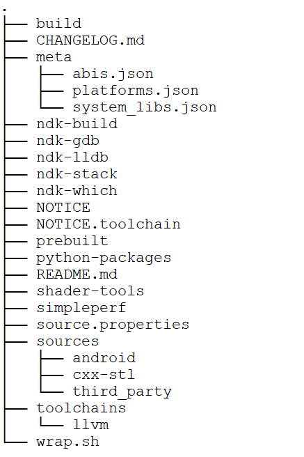

文章标题：**深入理解 Android NDK**

- 作者：汪辰
- 联系方式：<unicorn_wang@outlook.com> / <wangchen20@iscas.ac.cn>

文章大纲


<!-- TOC -->

- [1. 什么是 NDK](#1-什么是-ndk)
- [2. NDK 中有些什么](#2-ndk-中有些什么)
	- [2.1. 工具链/Toolchain](#21-工具链toolchain)
	- [2.2. Sysroot](#22-sysroot)
- [3. NDK 提供的库和 API](#3-ndk-提供的库和-api)
	- [3.1. Core C/C++](#31-core-cc)
		- [3.1.1. C library](#311-c-library)
		- [3.1.2. C++ library](#312-c-library)
		- [3.1.3. Logging](#313-logging)
		- [3.1.4. Trace](#314-trace)
		- [3.1.5. zlib compression：](#315-zlib-compression)
	- [3.2. Graphics 图像处理](#32-graphics-图像处理)
		- [3.2.1. OpenGL ES 1.0 - 3.2](#321-opengl-es-10---32)
		- [3.2.2. EGL](#322-egl)
		- [3.2.3. Vulkan](#323-vulkan)
		- [3.2.4. Bitmaps](#324-bitmaps)
		- [3.2.5. Sync API：](#325-sync-api)
	- [3.3. Camera 摄像相关：](#33-camera-摄像相关)
	- [3.4. Media 多媒体相关：](#34-media-多媒体相关)
		- [3.4.1. `libmediandk`](#341-libmediandk)
		- [3.4.2. OpenMAX AL：](#342-openmax-al)
	- [3.5. Android native application APIs：](#35-android-native-application-apis)
		- [3.5.1. Hardware Buffer APIs：](#351-hardware-buffer-apis)
	- [3.6. Audio 音频处理](#36-audio-音频处理)
		- [3.6.1. AAudio：](#361-aaudio)
		- [3.6.2. OpenSL ES](#362-opensl-es)
	- [3.7. Neural Networks API](#37-neural-networks-api)

<!-- /TOC -->

# 1. 什么是 NDK

摘录自官网文档 ["Get started with the NDK"][1]:

> The Native Development Kit (NDK) is a set of tools that allows you to use C and C++ code with Android, and provides platform libraries you can use to manage native activities and access physical device components, such as sensors and touch input. 

先去 ndk 发布网站下一个最新版本的 ndk 发布包看看，<https://developer.android.google.cn/ndk/downloads?hl=zh-cn>。这个 URL 对应的总是最新的 NDK 版本，本文例子参考的具体 ndk 版本是 25b，我下载了一个 Linux 64 位 (x86) 版本 “android-ndk-r25b-linux.zip” 的作为本文介绍的基础，其他的发布包内容和目录安排大同小异。对应下载 URL：<https://dl.google.com/android/repository/android-ndk-r25b-linux.zip>。 

下载解压后目录安排如下，只保留了目录，省去了文件部分：



下文假设 NDK 的路径为 `<NDK>`。

**[图一] 发布包目录结构**

下面我们就来浏览一下这些目录下的细节。

# 2. NDK 中有些什么

参考官网文档 [Build System Maintainers Guide][3]。

## 2.1. 工具链/Toolchain

NDK 中的工具链路径是 `<NDK>/toolchains/llvm/prebuilt/linux-x86_64/bin/`。在这个目录下包括如下工具软件：

- Clang/Clang++：编译 C 源文件时应使用 clang, 编译 C++ 源文件时应使用 clang++。

  使用 Clang/Clang++ 执行交叉编译（Cross-compilation）时可以使用 `--target` 选项或者使用相关封装脚本。

  如果使用 `--target` 选项，可以带上的 triple 值需要加上一个后缀，后缀即 Android 的 API level 值。譬如 triple 是 `armv7a-linux-androideabi`, API level 是 26，则完整的选项写成：`--target armv7a-linux-androideabi26`。

  另一种是使用 NDK 提供的封装脚本，参考 `<NDK>/toolchains/llvm/prebuilt/linux-x86_64/bin/` 下有很多类似这样的文件：
  ```bash
  ls toolchains/llvm/prebuilt/linux-x86_64/bin/ -l
  ......
  -rwxr-xr-x 1 wangchen wangchen       193 Aug 12 10:11 aarch64-linux-android21-clang
  -rwxr-xr-x 1 wangchen wangchen       197 Aug 12 10:11 aarch64-linux-android21-clang++
  -rwxr-xr-x 1 wangchen wangchen       193 Aug 12 10:11 aarch64-linux-android22-clang
  -rwxr-xr-x 1 wangchen wangchen       197 Aug 12 10:11 aarch64-linux-android22-clang++
  ......
  -rwxr-xr-x 1 wangchen wangchen       196 Aug 12 10:11 armv7a-linux-androideabi19-clang
  -rwxr-xr-x 1 wangchen wangchen       200 Aug 12 10:11 armv7a-linux-androideabi19-clang++
  -rwxr-xr-x 1 wangchen wangchen       196 Aug 12 10:11 armv7a-linux-androideabi21-clang
  -rwxr-xr-x 1 wangchen wangchen       200 Aug 12 10:11 armv7a-linux-androideabi21-clang++
  ......
  -rwxr-xr-x 1 wangchen wangchen       205 Aug 12 10:11 i686-linux-android19-clang
  -rwxr-xr-x 1 wangchen wangchen       209 Aug 12 10:11 i686-linux-android19-clang++
  -rwxr-xr-x 1 wangchen wangchen       205 Aug 12 10:11 i686-linux-android21-clang
  -rwxr-xr-x 1 wangchen wangchen       209 Aug 12 10:11 i686-linux-android21-clang++
  ......
  -rwxr-xr-x 1 wangchen wangchen       192 Aug 12 10:11 x86_64-linux-android21-clang
  -rwxr-xr-x 1 wangchen wangchen       196 Aug 12 10:11 x86_64-linux-android21-clang++
  -rwxr-xr-x 1 wangchen wangchen       192 Aug 12 10:11 x86_64-linux-android22-clang
  -rwxr-xr-x 1 wangchen wangchen       196 Aug 12 10:11 x86_64-linux-android22-clang++
  ```
  这些文件就是所谓的封装脚本，看一个例子
  ```bash
  $ cat toolchains/llvm/prebuilt/linux-x86_64/bin/armv7a-linux-androideabi26-clang
  #!/bin/bash
  bin_dir=`dirname "$0"`
  if [ "$1" != "-cc1" ]; then
      "$bin_dir/clang" --target=armv7a-linux-androideabi26 "$@"
  else
      # Target is already an argument.
      "$bin_dir/clang" "$@"
  fi
  ```

  Google 推荐我们在命令行中直接自己使用 `--target` 命令选项，避免使用封装脚本，特别是对编译构建工作量比较大的项目，因为使用脚本的效率较低，特别是在 Windows 平台上。

  有关 Android 支持的 triple 列表，我们可以查看 `<NDK>/meta/abis.json`，这个文件详细列出了该版本 NDK 中支持的 triple 信息，包括有哪些 ARCH，这些 ARCH 的 ABI 信息等。

  有关 Android 支持的 API level 信息，可以查看 `<NDK>/meta/platforms.json`，这个文件列出了该版本你的 NDK 支持的最低的/最高的 API level。
   
- 链接器：默认使用 LLD。我们在使用 clang 执行链接的时候可以通过 `-fuse-ld=<linker>` 选项指定使用链接器的类型，但需要注意的是从 NDK r22 开始，gold/bfd 等其他链接器已经被从 NDK 中移除，所以目前实际上我们只能使用 lld 了，[Build System Maintainers Guide][3] 上有关链接器的描述过时了，未更新。
  
  lld 安装在 `<NDK>/toolchains/llvm/prebuilt/linux-x86_64/bin/` 下。
  ```bash
  $ ls toolchains/llvm/prebuilt/linux-x86_64/bin/ -l
  ......
  lrwxrwxrwx 1 wangchen wangchen         6 Dec 14 08:36 ld -> ld.lld
  lrwxrwxrwx 1 wangchen wangchen         3 Dec 14 08:36 ld64.lld -> lld
  lrwxrwxrwx 1 wangchen wangchen         3 Dec 14 08:36 ld.lld -> lld
  -rwxr-xr-x 1 wangchen wangchen  56810672 Aug 12 10:10 lld
  lrwxrwxrwx 1 wangchen wangchen         3 Dec 14 08:36 lld-link -> lld
  ```
  
  注意：通常不要直接调用 lld，因为 clang 会自动调用 lld，而且 clang 还会自动链接 CRT 和默认库等，并设置其他特定于 target 的选项，因此通常最好使用 clang 进行链接。

- Binutils：binutils 是一套操作二进制文件的工具。我们比较熟悉的是 GNU 的那套（譬如 objdump/objcopy/readelf/......）。NDK 中原来是保留有 GNU 的那套 binutils 的，GNU Binutils 在 r22 之前（包括 r22）之前仍然可用。除 gas 外，所有 GNU binutils 在 r23 中均被删除。gas 在 r24 中被移除。NDK 中目前使用另外一套 LLVM 提供的和 GNU 等价的 binutils：
  ```bash
  $ ls toolchains/llvm/prebuilt/linux-x86_64/bin/ -l
  ......
  lrwxrwxrwx 1 wangchen wangchen        15 Dec 14 08:36 llvm-addr2line -> llvm-symbolizer
  -rwxr-xr-x 1 wangchen wangchen  10174344 Aug 12 10:10 llvm-ar
  -rwxr-xr-x 1 wangchen wangchen   3122784 Aug 12 10:10 llvm-as
  -rwxr-xr-x 1 wangchen wangchen  38869000 Aug 12 10:10 llvm-bolt
  -rwxr-xr-x 1 wangchen wangchen  13719120 Aug 12 10:10 llvm-cfi-verify
  -rwxr-xr-x 1 wangchen wangchen    207888 Aug 12 10:10 llvm-config
  -rwxr-xr-x 1 wangchen wangchen   3888648 Aug 12 10:10 llvm-cov
  -rwxr-xr-x 1 wangchen wangchen    341872 Aug 12 10:10 llvm-cxxfilt
  -rwxr-xr-x 1 wangchen wangchen   2297936 Aug 12 10:10 llvm-dis
  -rwxr-xr-x 1 wangchen wangchen   8599224 Aug 12 10:10 llvm-dwarfdump
  -rwxr-xr-x 1 wangchen wangchen  31271768 Aug 12 10:10 llvm-dwp
  lrwxrwxrwx 1 wangchen wangchen         7 Dec 14 08:36 llvm-lib -> llvm-ar
  -rwxr-xr-x 1 wangchen wangchen   3623888 Aug 12 10:10 llvm-link
  -rwxr-xr-x 1 wangchen wangchen   3235200 Aug 12 10:10 llvm-lipo
  -rwxr-xr-x 1 wangchen wangchen   2956520 Aug 12 10:10 llvm-modextract
  -rwxr-xr-x 1 wangchen wangchen  10487320 Aug 12 10:10 llvm-nm
  -rwxr-xr-x 1 wangchen wangchen   3693968 Aug 12 10:10 llvm-objcopy
  -rwxr-xr-x 1 wangchen wangchen  11722744 Aug 12 10:10 llvm-objdump
  -rwxr-xr-x 1 wangchen wangchen   4221096 Aug 12 10:10 llvm-profdata
  lrwxrwxrwx 1 wangchen wangchen         7 Dec 14 08:36 llvm-ranlib -> llvm-ar
  -rwxr-xr-x 1 wangchen wangchen    436200 Aug 12 10:10 llvm-rc
  lrwxrwxrwx 1 wangchen wangchen        12 Dec 14 08:36 llvm-readelf -> llvm-readobj
  -rwxr-xr-x 1 wangchen wangchen   5349016 Aug 12 10:10 llvm-readobj
  -rwxr-xr-x 1 wangchen wangchen   3210768 Aug 12 10:10 llvm-size
  -rwxr-xr-x 1 wangchen wangchen    236840 Aug 12 10:10 llvm-strings
  lrwxrwxrwx 1 wangchen wangchen        12 Dec 14 08:36 llvm-strip -> llvm-objcopy
  -rwxr-xr-x 1 wangchen wangchen   4286440 Aug 12 10:10 llvm-symbolizer
  lrwxrwxrwx 1 wangchen wangchen         7 Dec 14 08:36 llvm-windres -> llvm-rc
  ```


## 2.2. Sysroot

为了支持交叉编译 NDK 中提供了 sysroot，包含了针对 Android 支持的所有 target（体系架构）的系统头文件，系统库以及 CRT 文件等。

NDK 中的 sysroot 目录在 `<NDK>/toolchains/llvm/prebuilt/linux-x86_64/sysroot`。这个路径有点长，下文为方便用 `<SYSROOT>` 代替。

- 头文件：路径在 `<SYSROOT>/usr/include`。分为两部分：

  一部分是 generic 的头文件，就在 `<SYSROOT>/usr/include` 下。

  还有一部分是和 target/ARCH 相关的，放在 `<SYSROOT>/usr/include/<triple>`。具体是：
  - `<SYSROOT>/usr/include/arm-linux-androideabi`
  - `<SYSROOT>/usr/include/aarch64-linux-android`
  - `<SYSROOT>/usr/include/i686-linux-android`
  - `<SYSROOT>/usr/include/x86_64-linux-android`

- 库文件，路径在 `<SYSROOT>/usr/lib`，因为二进制文件天生是 target/ARCH 相关的，不存在 generic 的问题，所以在这个目录下直接按照 triple 分。
  - `<SYSROOT>/usr/lib/arm-linux-androideabi`
  - `<SYSROOT>/usr/lib/aarch64-linux-android`
  - `<SYSROOT>/usr/lib/i686-linux-android`
  - `<SYSROOT>/usr/lib/x86_64-linux-android`

  再看具体的一个 triple 目录下，譬如 arm-linux-androideabi
  ```bash
  ls toolchains/llvm/prebuilt/linux-x86_64/sysroot/usr/lib/arm-linux-androideabi/ -l
  total 19560
  drwxr-xr-x 2 wangchen wangchen    4096 Aug 12 10:11 19
  drwxr-xr-x 2 wangchen wangchen    4096 Aug 12 10:11 21
  drwxr-xr-x 2 wangchen wangchen    4096 Aug 12 10:11 22
  drwxr-xr-x 2 wangchen wangchen    4096 Aug 12 10:11 23
  drwxr-xr-x 2 wangchen wangchen    4096 Aug 12 10:11 24
  drwxr-xr-x 2 wangchen wangchen    4096 Aug 12 10:11 26
  drwxr-xr-x 2 wangchen wangchen    4096 Aug 12 10:11 27
  drwxr-xr-x 2 wangchen wangchen    4096 Aug 12 10:11 28
  drwxr-xr-x 2 wangchen wangchen    4096 Aug 12 10:11 29
  drwxr-xr-x 2 wangchen wangchen    4096 Aug 12 10:11 30
  drwxr-xr-x 2 wangchen wangchen    4096 Aug 12 10:11 31
  drwxr-xr-x 2 wangchen wangchen    4096 Aug 12 10:11 32
  drwxr-xr-x 2 wangchen wangchen    4096 Aug 12 10:11 33
  -rw-r--r-- 1 wangchen wangchen   89934 Aug 12 10:11 libandroid_support.a
  -rw-r--r-- 1 wangchen wangchen 7210300 Aug 12 10:00 libc.a
  -rw-r--r-- 1 wangchen wangchen 1185524 Aug 12 10:11 libc++abi.a
  -rw-r--r-- 1 wangchen wangchen    3698 Aug 12 10:00 libcompiler_rt-extras.a
  -rwxr-xr-x 1 wangchen wangchen 4173300 Aug 12 10:11 libc++_shared.so
  -rw-r--r-- 1 wangchen wangchen 5832548 Aug 12 10:11 libc++_static.a
  -rw-r--r-- 1 wangchen wangchen    5020 Aug 12 10:00 libdl.a
  -rw-r--r-- 1 wangchen wangchen 1130326 Aug 12 10:00 libm.a
  -rw-r--r-- 1 wangchen wangchen   17000 Aug 12 10:00 libstdc++.a
  -rw-r--r-- 1 wangchen wangchen  311910 Aug 12 10:00 libz.a
  ```

  大部分的库文件按照 API-level 组织在下一级子目录中。除此之外是也有一些库文件是单独放在 triple 下。

  看一个 API-level 的例子如下，一部分是 CRT object 文件。此外大部分是 `.so` 文件。有两个特殊的文件需要注意一下，一个是 `libc++.a`，一个是 `libc++.so`，这两个文件并不是库文件，而是 [implicit linker scripts 文件][7]。实际是文本文件，可以用 cat 命令查看其内容。其中 `libc++.a` 的内容是 `INPUT(-lc++_static -lc++abi)`, `libc++.so` 的内容是 `INPUT(-lc++_shared)`。所以当我们在 clang 命令行中链接这两个库的时候，实际上会去链接上一级目录，即 triple 目录下的 `libc++_static.a`、`libc++abi.a` 或者是 `libc++_shared.so`。有关这些库文件的总结在下文中。

  ```bash
  $ ls toolchains/llvm/prebuilt/linux-x86_64/sysroot/usr/lib/arm-linux-androideabi/29/ -l
  total 856
  -rw-r--r-- 1 wangchen wangchen   2504 Aug 12 10:10 crtbegin_dynamic.o
  -rw-r--r-- 1 wangchen wangchen   2468 Aug 12 10:10 crtbegin_so.o
  -rw-r--r-- 1 wangchen wangchen   2504 Aug 12 10:10 crtbegin_static.o
  -rw-r--r-- 1 wangchen wangchen    700 Aug 12 10:10 crtend_android.o
  -rw-r--r-- 1 wangchen wangchen    480 Aug 12 10:10 crtend_so.o
  -rwxr-xr-x 1 wangchen wangchen  14944 Aug 12 10:00 libaaudio.so
  -rwxr-xr-x 1 wangchen wangchen   5420 Aug 12 10:00 libamidi.so
  -rwxr-xr-x 1 wangchen wangchen  61452 Aug 12 10:00 libandroid.so
  -rwxr-xr-x 1 wangchen wangchen  20592 Aug 12 10:00 libbinder_ndk.so
  -rw-r--r-- 1 wangchen wangchen     28 Aug 12 10:11 libc++.a
  -rwxr-xr-x 1 wangchen wangchen  17576 Aug 12 10:00 libcamera2ndk.so
  -rw-r--r-- 1 wangchen wangchen     19 Aug 12 10:11 libc++.so
  -rwxr-xr-x 1 wangchen wangchen 247964 Aug 12 10:00 libc.so
  -rwxr-xr-x 1 wangchen wangchen   5108 Aug 12 10:00 libdl.so
  -rwxr-xr-x 1 wangchen wangchen  16416 Aug 12 10:00 libEGL.so
  -rwxr-xr-x 1 wangchen wangchen  53328 Aug 12 10:00 libGLESv1_CM.so
  -rwxr-xr-x 1 wangchen wangchen  40988 Aug 12 10:00 libGLESv2.so
  -rwxr-xr-x 1 wangchen wangchen  82820 Aug 12 10:00 libGLESv3.so
  -rwxr-xr-x 1 wangchen wangchen   5568 Aug 12 10:00 libjnigraphics.so
  -rwxr-xr-x 1 wangchen wangchen   4156 Aug 12 10:00 liblog.so
  -rwxr-xr-x 1 wangchen wangchen  54608 Aug 12 10:00 libmediandk.so
  -rwxr-xr-x 1 wangchen wangchen  47168 Aug 12 10:00 libm.so
  -rwxr-xr-x 1 wangchen wangchen   7556 Aug 12 10:00 libnativewindow.so
  -rwxr-xr-x 1 wangchen wangchen  13276 Aug 12 10:00 libneuralnetworks.so
  -rwxr-xr-x 1 wangchen wangchen   8720 Aug 12 10:00 libOpenMAXAL.so
  -rwxr-xr-x 1 wangchen wangchen  10220 Aug 12 10:00 libOpenSLES.so
  -rwxr-xr-x 1 wangchen wangchen   5104 Aug 12 10:00 libstdc++.so
  -rwxr-xr-x 1 wangchen wangchen   3308 Aug 12 10:00 libsync.so
  -rwxr-xr-x 1 wangchen wangchen  39724 Aug 12 10:00 libvulkan.so
  -rwxr-xr-x 1 wangchen wangchen  18016 Aug 12 10:00 libz.so
  ```

  总的来说，NDK 包含的库文件分两类：

  - 动态库（shared libraries），文件后缀为 `.so`。作为动态链接的库文件，根据其是否使用系统提供的版本，分为两类：

    如果使用系统提供的动态库文件，则应用程序打包时不需要提供这个动态库文件，应用程序在运行期间会加载目标系统上的动态库并进行符号链接。那么就要考虑一个符号兼容性的问题。举个例子，一个 app 是基于动态链接系统库 X.so 的 A 版本开发测试，在实际部署时目标系统上的 X.so 是 B 版本，如果 B 版本比较老，其支持的 API 可能比 A 版本的少，那么 app 运行如果调用了新的 B 版本中不支持的 API 就会导致程序异常。为了解决这个问题，我们看到 NDK 中大部分的 so 文件都是按照 API-level 分的。编译链接时前面也说过我们会在调用 clang/clang++ 传入 `--target` 选项时除了给出 triple 信息（这绝决定了 cross compile 的 ARCH 问题），还需要带上 API level 后缀，这样链接器就会检查 API 的版本信息，提前检查发现错误。

	同时我们也要了解到，在 `<SYSROOT>/usr/include/<triple>/<API-level>` 下的 `.so` 文件（除了 `libc++.so`）按照 [Build System Maintainers Guide][3] 的说法实际上都是一些 "system stub libraries"。这些 "system stub libraries" 只提供了函数 API 的描述信息，但函数体实际上都实现为空。这是因为在我们基于 NDK 编译链接时，实际上链接器只需要了解符号的信息，而并不需要像静态链接那样获取函数的实际实现指令。更详细的描述可以阅读 [Bionic and libc’s stub implementations][5]。

	NDK 的 sysroot 中也有一些动态链接库文件不是 "system stub libraries"，但不多，只有 `libc++_shared.so`。有关这个库的介绍，见下文，现在我们只要知道在 Android 系统中并没有自带 `libc++_shared.so` 这个动态链接库，所以 NDK 针对每个 triple 提供了一份。这也意味着我们在打包 apk 的时候需要将这个 `libc++_shared.so` 一起打包发布。

	所以对于 NDK 中的动态库，我们也可以认为有两类，一类是正常的 so，需要随 apk 一起打包发布，还有一类是 "system stub libraries"，它们只是提供作为连接时解析符号用，并不包含实际实现指令，所以是不需要打包进 apk 的，目标系统上会提供这些 "system stub libraries" 对应的实际 "system libraries"。

  - 静态库（static libraries），文件后缀为 `.a`，编译链接时直接和 app 链接。和动态库不同，首先它不按照 API-level 分，一般只提供一个，因为 API 都是后向兼容的，所以不存在针对不同 API level 开发的 app 静态链接失败的问题。其次因为是要实际静态链接，所以 `.a` 文件不存在 stub 的问题。

  所以综上所述，按照 [Bionic and libc’s stub implementations][5] 上 Libraries 章节的说法，`The NDK contains three types of libraries`。

# 3. NDK 提供的库和 API

参考 [Native APIs][2]。我们这里简单罗列一下 Android NDK 包含的库，这些库提供的函数可以认为就是 NDK 提供的 API。我们编写 native 应用的时候可以调用的 native API 就是由这些库函数提供和定义的。

有关当前该版本的 NDK 中包含的库，可以查看 `<NDK>/meta/system_libs.json`，下面是一个例子，其中每一行是一个 key/value，key 是支持的库的名字，value 是第一个支持该库的 API level 的值（对应着某个 Android Platform）。有关更多有关 API level 和 Platform 版本的总结，可以参考我总结的另一篇笔记 [《AOSP 的版本管理》][10]。

再次注意，这里的 system libs 中不包括 libc++，但是截至本文看到的信息还包括 libstdc++。

```bash
$ cat system_libs.json 
{
  "libEGL.so": "19",
  "libGLESv1_CM.so": "19",
  "libGLESv2.so": "19",
  "libGLESv3.so": "19",
  "libOpenMAXAL.so": "19",
  "libOpenSLES.so": "19",
  "libaaudio.so": "26",
  "libamidi.so": "29",
  "libandroid.so": "19",
  "libbinder_ndk.so": "29",
  "libc.so": "19",
  "libcamera2ndk.so": "24",
  "libdl.so": "19",
  "libicu.so": "31",
  "libjnigraphics.so": "19",
  "liblog.so": "19",
  "libm.so": "19",
  "libmediandk.so": "21",
  "libnativehelper.so": "31",
  "libnativewindow.so": "26",
  "libneuralnetworks.so": "27",
  "libstdc++.so": "19",
  "libsync.so": "26",
  "libvulkan.so": "24",
  "libz.so": "19"
```

## 3.1. Core C/C++

### 3.1.1. C library

NDK 提供了标准的 C11 library 头文件，譬如 `stdlib.h` 和 `stdio.h`，这个和 GNU 是一样的。

Android 上的 C 库，由以下几个主要的库组成，具体实现在 bionic 中（bionic 是 android 上的 runtime 库的实现，包括了以下几个库还有一些其他的组件，譬如 linker）:

- libc：在 Android 上，libc 库中包含了 GNU/Linux 上的 libpthread/librt。
- libm：独立的数学库
- libdl: 该库支持 dlopen/dlsym， 使用时需要 `#include <dlfcn.h>` 并显式链接。

### 3.1.2. C++ library

提供 C++17 支持。更多参考 [C++ Library Support](https://developer.android.google.cn/ndk/guides/cpp-support).

NDK 提供的 C++ library 即 STL。STL 是 Standard Template Library 的简称，中文名 “标准模板库”。从根本上说，STL 是一些 “容器” 的集合，这些 “容器” 有 list, vector, set, map 等，STL 也是算法和其他一些组件的集合。 

NDK 提供了两种 STL:

- libc++: 即 LLVM 的 libc++ 库（<https://libcxx.llvm.org/>）。自 Android 5.0/Lollipop 以来 Android 操作系统便一直使用该库，并且从 NDK r18 开始成为 NDK 中唯一可用的 STL。

  libc++ 的头文件安装在 `<NDK>/sysroot/usr/include/c++/v1`。

  libc++ 提供了静态库版本，也提供了动态库版本。默认情况下使用动态库版本，即前面提到的 `libc++_shared.so`，而且需要注意在使用动态库版本时，需要在打包 apk 时包含该动态库文件。如果我们要链接静态库版本（`libc++_static.a` 和 `libc++abi.a`），则需要在调用 clang 时加上 `-static-libstdc++` 这个选项。

- System STL: System STL 已经过时，在未来的 NDK 中会被删除。请勿将该库与 GNU 的全功能 libstdc++ 混淆。Android 系统中的 libstdc++ 只实现了基本的 new 和 delete。对于全功能 C++ 标准库，请使用 libc++。在 NDK 中，System STL 对应的就是 `libstdc++.a` 和 `libstdc++.so`。其中 libstdc++.a 安装在 `<SYSROOT>/usr/lib/<triple>/` 下；`libstdc++.so` 是 stub 文件，安装在 `<SYSROOT>/usr/lib/<triple>/<API-level>/` 下，安装方式和其 libc 等类似。

如果基于 NDK 构建应用时不想使用 STL，可以在编译时设置 `-nostdinc++` 选项；在链接时设置 `-nostdlib++` 选项，而且这只针对 clang++，不涉及 clang。

### 3.1.3. Logging

需要 `#include <android/log.h>`

Logging 功能由 `liblog` 提供，这个库提供了一组 APIs for logging to logcat。[官网对 logging API 的介绍][8]。

### 3.1.4. Trace

是 java API 中的 android.os.Trace 接口的 native 实现。要调用 The native tracing API，需要 `#include <android/trace.h>`， Trace 功能由 libandroid 提供。

> This API lets you trace named units of work in your code by writing trace events to the system trace buffer. You can then collect and analyze the trace events using the Systrace tool.

这里涉及一个工具叫 Systrace，systrace 是分析 Android 设备性能的主要工具，官网参考 [Capture a system trace on the command line][9]。

### 3.1.5. zlib compression：

google 官网给出的这个库的官网在 <http://www.zlib.net/manual.html>

使用时需要 `#include <zlib.h>`， 以及显式链接 `libz`

## 3.2. Graphics 图像处理

### 3.2.1. OpenGL ES 1.0 - 3.2

不同版本的 OpenGL 对应的头文件/链接库/起始支持的 API level：

- OpenGL ES 1.x：<GLES/gl.h> and <GLES/glext.h>，link with `libGLESv1_CM`, OpenGL ES 1.0 is available since API level 4.
- OpenGL ES 2.0：<GLES2/gl2.h> and <GLES2/gl2ext.h>，link with `libGLESv2`, OpenGL ES 2.0 is available since API level 5.
- OpenGL ES 3.0：<GLES3/gl3.h> and <GLES3/gl3ext.h>，link with `libGLESv3`, OpenGL ES 3.0 is available since API level 18.
- OpenGL ES 3.1：<GLES3/gl31.h> and <GLES3/gl3ext.h>，link with `libGLESv3`, OpenGL ES 3.1 is available since API level 21.
- OpenGL ES 3.2：<GLES3/gl32.h> and <GLES3/gl3ext.h>，link with `libGLESv3`, OpenGL ES 3.2 is available since API level 24.

注意：All Android-based devices support OpenGL ES 1.0 and 2.0. 但是 Only Android devices that have the necessary GPU fully support later versions of OpenGL ES, but the libraries are present on all devices that support the API level where they were introduced. 我的理解 3.x 提供的一些功能（API）是需要一些特定的硬件 GPU 支持的，代码中调用这些 API，只要链接不出问题编译构建是可以通过的，但是如果真的要确保使用需要有硬件的支持，软件中可以通过调用特定的函数询问版本是否支持。

### 3.2.2. EGL

需要 include <EGL/egl.h> and <EGL/eglext.h>

`libEGL`，for allocating and managing OpenGL ES contexts and surfaces

### 3.2.3. Vulkan

include <vulkan/vulkan.h>

`libvulkan`，a low-overhead, cross-platform API for high-performance 3D graphics rendering.

### 3.2.4. Bitmaps

`libjnigraphics`， allows access to the pixel buffers of Java `Bitmap` objects.

是 java API `Bitmap` 对象封装的 native API

### 3.2.5. Sync API：

`libsync`

## 3.3. Camera 摄像相关：

`libcamera2ndk`， perform fine-grained photo capture and processing

## 3.4. Media 多媒体相关：

### 3.4.1. `libmediandk`

provide low-level native interfaces similar to `MediaExtractor`, `MediaCodec` and other related Java APIs.

### 3.4.2. OpenMAX AL：

include <OMXAL/OpenMAXAL.h> and <OMXAL/OpenMAXAL_Platform.h>

The NDK distribution of OpenMAX AL also provides Android-specific extensions. For information about these extensions, see the comments in <OMXAL/OpenMAXAL_Android.h>.

`libOpenMAXAL`, native multimedia handling

## 3.5. Android native application APIs：

对应的库有 `libandroid` & `libnativewindow`

`libandroid` 集中提供了很多功能，包括：
- Asset
- Choreographer
- Configuration
- Input
- Looper
- Native Activity
- Native Hardware Buffers
- Native Window
- Memory
- Networking
- Sensor
- Storage
- SurfaceTexture

`libnativewindow` for more recent Native Window functionality

### 3.5.1. Hardware Buffer APIs：

create your own pipelines for cross-process buffer management

include <android/hardware_buffer.h>

为 Java 提供了面向 HardwareBuffer object 的封装 JNI API
include <android/hardware_buffer_jni.h>

## 3.6. Audio 音频处理

### 3.6.1. AAudio：

`libaaudio`，currently-supported native audio API. It replaced OpenSL ES, and provides better support for high-performance audio apps that require low-latency audio.

### 3.6.2. OpenSL ES

`libOpenSLES`， another native audio API which is also supported

## 3.7. Neural Networks API

`libneuralnetworks`，provides apps with hardware acceleration for on-device machine learning operations.


[1]:https://developer.android.google.cn/ndk/guides
[2]:https://developer.android.com/ndk/guides/stable_apis
[3]:https://android.googlesource.com/platform/ndk/+/master/docs/BuildSystemMaintainers.md
[4]:https://issuetracker.google.com/70838247
[5]:https://stackoverflow.com/questions/39108778/bionic-and-libc-s-stub-implementations
[6]:https://developer.android.google.cn/ndk/guides/cpp-support
[7]:https://sourceware.org/binutils/docs/ld/Scripts.html
[8]:https://developer.android.com/ndk/reference/group/logging
[9]:https://developer.android.com/topic/performance/tracing/command-line
[10]:./20200911-platform-version.md