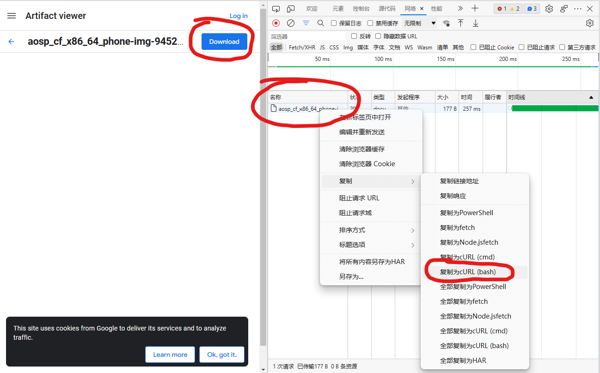
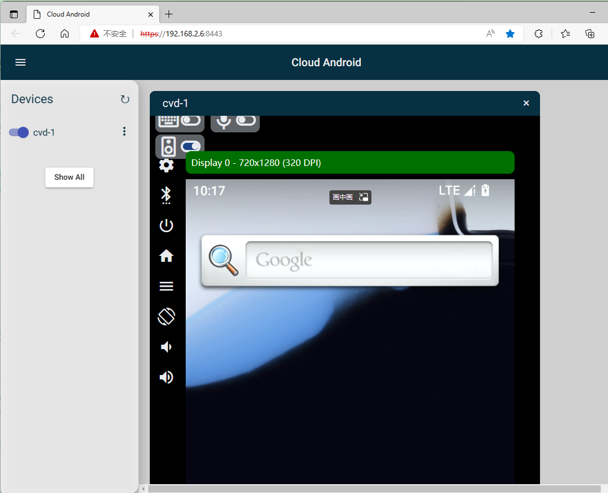

文章标题：**笔记：搭建 Cuttlefish 运行环境**

- 作者：汪辰
- 联系方式：<unicorn_wang@outlook.com> / <wangchen20@iscas.ac.cn>

<!-- TOC -->

- [1. 参考文档](#1-参考文档)
- [2. 有关 Cuttlefish](#2-有关-cuttlefish)
- [3. 操作系统](#3-操作系统)
- [4. 验证 KVM 可用性](#4-验证-kvm-可用性)
- [5. 安装 Cuttlefish 运行环境](#5-安装-cuttlefish-运行环境)
- [6. 下载 CuttleFish 镜像](#6-下载-cuttlefish-镜像)
- [7. 运行 Cuttlefish](#7-运行-cuttlefish)
	- [7.1. 启动 Cuttlefish](#71-启动-cuttlefish)
	- [7.2. 查看 Cuttlefish 的运行状态](#72-查看-cuttlefish-的运行状态)
	- [7.3. 关闭 Cuttlefish](#73-关闭-cuttlefish)
- [8. 查看 log](#8-查看-log)
- [9. 通过 console 和 Cuttlefish 进行交互](#9-通过-console-和-cuttlefish-进行交互)
- [10. 通过 adb 访问 Cuttlefish 虚拟设备](#10-通过-adb-访问-cuttlefish-虚拟设备)
- [11. 通过 Web 方式访问 Cuttlefish 虚拟设备](#11-通过-web-方式访问-cuttlefish-虚拟设备)

<!-- /TOC -->

# 1. 参考文档 

- [1] [Cuttlefish Virtual Android Devices][1] 官网对 Cuttlefish 的介绍
- [2] [Use Cuttlefish to Launch an AOSP Build][2] 官网介绍如何搭建 cuttlefish 运行环境
- [3] [The Android Cuttlefish emulator][3] 比较新 03/08/2022
- [4] [Building and using Cuttlefish][4] January 31, 2020
- [5] [Vmware Ubuntu20 Cuttlefish 模拟运行 Android12][5]

注意，Google 官方的 android 网站 URL 前缀凡是 <https://source.android.com/> 的国内大陆无法直接访问，可以替换为 <https://source.android.google.cn/>。

# 2. 有关 Cuttlefish

参考 [1] 和 [3]。

摘录 [3] 上一段对 Cuttlefish/Goldfish 的介绍：

> A tale of two fishes: Cuttlefish and Goldfish
> When I say "Android emulator", most of you will think of the one that comes with Android Studio that you use for testing applications. That emulator is called Goldfish, and sometimes Ranchu (a Ranchu is a kind of fancy Goldfish). The Goldfish emulator is optimized for testing applications, which is fine if that is what you are doing. But what about those of us who want to develop and test the operating system? Goldfish sort of works, but it misses out important areas of function such as bootstrap. Cuttlefish, on the other hand, is a virtual platform that is designed to replicate actual hardware as closely as possible and so is better if you are testing the platform OS. That is exactly what this post is all about: how to use Cuttlefish to experiment with and test AOSP builds
>
> Cuttlefish runs as a virtual machine on top of either crosvm or QEMU. Crosvm is a virtual machine manager from the ChromeOS project. More information here: https://chromium.googlesource.com/chromiumos/platform/crosvm/
>
> Cuttlefish runs “headless”, meaning that there is no window to show the screen of the emulated device. Instead, you can connect to it at the command-line level using ADB, or you can run a remote desktop and see the screen that way
>
> Cuttlefish only runs on Linux; more specifically on Debian based distributions, and more specifically still, the version of Cuttlefish shipped with AOSP 11 and 12 only works out of the box on Ubuntu 20.04. It is not impossible, I am sure, to make it work on other Linux distros, but it will take time and effort. I have only ever tested it on Ubuntu 20.04

据我了解，在 Google 内部，当没有物理设备在手边的时候，如果想调试底层系统启动，譬如 bootstrap 以及 kernel 相关的工作时，一般会比较倾向于使用 Cuttlefish。而 Goldfish 目前看上去更适合调试上层的应用，至少目前我们在 Android SDK 中会经常使用 Goldfish，也就是我们常说的 Android emulator 来运行调试 AOSP 的 system image 以及一些 application。

但从我个人的了解和理解，我感觉 Goldfish 采用的底层模拟器平台，即 QEMU，似乎版本有点太老了点（一直停留在 2.12.0），至少从我移植 riscv64 的过程中我不确定 Google 会如何看待未来的 Goldfish，特别是要加入 riscv64，会如何处理 QEMU 版本太老，以及如何追平 QEMU 上游主线的问题。

# 3. 操作系统

我采用的是：

```bash
lsb_release -a
No LSB modules are available.
Distributor ID:	Ubuntu
Description:	Ubuntu 20.04.5 LTS
Release:	20.04
Codename:	focal
```

# 4. 验证 KVM 可用性

我一开始是想搭建一个 VirtualBox 虚拟机的，但发现即使在 VirtualBox 上打开了 Enabled VT-x/AMD-V 选项，launch cuttlefish 时依然会失败。所以我目前的建议是采用真实的物理机上安装 Ubuntu 的方式来运行 cuttlefish。

# 5. 安装 Cuttlefish 运行环境

基本上参考 [2] 中 “Launch Cuttlefish” 章节第 1 步的描述。国内情况下执行这些命令时需要有些调整，对调整，增加的命令，我嵌入了注释：

```bash
sudo apt install -y git devscripts config-package-dev debhelper-compat golang curl
# https 方式 clone 可能不通，换成 git/ssh 协议方式
git clone git@github.com:google/android-cuttlefish.git
cd android-cuttlefish
# for 循环执行 debuild 过程中间会执行 go build，需要提前设置 go 代理
go env -w GO111MODULE=on
go env -w GOPROXY=https://goproxy.cn,direct
for dir in base frontend; do
  cd $dir
  debuild -i -us -uc -b -d
  cd ..
done
sudo dpkg -i ./cuttlefish-base_*_*64.deb || sudo apt-get install -f
sudo dpkg -i ./cuttlefish-user_*_*64.deb || sudo apt-get install -f
sudo usermod -aG kvm,cvdnetwork,render $USER
sudo reboot
```
 **注意：设置 go 代理的问题，升级到较新的 android-cuttlefish 仓库后，在执行debuild 之前设置的 go 代理可能无效，可以参考如下方法解决！** 

上述 debuild 命令用于生成 Debian 发行版及其衍生版的软件包（后缀名 .deb），在 frontend 文件夹中，debuild 会根据`debian/rules`里面的规则（调用 `go build` 指令)，生成最终的 cuttlefish-user*.deb，按照上文提到的方法设置 go 代理，可能遇到如下报错：
```bash
github.com/google/uuid@v1.3.0/go.mod: verifying module: github.com/google/uuid@v1.3.0/go.mod: Get "https://sum.golang.org/lookup/github.com/google/uuid@v1.3.0": dial tcp 142.251.42.241:443: i/o timeout
```
请把设置代理的命令放到 `frontend/src/goutil`，并且把原来的代理注释掉，goutil 是一个 bash 脚本，作用是为 `go build` 配置一些环境变量，`debian/rules` 会调用它。

```bash
diff --git a/frontend/src/goutil b/frontend/src/goutil
index 449ccab..03e7cd8 100755
--- a/frontend/src/goutil
+++ b/frontend/src/goutil
@@ -24,7 +24,9 @@ if [[ "$version" > "1.15" ]]; then
   # Temporary solution until https://github.com/golang/go/issues/28194 is fixed
   # in order to retry failed fetch requests.
   # GOPROXY fallback was added in Go 1.15
-  export GOPROXY="proxy.golang.org|proxy.golang.org|direct"
+  #export GOPROXY="proxy.golang.org|proxy.golang.org|direct"
+  go env -w GO111MODULE=on
+  go env -w GOPROXY=https://goproxy.cn,direct
 fi
```

# 6. 下载 CuttleFish 镜像

参考 [2] 中 “Launch Cuttlefish” 章节第 2 步 ~ 第 7 步的描述，从 [Android CI(Continuous Integration)][6] 网站下载每日构建的镜像。

这里记录一下，如果不想通过 chrome/edge browser 下载 image，想用 crul 等命令行下载，如何在 browser 中获取下载的链接地址。



参考上图：在 Chrome 或者 Edge 里进入到上面图片中左边的这个界面后按 F12 打开调试窗口，选择 "网络" tab 页，然后在右键弹出菜单中选择 "复制" -> "复制为 cURL（bash）"，登录到控制终端将命令黏贴到 bash 终端上，注意后面加上一个 "--output FILENAME" , 然后回车就可以通过命令行下载文件了，下载后的文件名就是你指定的 "FILENAME"。

另外需要注意的是：通过 [Android CI][6] 下载镜像必须访问境外 Google 网站，并不是很方便。我们其实也可以自己取 AOSP 的源码构建这些镜像，具体可以参考另一篇 [《笔记：基于 Cuttlefish 调试 Android 内核》][7] 中有关 “在 AOSP 中运行 Cuttlefish” 的介绍。

# 7. 运行 Cuttlefish

参考 [2] 中 “Launch Cuttlefish” 章节第 8 步。假设我们的当前工作目录就是 `cf`。

## 7.1. 启动 Cuttlefish

```bash
HOME=$PWD ./bin/launch_cvd --daemon
```

`--daemon` 表示后台启动。`--start_webrtc` 参数不需要加，因为 Webview 默认是开启了的。获取更多帮助，可以输入 `--help`。


看到下面的输出，说明 Cuttlefish 成功运行起来了。

```bash
Virtual device booted successfully
VIRTUAL_DEVICE_BOOT_COMPLETED
```

如果我们仔细看一下 `cf` 目录，发现运行 Cuttlefish 后会出现几个新的子目录：

- `cuttlefish`：实际创建的子目录，其他几个子目录都是指向这个子目录下的符号链接。
- `cuttlefish_assembly`：指向 `cf/cuttlefish/assembly` 的符号链接，下面是 `assemble_cvd` 运行过程中创建出来的一些文件（有关 `assemble_cvd` 又是什么，不是本文的重点，我们这里只要知道这个程序会被 `launch_cvd` 调用执行），其中比较重要的包括两个文件
  - `assemble_cvd.log`: `assemble_cvd` 运行产生的日志。
  - `cuttlefish_config.json`: cuttlefish 运行环境的当前配置信息，各种运行参数，可以和我们运行 `launch_cvd` 时输入的命令行选项对照起来看。
- `cuttlefish_runtime`: 指向 `cf/cuttlefish/instances/cvd-1` 的符号链接。
- `cuttlefish_runtime.1`：指向 `cf/cuttlefish/instances/cvd-1` 的符号链接。我理解可能 Cuttlefish 支持同时运行多个 virtual device 的实例，所以如果是这样可能会出现 `cvd-2`、`cvd-3`、......

这些目录里记录了 Cuttlefish 运行的上下文环境信息，以及 log 等，后面我们还会遇到，这里先简单提一下。

## 7.2. 查看 Cuttlefish 的运行状态

启动 Cuttlefish 后我们也可以使用 `cvd_status` 命令查看 Cuttlefish 的 instance 的运行状态。

```bash
$ HOME=$PWD ./bin/cvd_status
run_cvd is active.
```

## 7.3. 关闭 Cuttlefish

```bash
$ HOME=$PWD ./bin/stop_cvd
stop_cvd I 01-11 10:08:15  7547  7547 main.cc:162] Successfully stopped device cvd-1: 0.0.0.0:6520
```

# 8. 查看 log

在我们运行 `launch_cvd` 命令时注意终端上打印的如下信息，指明了我们启动的虚拟设备名称为 `cvd-1`，以及该虚拟设备的一些运行日志的路径，譬如内核的日志和 launcher 的日志，还有 logcat。

```bash
The following files contain useful debugging information:
  Serial console is disabled; use -console=true to enable it.
  Kernel log: /home/u/ws/cf/cuttlefish/instances/cvd-1/kernel.log
  Logcat output: /home/u/ws/cf/cuttlefish/instances/cvd-1/logs/logcat
  Launcher log: /home/u/ws/cf/cuttlefish/instances/cvd-1/logs/launcher.log
  Instance configuration: /home/u/ws/cf/cuttlefish/instances/cvd-1/cuttlefish_config.json
  Instance environment: /home/u/ws/cf/.cuttlefish.sh
```

这些 log 文件存放的路径看山区有点乱，但实际上最新的 cuttlefish 版本已经把它们都归档到 `/home/u/ws/cf/cuttlefish/instances/cvd-1/logs/` 这个目录下了，主要包括：
- `launcher.log`：log files from `launch_cvd`, 这个 log 的内容时前面提到的 `assemble_cvd.log` 的超集，所以如果我们想了解 `launch_cvd` 的执行过程，更多是看这个文件。
- `kernel.log`：我们在 console 上可以看到的所有的 log, 包括从 OpenSBI -> U-Boot -> Linux kernel
- `logcat`：Android logcat 能接收到的日志信息

另外这里也列出了 `cuttlefish_config.json`，注意到这是 cvd-1 实例下的，但似乎没发现和前面提到的 `cf/cuttlefish/assembly` 下的 `cuttlefish_config.json` 有多大差别，可能我们这里还没有涉及到吧，建议对明确的 cvd-1 实例，还是看这里列出的这份会更准确。

如果想控制 log 的显示层级，可以使用 `ANDROID_LOG_TAGS` 这个环境变量。譬如我们想只看 Info （包含）以上的 log level 的信息，则可以在启动 cuttlefish 时加上这个环境变量如下，具体用法参考 [Filter log output][8]：

```bash
$ ANDROID_LOG_TAGS='*:i' HOME=$PWD ./bin/launch_cvd --daemon
```

# 9. 通过 console 和 Cuttlefish 进行交互

Cuttlefish 提供了本地 console 的访问形式，这方便我们调试譬如 bootloader 阶段，类似我们通过串口连接一个真实物理设备。注意 console 和 adb 方式的不同。adb 服务是 linux 内核启动完成后进入 user mode 后才可以访问的命令行服务形式，而 console 可以发生在 linux 内核启动之前，所以如果我们要调试早期的程序，譬如 U-boot 或者内核，就非常需要 console 的支持了。

启用 console 的方法是在运行 `launch_cvd` 时带上 `--console` 参数选项。因为我们经常使用 console 方式是为了在引导阶段可以和 bootloader 交互，所以这里我们还带上 `-pause-in-bootloader=true`，这个选项可以让处理器进入 U-boot 的交互命令阶段，不往下继续引导内核:

```bash
$ HOME=$PWD ./bin/launch_cvd --console=true -pause-in-bootloader=true
```

注意不要带上 `--daemon`，我发现带上这个参数也不起作用，程序没进入 linux 是不会直接挂起到后台的，具体原因不知道。

然后我们另外开一个终端。首先我们可以验证一下此时 Cuttlefish 的 console device 的确建立了。在 cf 目录下输入以下命令

```bash
$ ls cuttlefish_runtime/console -l
lrwxrwxrwx 1 u u 10 1月  22 17:50 cuttlefish_runtime/console -> /dev/pts/1
```

然后我们可以使用 terminal emulator 程序，譬如 screen 来登录这个虚拟的 console 设备。

```bash
$ screen ./cuttlefish_runtime/console
```

此时我们会发现程序停在 U-boot 的命令交互阶段，我们就可以输入 U-boot 的控制台命令了，譬如 `version` 获取 U-boot 版本信息，`help` 打印命令帮助，或者 `boot` 继续引导内核。

如果要退出 screen，可以采用 `Ctrl-A` + `\`。更多帮助可以在 screen 中输入 `Ctrl-a` + `?`。

# 10. 通过 adb 访问 Cuttlefish 虚拟设备

adb 的操作和 goldfish 虚拟设备访问是一致的，譬如：

查看虚拟设备列表：

```bash
./bin/adb devices -l
List of devices attached
0.0.0.0:6520           device product:aosp_cf_x86_64_phone model:Cuttlefish_x86_64_phone device:vsoc_x86_64 transport_id:1
```

shell 登录：
```bash
./bin/adb shell
vsoc_x86_64:/ $ ls
acct        cache   data_mirror    init             metadata  oem          sdcard                  system       vendor_dlkm
apex        config  debug_ramdisk  init.environ.rc  mnt       postinstall  second_stage_resources  system_dlkm
bin         d       dev            linkerconfig     odm       proc         storage                 system_ext
bugreports  data    etc            lost+found       odm_dlkm  product      sys                     vendor
vsoc_x86_64:/ $ 
```

# 11. 通过 Web 方式访问 Cuttlefish 虚拟设备

Cuttlefish 的最大特色就是可以通过浏览器访问，注意我发现目前 Cuttlefish 比较挑浏览器，我测试发现可以正常工作的有 Chrome 或者 Edge，但是采用 Ubuntu 自带的 Firefox 却不行，这个问题当时困扰了我一段时间，一直以为是我环境搭建的问题，结果换了 Chrome/Edge 就好了。看来毕竟是 Google 自家的产品 :(。

Cuttlefish 支持 webview 访问的端口是 8443。所以：

- 如果是本地访问，浏览器中输入 `https://localhost:8443/`。
- 如果是远程访问，我这里只尝试了局域网的访问，假设我所在的局域网网段是 "192.168.2.x"，cuttelfish 所在机器的 IP 是 "192.168.2.6"，则浏览器中输入 `https://192.168.2.6:8443/`。

第一次打开，浏览器会告警 “你的连接不是专用连接”，不用管它，选择 “高级” -> “继续访问 x.x.x.x(不安全)”。



参考 [3] 中还提到可以采用 VNC 方式远程访问，这个我没有试过，感兴趣的可以自己尝试。


[1]:https://source.android.com/docs/setup/create/cuttlefish
[2]:https://source.android.com/docs/setup/create/cuttlefish-use
[3]:https://2net.co.uk/blog/cuttlefish-android12.html
[4]:https://nathanchance.dev/posts/building-using-cuttlefish/
[5]:https://coderfan.net/vmware-ubuntu20-cuttlefish-run-android12.html
[6]:https://ci.android.com/
[7]:./20230115-cuttlefish-kernel-dev.md
[8]:https://developer.android.com/studio/command-line/logcat#filteringOutput