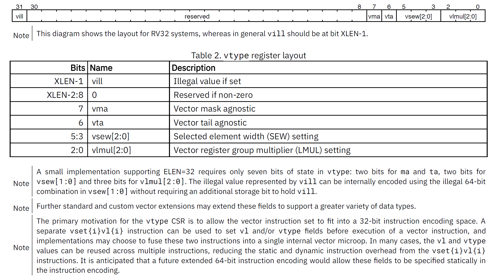
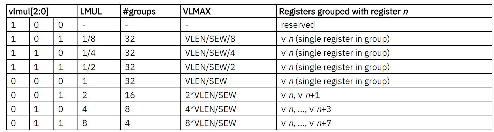
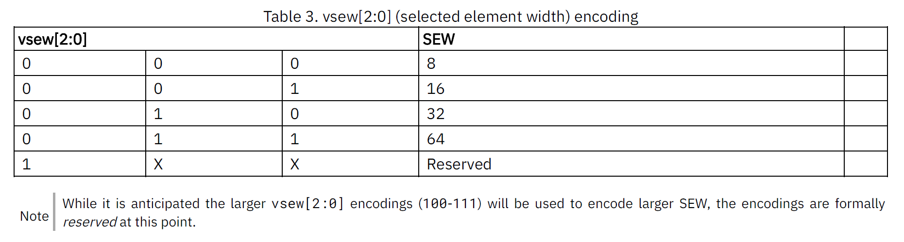
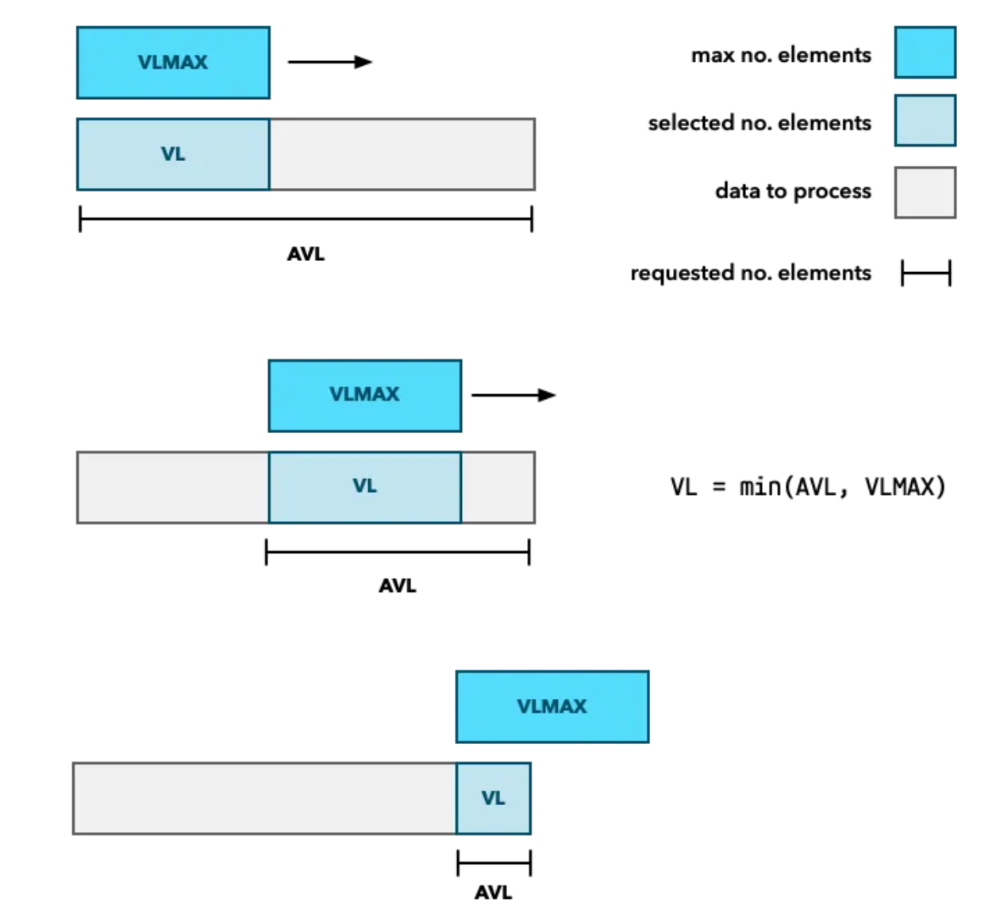

文章标题：**读书笔记：RVV 基础学习**

- 作者：汪辰
- 联系方式：<unicorn_wang@outlook.com> / <wangchen20@iscas.ac.cn>

<!-- TOC -->

- [1. 参考文档](#1-参考文档)
- [2. RVV 对 Vector 的理解](#2-rvv-对-vector-的理解)
- [3. RVV 对 Vector 寄存器的设计](#3-rvv-对-vector-寄存器的设计)
- [4. vtype 和设置 vtype 的指令](#4-vtype-和设置-vtype-的指令)
- [5. vtype 相关的基本概念](#5-vtype-相关的基本概念)
	- [5.1. Vector Register Group Multiplier (LMUL)](#51-vector-register-group-multiplier-lmul)
	- [5.2. Selected Element Width (SEW)](#52-selected-element-width-sew)
	- [5.3. VLEN](#53-vlen)
	- [5.4. VLMAX](#54-vlmax)
	- [5.5. VL](#55-vl)
- [6. RVV 完整的处理流程机制](#6-rvv-完整的处理流程机制)

<!-- /TOC -->


# 1. 参考文档 

- [参考 1] [Grokking RISC-V Vector Processing][1]
- [参考 2] [RISC-V Vector Extension][2]
- [参考 3] [RISC-V Vector Extension 1.0, frozen for public review][3]

本文主要是看了 [参考 1][1] 之后的一些笔记，网上搜了一下，感觉还是这篇写得比较通俗易懂。全文翻译还是先算了，把重点的部分摘录下来，结合自己的理解总结一下才是王道。

不得不说，Erik Engheim 先生的文采的确很棒，先赞一个！

自己感觉写得还不是很透彻，后面随着理解得深入再补充。

# 2. RVV 对 Vector 的理解

我这里试图用自己的理解解释一下从 RVV 的角度是如何设计 Vector 操作的，目前可能还不是很到位，甚至可能是错误的，希望大家提出宝贵意见，但我觉得这个视角必须要有，才能从整体上把握 RVV 的精髓。

[参考 3][3] 的 “6.1. vtype encoding” 中以下这句话：

> One of the common approaches to handling a large number of elements is "stripmining" where each iteration of a loop handles some number of elements, and the iterations continue until all elements have been processed. The RISC-V vector specification provides direct, portable support for this approach.

这句话怎么理解，我们下面逐步分解。

# 3. RVV 对 Vector 寄存器的设计

个人理解：我们之所以赞美 RVV 指令具备扩展性的优点，是相对于那些将 Vector 寄存器设计为定长向量系统的平台（即我们常说的 SIMD 类型的向量处理指令系统）。[参考 1][1] 上是这么说的：

> However when developers talk about SIMD today they usually refer to packed-SIMD instruction sets such as MMX, SSE and Neon. These types of SIMD instruction sets operate on fixed length vectors (length in bits is known). Each instruction is tailored to a particular number of elements and a known vector length.

> This approach is somewhat limiting as the number of elements you can process in parallel is constrained by the word size of the processor.

这些 fixed length vectors 指令体现在这些系统提供的指令需要明确指定 vector 中每个元素（element）所占的 bit 位。FIXME 这里我的理解还不成熟，有待以后改进。

而 RVV 的设计的主要目标就是要改变这种状态：

> With vector processing, enabled by the RISC-V V extension, we get a far more flexible system, because vector registers can be of any length, regardless of word size.

RVV 对 支持 V 扩展的 CPU 的基本要求

> If a CPU implements the V extension it must support the following:
> - 32 vector registers named v0, v1, …, v31.
> - Each vector register is at least 128-bits long.
> - Allow developers to set the size of each vector element to 8, 16, 32 or 64 bits.

先记住前两条，实现 v 扩展的处理器额外会新增 32 个和 vector 相关的寄存器，分别编号为 v0，v1 直到 v31，但规范中并没有强制规定这些寄存器的宽度(bit 数)，不同的 CPU 会自己定义自己的 vector 寄存器的宽度，即后面会提到的 VLEN，只是说了最小不能少于 128 bit，这应该也是业界应用需要，太短了没意义。


# 4. vtype 和设置 vtype 的指令

个人理解：我们之所以赞美 RVV 指令具备扩展性的优点，是相对于那些设计为定长向量系统的平台（即我们常说的 SIMD 类型的向量处理指令系统）。

> However when developers talk about SIMD today they usually refer to packed-SIMD instruction sets such as MMX, SSE and Neon. These types of SIMD instruction sets operate on fixed length vectors (length in bits is known). Each instruction is tailored to a particular number of elements and a known vector length.

这些 fixed length vectors 指令体现在这些系统提供的指令需要明确指定 vector 中每个元素（element）所占的 bit 位。FIXME 这里我的理解还不成熟，有待以后改进。

RVV 的指令不存在这些问题，但在实际使用时体现在需要额外引入 vtype 的概念以及在具体执行 vector 操作之前需要对 vtype 进行设置。

vtype 是 Control Status Registers（CSR），[参考 3][3] 的 “3.4. Vector type register, vtype” 给出了一个 RV32 系统中典型 vtype 寄存器的 layout 如下（很奇怪 “6.1. vtype encoding” 也有类似的图，感觉是重复了）：




其中两个关键字段：vlmul 和 vsew 是我们特别关心的，即下文要展开重点说明的 LMUL 和 SEW。

我们需要额外的特定指令来专门设置 vtype。[参考 1][1] 给出了一个设置 vtype 的指令的例子：vsetvli，但实际上我们要直到不仅仅只有一个，参考 [RVV 规范 v1.0][3] 的 "6. Configuration-Setting Instructions", 类似的命令一共有三个：
- vsetvli
- vsetivli
- vsetvl

先不展开，结合 [参考 1][1] 先重点理解相关的概念。

# 5. vtype 相关的基本概念

## 5.1. Vector Register Group Multiplier (LMUL)

LMUL 从字面意思来看是用于设置 cpu 如何对 vector register 进行分组，也就是说 RVV 中支持以 physical vector register 为基础进一步组装更大（也可以是更小）的 “虚拟寄存器”。[参考 1][1] 中是这么说的：

> However RISC-V has added a unique twist called register grouping. It allows you to group up to 8 vector registers to form a “virtual” mega register. 

之所以说 "up to 8 vector registers" 是因为 LMUL 对应的 vtype 寄存器中的 vlmul 的取值如下，见 [参考 3][3] “3.4.2. Vector Register Grouping (vlmul[2:0])” 中对 vlmul 的取值范围的定义：



LMUL 的取值还允许是分数（fractions），也即是说 "instead of grouping registers you can pick just a fraction of a register."。

## 5.2. Selected Element Width (SEW)

这个 [参考 1][1] 上称之为 “Set Element Width (SEW)”，但是我们遵循官方规范 [参考 3][3] 的说法。

SEW 对应 vtype 寄存器的 vsew 字段，用来设置我们期望处理的 vector register 中每个 element 的宽度（bit 数）。

见 [参考 3][3] “3.4.1. Vector selected element width vsew[2:0]”，目前规范定义的取值范围如下：




## 5.3. VLEN

[参考 1][1]

> VLEN is the total number of bits for a vector register. It is hardwired on each particular microprocessor and not something you can programmatically change. 

更多规范定义见 [参考 3][3] 的 “2. Implementation-defined Constant Parameters”。

这个值和具体实现有关，而且规范也进一步定义了在不同应用场景下 VLEN 的最小值，具体参考 [参考 3][3] 的 “18. Standard Vector Extensions”。


## 5.4. VLMAX

官方标准中是这么引出 VLMAX 的定义的，引用 [参考 3][3] “3.4.2. Vector Register Grouping (vlmul[2:0])” 中的原话：

> The derived value VLMAX = LMUL*VLEN/SEW represents the maximum number of elements that can be operated on with a single vector instruction given the current SEW and LMUL settings .......

其中 LMUL*VLEN 可以认为是 RVV 引入的 “virtual” register 的宽度（单位是 bit），SEW 是我们（程序员）可以指定的 **期望的** 执行 vector 计算时每个 element 的宽度（单位是 bit），两者相除，得到的 VLMAX 就是 **可允许的** 的一次 vector 计算可以处理的最大的 element 的个数。之所以强调是 **可允许的**，因为这还不是最终 **实际** 运算时我们一次处理的 element 的个数。

## 5.5. VL

VL 是我们每次 vector 运算中 **实际** 处理的 element 的个数。

这个值通过 `vset{i}vl{i}` 指令进行计算得到，实际上就是内部计算公式如下，其中 AVL 是由程序员提供的 "the total number of elements to be processed (the application vector length or AVL)"。

```
VL = min(AVL, VLMAX)
```

如何理解 **实际**，这个就要看 RVV 设计的完整的处理流程机制。

# 6. RVV 完整的处理流程机制

[参考 1][1] 的 “How an Array of Data is Processed” 实际上就是在介绍 RVV 的处理机制：

> The solution is to process our array by sliding a "window" across it of VL length ...



[参考 1][1] 举了三个例子描述了 RVV 提供的 vector 处理机制，我以比较简单的 memcpy 例子为例：

```asm
# void memcpy(void* dest, const void* src, size_t n)
# - a0: dest
# - a1: src
# - a2: n
memcpy:
    mv t1, a0 # Copy destination, since a0 is return value
loop:
    # a2 就是 AVL，这个值每处理一次就会减少
    # e8 表示我们希望设置 SEW 为 8，即我们期望 vector 处理中 element 的宽度是 8bit
    # m8 表示我们希望设置 LMUL 为 8，那么 virtual vector register 的宽度就是 VLEN x 8
    # ta 和 ma 分别对应设置 vtype 中的 vma 和 vta 字段，暂时不管
    # 所以 vsetvli 的计算结果 VL 就存放在 t0
    # VL = min(AVL, LMUL)
    #    = min(AVL, (LMUL x VLEN) / SEW)
    #    = min(a2,  (   8 x VLEN) /   8)
    # 这个计算在 loop 中每次都会执行，VL 作为滑动窗口，其实际大小会随着数据的处理发生变化，
    # 譬如如果最后一次 VL 的值可能小于前面的 VL 值。
    vsetvli t0, a2, e8, m8, ta, ma

    # 因为我们设置 LMUL 为 8，所以 virtual register 包含了 8 个 vector register
    # When we group register we refer to the group by the name of the 
    # first register in that group.
    # 所以我们用 v0 表示 {v0,v1,v2,v3,v4,v5,v6,v7}
    # 假设 VLEN 是 128 bit，那么这个 virtual vector register 的总宽度就是 128x8 bit
    # 也就是说我们这里一条 vle8.v 一次可以搬运 128 个字节。
    # Vector unit-stride loads，8-bit unit-stride load
    vle8.v v0, (a1)    # load，从 a1(src) load 数据到 v0
    add a1, a1, t0     # calculate index of next batch
    sub a2, a2, t0     # calc no. elements left to read

    # Vector unit-stride stores，8-bit unit-stride store
    vse8.v v0, (t1)    # store，从 v0 store 数据到 address t1 (保存了 a0，即 dest)
    add t1, t1, t0     # increment t1 with VL
    bnez a2, loop      # goto loop if a2 != 0, 还有剩余的数据需要搬运
    ret
```

从代码中我们看出：
- 我们无需关心 VLEN，这是 CPU 内部的实现，这个和其他 ARCH 的 SIMD 操作中我们关心物理 vector register 的长度不同。
- 因为我们不关心 VLEN，我们也不需要设计各种 LOAD8xN 的指令，RVV 这里的 vle8.v 和 vse8.v 只关心每个 element 的宽度。

这就体现了 RVV 代码的可移植性。同样一段代码，换了不同的 CPU，它们内部的 VLEN 可能不同，但是我们无需为了优化更改 load/store 指令。我立即为了充分利用更大 VLEN，程序上可能可以调整 LMUL。


现在回头再看看 [参考 3][3] 的 “6.1. vtype encoding” 中以下这句话可能就比较好理解了。

> One of the common approaches to handling a large number of elements is "stripmining" where each iteration of a loop handles some number of elements, and the iterations continue until all elements have been processed. The RISC-V vector specification provides direct, portable support for this approach.

[1]:https://itnext.io/grokking-risc-v-vector-processing-6afe35f2b5de
[2]:https://pages.dogdog.run/riscv/riscv_vector_extension.html
[3]:https://github.com/riscv/riscv-v-spec/releases/tag/v1.0
