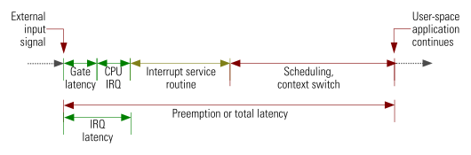

文章标题：**实时 Linux（Real-Time Linux）**

- 作者：汪辰
- 联系方式：<unicorn_wang@outlook.com> / <wangchen20@iscas.ac.cn>


<!-- TOC -->

- [1. 参考文档](#1-参考文档)
- [2. 实时系统（Real-Time System）的定义](#2-实时系统real-time-system的定义)
- [3. 实时操作系统（Real-Time Operation System）的定义](#3-实时操作系统real-time-operation-system的定义)
- [4. 抢占延迟（Preempt Lantency）](#4-抢占延迟preempt-lantency)
	- [4.1. “延迟（Latency）”的定义](#41-延迟latency的定义)
	- [4.2. 抢占延迟（preemption latency）](#42-抢占延迟preemption-latency)
- [5. Linux 与 PREEMPT_RT 补丁](#5-linux-与-preempt_rt-补丁)

<!-- /TOC -->


# 1. 参考文档 

- [参考 1] [Technical basics: Important aspects for real time][1]
- [参考 2] Internals of the RT Patch，Steven Rostedt, Darren V.Hart，2007
- [参考 3] Preemption latency of real-time Linux systems, Carsten Emde，2016/9

# 2. 实时系统（Real-Time System）的定义

引用 [参考 1][1]:

> A real-time system is a platform that is running an RTOS and at least one real-time task. An RT task is a task that must be completed before a certain deadline. These tasks can be periodic or aperiodic have a priority to make sure that they are scheduled according to their frequency of execution and the strictness of their deadline. There can also be non real-time tasks running on the system as well.

要点：
- 实时系统是一个软硬件整体，其中软件部分比较重要的是需要一个 RTOS，即实时操作系统（Real-Time Operation System）。
- 从软件层面上说，一个实时系统上至少有一个实时的任务，除此之外也可以存在非实时的任务。
- 实时任务的定义就是其执行的动作或者工作是有时间限制的（deadline），所谓任务是有时间限制，即一个动作的发起到完成有严格的时间要求，超过时间完成不了则认为任务失败，换句话说即使任务完成但超时了也认为是任务失败。
- 实时任务执行的动作可以是周期性的，也可以是非周期性的（突发的）。

# 3. 实时操作系统（Real-Time Operation System）的定义

实时操作系统（下面简称 RTOS）的首要目标是要创建一个可预期的（predictable）并且具备确定性（deterministic）的操作环境，而非仅仅提高系统的运行速度或者降低响应延迟那么简单。换句话说 RTOS 相对于non-RTOS 的特点是在于能够提供给用户也就是使用 RTOS 的操作人员或者是应用开发人员一个 “稳定” 的工作环境，这个 “稳定” 的工作环境能够明确地让使用者知道在给定的负载范围内其发起的所有操作的完成时间都不会超过一个 “确定” 的上限值，从而满足前面实时系统中实时任务的执行要求。

单纯地提高系统地运行速度或者提高某些操作的处理速度当然对实时性有帮助，但相对于 “确定性” 来说毕竟是第二位的。而且我们要了解的是一般来说一个 RTOS 为了实现 “确定性” 往往反而会牺牲一定的性能，譬如相对于 non-RTOS 来说会带来诸如整体吞吐量性能（throughput）的损失。

# 4. 抢占延迟（Preempt Lantency）

当前基于 RTOS 的实时应用更倾向于在用户态采用任务的方式实现，所以考量一个 RTOS 的 “确定性” 问题更多的是考量一个实时系统在 “抢占延迟” 上的 “确定性”。

## 4.1. “延迟（Latency）”的定义

“延迟”（Latency）的定义见 [参考 2] 的 1.1 章节，原文摘录如下：“The time between an event is expected to occur and the time it actually does is called latency.”。

这里的 event 可以理解成一个任务的完成实现点。包括两种情况：
- the time event expected to occur
- the time event actually does

两者的差值就是 latency。

## 4.2. 抢占延迟（preemption latency）

考虑一个典型的实时应用的例子譬如打孔机，周期性地驱动一个马达在一个以匀速转动的织带上打间隔均匀小孔，假设纸带以每秒 1cm 的速度运动，小孔间的间距需要保持在 1cm，则我们打孔的周期驱动周期也是 1s，则可以采用类似如下简化算法实现：

```cpp
for （......） ｛
	sleep(1);
	//具体的驱动马达动作
｝
```

首先我们要明确在操作系统环境下一般同时存在不止一个任务共享处理器，有些有实时性的要求，有些没有。我们这里关心的控制马达的任务首先调用 sleep 函数放弃处理器进入睡眠态，其他任务获得处理器开始运行，sleep 函数到期事件最终由定时器到期并以中断方式产生进入系统，唤醒该实时任务。实时性更关注的当唤醒动作到来时（譬如这里是中断），该任务是否可以及时地得到处理器进而执行后续的具体操作动作，从中断事件（event）发生到任务被唤醒继续具体操作动作（it actually does）之间所经历的时间间隔是否是确定的，譬如误差绝不超过 50us，否则可以想象这样打出来的小孔也会出现明显不均匀的分布情况。如果能保证这个均匀的条件则我们认为该系统是实时的，否则就不是。
从上面这个例子里我们可以看到多个任务共享处理器时，对于实时任务来说最关心的就是自己关心的事件到来时自己是否可以及时地 “抢占” 处理器执行自己的动作。从事件发生到任务抢到处理器开始执行自己的动作之间所经历的时间就是我们在 RTOS 中最关心的所谓 “抢占延迟”。具体定义见 [参考 3] 中图（Figure 1），摘录如下：



图1. 抢占延迟

系统中一个实时任务当前处于等待态（睡眠），系统从外部接收一个输入信号（External input signal），譬如中断，从该外部信号发生开始，内核依次经历如下流程：
- 中断处理（包括“中断延迟”- IRQ latency）；
- 中断服务处理（Interrupt service routine）；
- 中断结束之际由于条件满足触发内核调度器选中该等待态中的实时任务，抢占发生，打断当前处理器上执行的任务流程，执行相应上下文切换（Scheduling，context switch）；
- 该任务被唤醒，重新占有处理器并在用户态继续执行逻辑（User-space application continues）。

整个这个过程称之为 “抢占延迟” 或 “总延迟”（Preemption or total latency）。

“抢占延迟”时间的长短反映了一个具体的实时任务的响应速度，即该处于等待中的实时任务从外部信号开始触发起到最后该实时任务抢占其他运行态任务获取处理器进而开始执行自己的处理逻辑为止之间花费的时间。这个响应速度是我们衡量一个实时应用，也是进而一个实时系统整体的所谓实时性的主要关键性能指标。

# 5. Linux 与 PREEMPT_RT 补丁

Linux 就是在 “http://www.kernel.org/” 上发布的官方主线内核，又称为 Vanilla 内核，当前其主要目的是作为通用型操作系统开发，具备一定的实时性但还不能称得上是一款真正的 RTOS。针对愈来愈多实时应用的需要以及 Linux 在嵌入式实时项目上的应用，以Ingo Molnar 和 Thomas Gleixner 等为代表的内核开发人员试图在原有基础上对 Linux 进行改造，使其具备一定的实时能力。所有的修改通过一个代号为 "PREEMPT_RT" 的补丁的方式提供，其中大部分的修改已经被 Vanilla 主线所采纳。而打上这个补丁的 Linux 就称为 “Real Time Linux”，简称 “RT-Linux”，该项目的官网托管在 The Linux Foundation 网站上，网址是：<https://wiki.linuxfoundation.org/realtime/start>。

"PREEMPT_RT" 对 Linux 内核实时化改造的主要目标就是试图将其尽可能 100% 地可抢占，只要存在妨碍抢占的内核路径就有可能会导致不可预期的延迟，违反实时系统所期望的 “确定性” 原则。摘录 [RTLinux 官网上对 “PREEMT_RT” patch 的定义][2] 如下：

> The main aim of the PREEMPT_RT patch is to minimize the amount of kernel code that is non-preemptible. Therefore different mechanisms are implemented. Those mechanisms are partially available in mainline Linux.

从 **图1** 可以看到，内核中影响抢占延迟的因素，主要来自中断处理，任务调度中的抢占处理以及影响任务调度的内核同步机制。后面我们有机会再来分析一下当前 Vanilla 内核提供的支持能力和 “PREEMPT_RT” 补丁所做的优化改进。

[1]:https://wiki.linuxfoundation.org/realtime/documentation/technical_basics/start
[2]:https://wiki.linuxfoundation.org/realtime/documentation/technical_details/start

