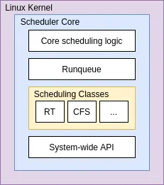
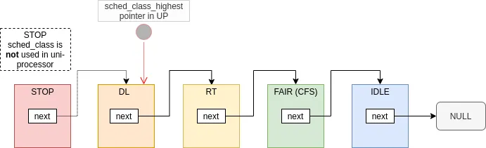
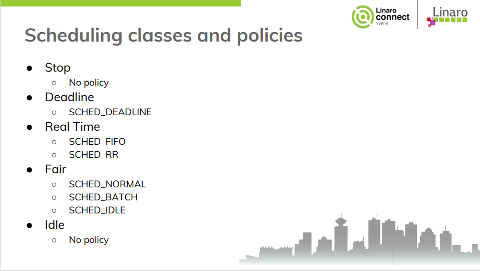
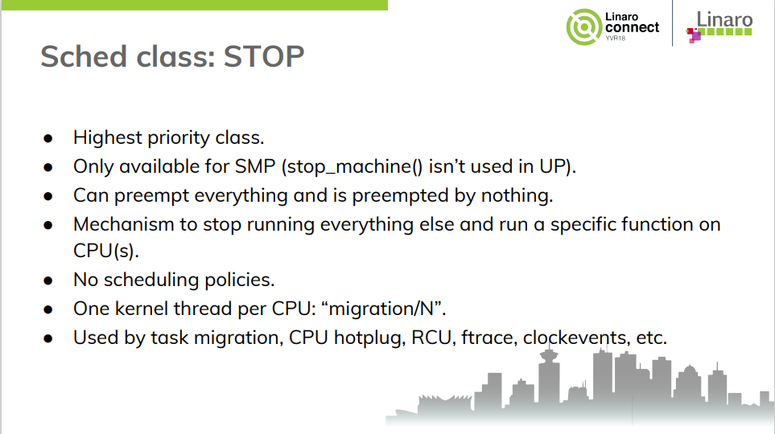
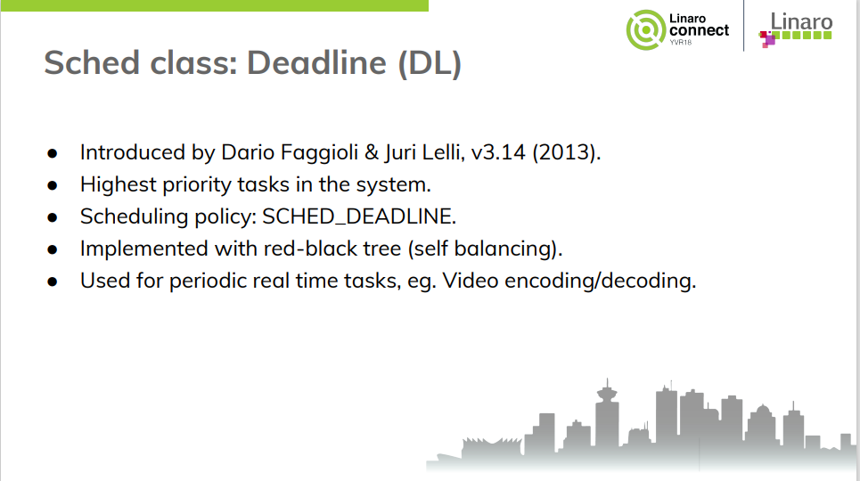
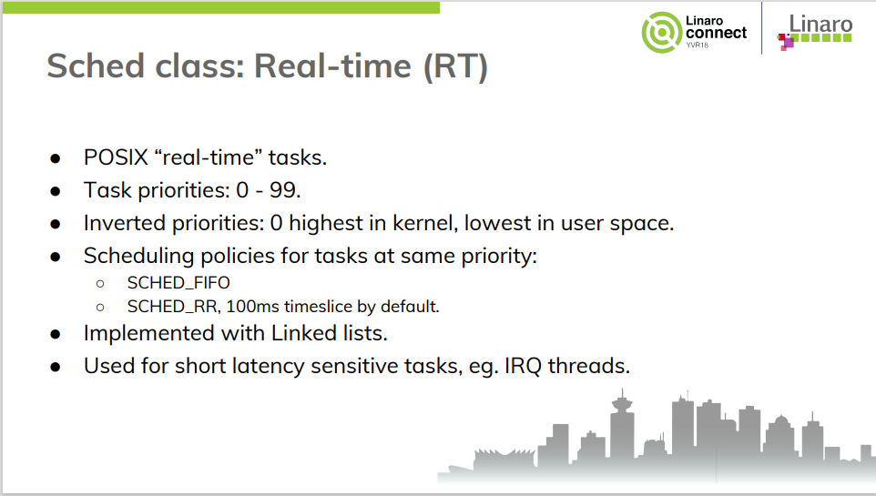
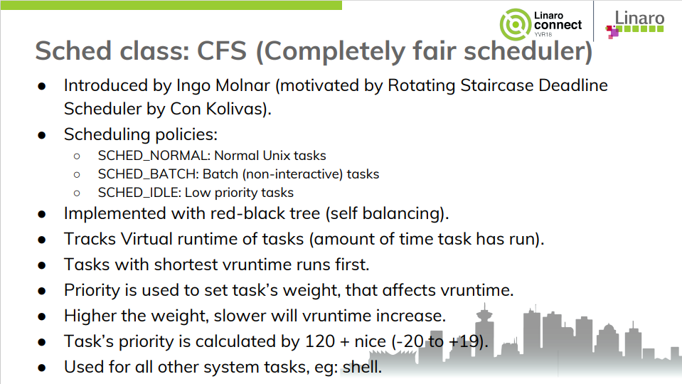
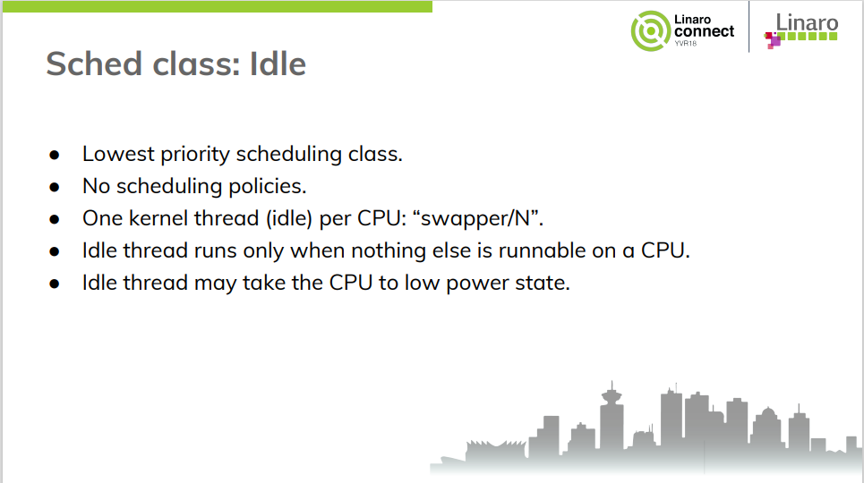
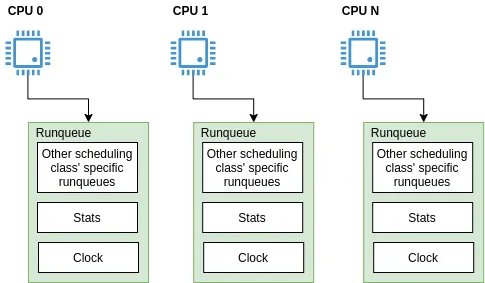

文章标题：**笔记：Linux 调度器（Schedular）**

- 作者：汪辰
- 联系方式：<unicorn_wang@outlook.com> / <wangchen20@iscas.ac.cn>

本笔记主要是摘录了一些我在整理有关 Linux 调度器子系统中有关 scheduling class 和 Scheduling policy 方面的内容。通过这篇笔记希望对理解 Linux 内核中调度器的框架设计有一个初步的认识。

因为是摘录，所以本文主要是提纲挈领，没有过多的深入。

本文文字直接引用了 [参考 1][1], [参考 2][2] 和 [参考 3][3] 的内容，在此声明并表示感谢。

代码部分基于 Linux 5.15.36。

<!-- TOC -->

- [1. 参考文档](#1-参考文档)
- [2. Linux Schedular 概述](#2-linux-schedular-概述)
- [3. Linux Schedular 的发展历史：](#3-linux-schedular-的发展历史)
- [4. 当前任务调度子系统的设计](#4-当前任务调度子系统的设计)
	- [4.1. Task Schedular 子系统](#41-task-schedular-子系统)
	- [4.2. Scheduling Core](#42-scheduling-core)
	- [4.3. Scheduling Classes](#43-scheduling-classes)
	- [4.4. Scheduling classes and policies](#44-scheduling-classes-and-policies)
	- [4.5. 具体 Scheduling class 的行为](#45-具体-scheduling-class-的行为)
	- [4.6. Runqeue](#46-runqeue)

<!-- /TOC -->

# 1. 参考文档 

- [参考 1] [Digging into the Linux scheduler][1]
- [参考 2] [The Linux Kernel Scheduler, Viresh Kumar][2]
- [参考 3] [Linux kernel scheduler][3]

# 2. Linux Schedular 概述

问题的提出：有限的处理器与"无限"的等待运行的任务之间的矛盾。

Linux Scheduler 是一个内核子系统，其任务就是解决以上矛盾。确保有限的处理器资源能够被充分利用。

# 3. Linux Schedular 的发展历史：

从 1991 年 Linux 的第 1 版到后来的 2.4 内核系列，Linux 的调度程序都相当简陋，设计近乎原始，当然它很容易理解。

在 Linux 2.5 开发系列中，针对调度程序做了很大的改进，引入一种叫做 O(1) 的新调度程序。它解决了先前版本 Linux 调度程序的不足，引入了许多强大的新特性和性能特征，
- 140 priorities. 0-99: RT tasks and 100-139: User tasks.
- 引入 Each CPU’s runqueue
- 虽然对于大服务器的工作负载很理想，但在有很多用户交互程序要运行的桌面系统上表现不佳。

Linux 2.6 种引入新的调度算法 CFS，同时引入一些针对调度子系统的新的改造，方便扩展，打造了当前 Linux 的任务调度子系统。
- Introduced by Ingo Molnar in 2.6.23 (2007).
- Scheduling policies within scheduling classes.
- Scheduling class with higher priority served first.
- Task can migrate between CPUs, scheduling policies and scheduling classes.

# 4. 当前任务调度子系统的设计

## 4.1. Task Schedular 子系统



## 4.2. Scheduling Core

两个主要入口：
- The main body: `__schedule()`
- Periodic accounting: `scheduler_tick()`

## 4.3. Scheduling Classes

Linux Scheduler 子系统通过 Scheduling Classes 来扩展不同的调度器算法。内核定义了一个 [`sched_class`][sched_class] 作为接口类，这个类定义了一堆回调函数，不同的调度器类实现这个接口。譬如 `rt_sched_class` 就是 RT sched class 的实现。我们也可以自己定义新的 scheduling class，实现 `sched_class` 定义的接口回调函数即可。

```cpp
struct sched_class {
......
	struct task_struct *(*pick_next_task)(struct rq *rq);

	void (*put_prev_task)(struct rq *rq, struct task_struct *p);
	void (*set_next_task)(struct rq *rq, struct task_struct *p, bool first);

#ifdef CONFIG_SMP
	int (*balance)(struct rq *rq, struct task_struct *prev, struct rq_flags *rf);
......
#endif

	void (*task_tick)(struct rq *rq, struct task_struct *p, int queued);
......
};
```

目前内核中一共定义了如下这些 sched class 对象，并通过一个链表组织起来:



选择下一个调度的 task 时会遍历整个链表，所以从左到右意味着优先级递减，也就是说如果遇到 DL 类的 task，那么就不会往后继续了，所以只要有 DL 类型的 task 处于 Running 状态，就没有 RT 及以后类型的 task 什么事了。

## 4.4. Scheduling classes and policies

为了进一步细分不同的行为，调度类下还分 policy




## 4.5. 具体 Scheduling class 的行为












## 4.6. Runqeue

在 Scheduler 子系统中，Runqeue 是一个 per-CPU 的对象。也就是说每个 CPU 都有一个自己对应的 Runqueue。



[runqueues][runqueues] 定义如下：

```cpp
DECLARE_PER_CPU_SHARED_ALIGNED(struct rq, runqueues);
```

基于 Run queue，内核任务调度子系统还实现了负载均衡。

> Here comes the need of load balancing among CPUs in multi-core systems. Without a special effort to balance load, threads may wait in a specific CPU’s run queue, while other CPUs have nothing in their run queue, which, of course, means performance degradation.


[1]:https://deepdives.medium.com/digging-into-linux-scheduler-47a32ad5a0a8
[2]:https://static.linaro.org/connect/yvr18/presentations/yvr18-220.pdf
[3]:https://helix979.github.io/jkoo/post/os-scheduler/

[runqueues]:https://elixir.bootlin.com/linux/v5.15.36/source/kernel/sched/sched.h#L1365
[sched_class]:https://elixir.bootlin.com/linux/v5.15.36/source/kernel/sched/sched.h#L2113

