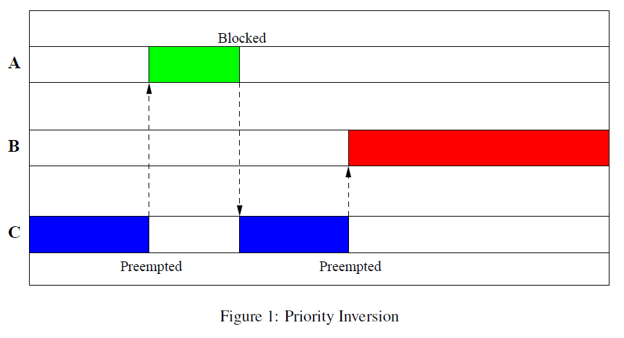
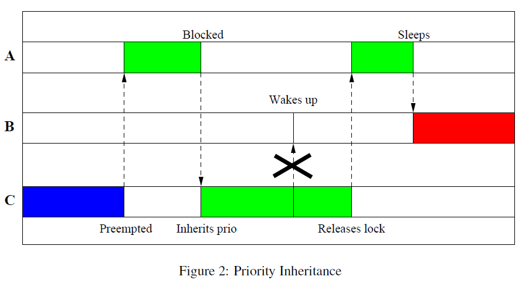

文章标题：**笔记：优先级反转（Priority Inversion）和 优先级继承（Priority Inheritance）**

- 作者：汪辰
- 联系方式：<unicorn_wang@outlook.com> / <wangchen20@iscas.ac.cn>

目前先整理总结一下 优先级反转（Priority Inversion）和 优先级继承（Priority Inheritance）的基本概念。有关 Linux 内核中如何实现的相关内容，后面有机会再补充。

<!-- TOC -->

- [1. 参考文档](#1-参考文档)
- [2. 优先级反转（Priority Inversion）](#2-优先级反转priority-inversion)
- [3. 优先级继承（Priority Inheritance）](#3-优先级继承priority-inheritance)

<!-- /TOC -->

# 1. 参考文档

- [参考 1] Internals of the RT Patch, Steven Rostedt, Darren V. Hart, 2007

# 2. 优先级反转（Priority Inversion）

正常情况下高优先级的任务应该能够及时抢占低优先级的任务才对，但某些条件下，也会发生高优先级的任务无法抢占低优先级的任务而不得不等待低优先级的任务执行完才能获得处理器并执行，这就是所谓的优先级反转。发生优先级反转需要满足如下条件：

- 高优先级的任务和低优先级的任务共享了某些资源（譬如互斥量/Mutex 或者自旋锁/ Spinlock）
- 些共享资源被低优先级任务先获得而高优先级任务不得不等待。

只要上述条件满足，就会发生优先级反转，这是无法避免的，我们最需要防止的情况严格来说其实是一种叫做 “无限制优先级反转”（unbounded priority inversion），也就是说虽然高优先级的任务可能被低优先级的任务阻塞，但阻塞的时长只要是可控的（譬如低优先级的任务 **可以预期** 快速完成其工作并释放共享资源），反之，如果阻塞的时间对于高优先级任务来说存在 “不确定” 的情况，那么我们就要当心了。“无限制优先级反转” 是 RTOS 系统上最容易引入不确定的大延迟问题的原因。

经典的 “无限制优先级反转” 的例子可以用下图来描述，Figure 1 摘录自 [参考 1]：

这个经典的例子中涉及三个不同优先级的任务 A、B、C。优先级 A > B > C。并假设只考虑一个处理器的情况。

A 和 C 共享资源（譬如一个 lock）。发生 “无限制优先级反转” 的时序如下：

- 假设 C 先唤醒并获取了这个 lock；
- 然后 A 唤醒，抢占 C 并尝试获取 lock 失败，进入 Blocked 状态；
- C 继续执行；
- 此后 **在 C 还未来得及释放 lock 之前** 被 B 抢占。B 虽然优先级低于 A，但是 A 却无法抢占 B，因为 A 在等待 C 释放 lock，但是我们知道，因为 B 的优先级高于 C，只要 B 不主动释放处理器，C 是没有机会继续执行并释放 lock 的，这就造成了一种现象，就是虽然 A 优先级高于 B，但本质上 B 却一直无法被 A 抢占，在 A 和 B 之间实际上发生了优先级反转。而更糟糕的是从某种业务实现逻辑的角度来说，B 的出现完全独立于 A 和 C，它是一个完全不受我们控制的任务（A 和 C 存在资源共享，实际实现存在 “可预期” 性），这导致了 A 和 B 之间的 “优先级反转” 关系有很大可能升级为一种 “无限制优先级反转”，极端条件 B 进入死循环，那么 A 就再也无法抢占 CPU 运行了。

# 3. 优先级继承（Priority Inheritance）

Linux 中解决 “优先级反转”（严格说是 “无限制优先级反转”）的方案是 “优先级继承”。

“优先级继承” 算法的核心思想，利用上述例子描述就是：当一个高优先级的任务 A 因为资源共享的问题被一个低优先级的任务 C 阻塞的时候，我们需要临时提高低优先级任务 C 的优先级到和被阻塞的高优先级的任务 A 的优先级一致（就好像低优先级的任务 **继承**了高优先级任务的优先级一样），这样一来，原先低优先级的任务 C 就不会被其他优先级低于 A 的任务 B 所抢占，这样 C 就有机会释放 lock，A 就可以不被 B 反转。当然 C 让出处理器的同时，继承的优先级会恢复到原先的值，这样也不会阻碍 B 继续抢占 C。

引用 [参考 1] 上的图我们可以对照看一下采用 “优先级继承” 后我们如何避免了 “无限制优先级反转” 的问题：

